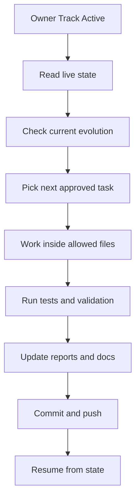
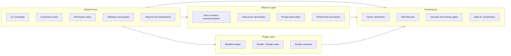
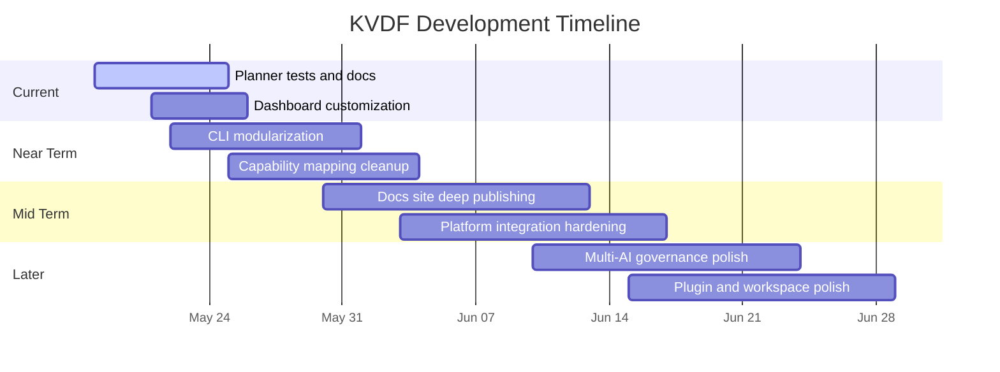
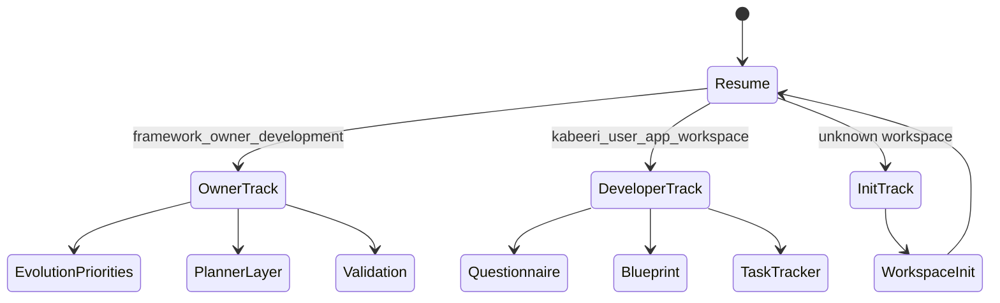
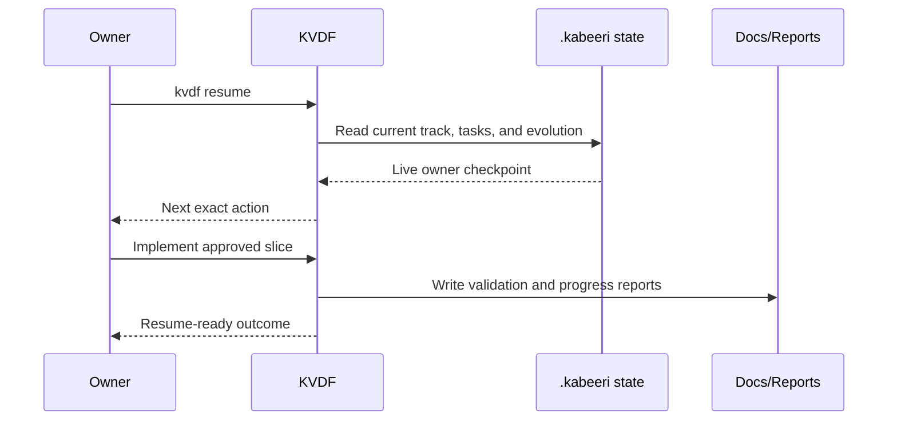

# KVDF Development Plan Visual Report

Generated: 2026-05-21

This report turns the current KVDF development plan into tables and Mermaid diagrams.
It is based on the live owner checkpoint, the current resume state, and the active evolution backlog.

## Current Snapshot

| Area | Live State | Notes |
| --- | --- | --- |
| Track | `framework_owner` | Owner-only development track is active. |
| Branch | `main` | Local worktree is aligned to the default branch. |
| Repo health | Clean | No uncommitted changes at the time this report was generated. |
| Active change | `owner-dashboard-planner` | Current planned evolution is the owner dashboard planner slice. |
| Open priorities | `0` | No Evolution priorities are currently open. |
| Open task memory | `owner-dashboard-planner-tests` | Scope is limited to planner integration and docs coverage. |
| Pending UI decision | `Dashboard Customization` | One questionnaire item remains open. |

## Development Layers

| Layer | Purpose | Current Strength | Next Focus |
| --- | --- | --- | --- |
| CLI runtime | Command routing, state management, validation, report generation | Strong | Keep modularization safe and consistent |
| `.kabeeri/` state | Source of truth for work, governance, and history | Strong | Keep schema coverage and runtime consistency current |
| Planner layer | Recommend the next governed Evolution slice | Active focus | Finish planner integration and docs coverage |
| Dashboard layer | Live status and operational visibility | Implemented | Improve customization and drilldown |
| Plugin layer | Optional feature bundles and removable capability surfaces | Mature | Keep loader contracts and bundle boundaries clean |
| Multi-AI governance | Roles, leader handoff, tokens, locks, and sessions | Mature | Keep collaboration flows deterministic |

## Roadmap Table

| Order | Phase | Goal | Status |
| --- | --- | --- | --- |
| 1 | Capability registry and source mapping | Keep every capability traceable from source study to CLI and docs | In progress |
| 2 | Entry / track / role enforcement | Keep owner and vibe flows separated from the first command | In progress |
| 3 | Pack router and project profile | Route projects to the smallest correct pack set | In progress |
| 4 | Lifecycle engine and quality gates | Prevent premature execution and enforce readiness | In progress |
| 5 | Traceability, risk, and change control | Keep decisions explainable and auditable | In progress |
| 6 | Docs site deep publishing | Publish EN/AR developer explanations for each major capability | In progress |
| 7 | Source folder normalization | Preserve traceability while normalizing imported source roots | Deferred until after current cleanup |

## Owner Execution Queue

| Priority | Item | Why it matters | Next action |
| --- | --- | --- | --- |
| 1 | `owner-dashboard-planner-tests` | Confirms planner command behavior and docs coverage | Update tests and docs, then validate |
| 2 | Dashboard customization decision | Unblocks any dashboard-specific owner work | Resolve the pending questionnaire item |
| 3 | Safe CLI modularization | Keeps `src/cli/index.js` maintainable | Continue extracting route modules carefully |
| 4 | Capability/source mapping cleanup | Keeps imported knowledge unambiguous | Review duplicates and map to correct folders |
| 5 | Docs site publishing | Makes the runtime understandable without chat history | Deepen English and Arabic pages |

## Mermaid: Development Flow

## Mermaid: KVDF System Layers

## Mermaid: Development Timeline

## Mermaid: Track Routing

## Mermaid: Delivery Order

## Phase Detail Table

| Phase | Key Deliverables | Exit Condition |
| --- | --- | --- |
| Planner layer | Tests, docs, prompt outputs, allowed-file boundaries | Planner output is resumable and documented |
| CLI core | Safe modular routing, track enforcement, validation | Router stays readable and stable |
| Docs layer | EN/AR docs, command reference, capability reference | Docs match live runtime behavior |
| Governance layer | Policy gates, traceability, release readiness | Unsafe paths are blocked before execution |
| Platform layer | Dashboard, GitHub sync, VS Code bridge, reports | Local state remains the source of truth |
| Multi-AI layer | Leader routing, queues, locks, tokens, budgets | Collaboration remains deterministic and auditable |

## Suggested Immediate Next Steps

| Step | Action | Output |
| --- | --- | --- |
| 1 | Finish `owner-dashboard-planner-tests` | Planner integration coverage and doc alignment |
| 2 | Resolve `Dashboard Customization` | Clear the remaining UI decision |
| 3 | Continue safe CLI modularization | Smaller, maintainable command modules |
| 4 | Keep capability mapping current | No ambiguous imported knowledge |
| 5 | Deepen docs site publishing | Developer-readable EN/AR guidance |

## Notes

- This report is visual and summary-oriented, not a replacement for the live runtime state.
- For execution, trust `kvdf resume`, `kvdf evolution priorities`, and the `.kabeeri/` state files.
- For the next development slice, keep the scope inside the active task memory and validation commands.
