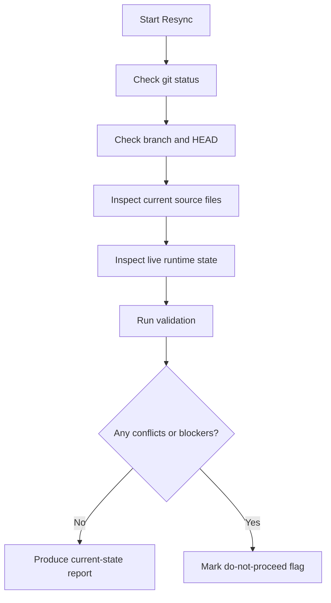
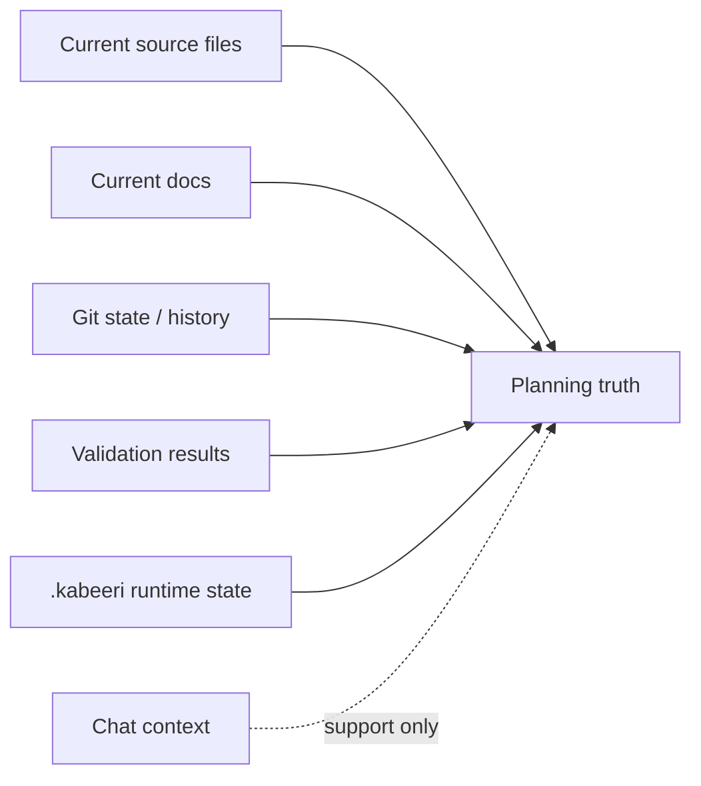
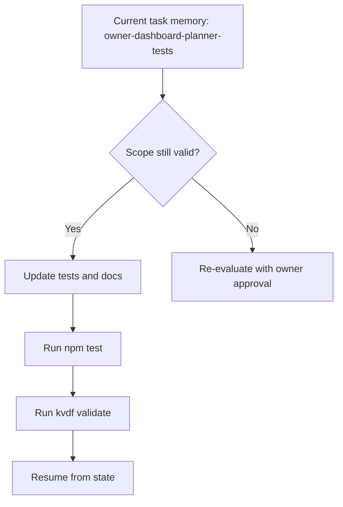

# KVDF State Resync Current-State Report

Generated: 2026-05-21

This report is an evidence-backed current-state snapshot.
It is intentionally stricter than a planning summary.

## State Resync Summary

| Check | Result | Evidence |
| --- | --- | --- |
| Repo path confirmed | Yes | `D:\My Project Ideas\kabeeri.vdf\kabeeri-vdf` |
| Current branch confirmed | Yes | `main` |
| Latest main checked | Yes | `HEAD -> main, origin/main, origin/HEAD` at `420fd43` |
| Git history checked | Yes | Recent commits reviewed with `git log -n 5` |
| Current files inspected | Yes | `OWNER_DEVELOPMENT_STATE.md`, `ROADMAP.md`, `README.md`, `src/core/bootstrap.js`, `src/cli/index.js`, `src/cli/commands/resume.js`, `src/cli/commands/dashboard_state.js`, `src/cli/commands/security.js`, `src/cli/commands/release.js`, `src/cli/workspace.js`, `src/cli/fs_utils.js`, `.kabeeri/evolution.json`, `.kabeeri/reports/evolution_batch_execution.json` |
| `.kabeeri` runtime state checked | Yes | Resume, evolution, and task memory state inspected |
| Stale docs detected | Yes | Historical roadmap / owner-state language still exists and must not outrank live runtime state |
| Conflicts found | No blocking conflicts | The tree is currently only dirty because of the two new report files created during this session |
| Validation checked | Yes | `node bin/kvdf.js validate` and `npm test` both passed |

## Important Distinction

| Statement | Meaning |
| --- | --- |
| `No open Evolution priorities` | The live priority queue is empty right now. |
| `Active change exists` | `owner-dashboard-planner` is still the current planned change and `owner-dashboard-planner-tests` is the live task memory. |
| `Therefore` | The work is not "done"; it is in a materialized planner/task state with no additional open queue item. |

## Current-State Verdict

| Item | Value |
| --- | --- |
| Trust level | High for planning and routing |
| Trust level for execution | Medium until the pending planner tests/docs slice is completed |
| Do we have a clean source-of-truth picture? | Mostly yes |
| Do we have a fully finished execution picture? | No |

## Evidence Notes

- `git status --short` shows only two untracked report files created in this session.
- `git log -1 --oneline --decorate` confirms the latest main commit is `420fd43 chore: refresh generated reports`.
- `node bin/kvdf.js validate` passed.
- `npm test` passed.
- `kvdf resume` shows `framework_owner_development`, one pending UI decision, and the owner checkpoint.
- `kvdf evolution priorities` shows no open priorities, while `.kabeeri/evolution.json` still contains the active materialized change `owner-dashboard-planner`.

## Current Planning Rule

`No planning without state resync.`

That means:

- Do not rely on `OWNER_DEVELOPMENT_STATE.md` alone.
- Do not rely on `ROADMAP.md` alone.
- Do not rely on `.kabeeri/evolution.json` alone.
- Do not rely on chat context alone.
- Treat `.kabeeri` as supporting state, not the only truth.
- Treat current source files, docs, git state, and validation as co-equal evidence for planning.

## Evidence-Backed Next Evolution

| Field | Value |
| --- | --- |
| Recommended next slice | `owner-dashboard-planner-tests` |
| Why this slice | It is the live task memory, already scoped, and it directly closes the planner-layer gap the current owner checkpoint points at |
| Allowed files | `tests/cli.integration.test.js`, `docs/cli/CLI_COMMAND_REFERENCE.md`, `docs/SYSTEM_CAPABILITIES_REFERENCE.md` |
| Validation commands | `npm test`, `node bin/kvdf.js validate` |
| Why not broader work | Broader planner or platform work would skip the active task memory and reintroduce planning drift |

## Blockers And Conflicts

| Type | Status | Detail |
| --- | --- | --- |
| Blocking conflict | None found | No code conflict or validation failure was detected in the resync |
| Planning ambiguity | Low | The only ambiguity is semantic: "no open priorities" does not mean "no active planner task" |
| UI decision pending | Open | `Dashboard Customization` remains unresolved and may affect dashboard-related planning later |

## Mermaid: Resync Logic

## Mermaid: Truth Hierarchy

## Mermaid: Next-Evolution Decision

## Suggested Immediate Next Steps

| Step | Action | Output |
| --- | --- | --- |
| 1 | Finish `owner-dashboard-planner-tests` | Planner integration coverage and doc alignment |
| 2 | Resolve `Dashboard Customization` if it affects the next slice | Clear the remaining UI decision |
| 3 | Keep CLI modularization safe | Stable route extraction and maintainable command wiring |
| 4 | Keep capability mapping current | No ambiguous imported knowledge |
| 5 | Keep docs and runtime aligned | Developer-readable EN/AR guidance |

## Do-Not-Proceed Flag

`False` for the planner test slice.

Reason:

- The resync found no blocking conflicts.
- Validation passed.
- The next slice is already materialized and scoped.

## Final Judgment

| Question | Answer |
| --- | --- |
| Good strategic orientation? | Yes |
| Good execution authority? | Not by itself |
| Needs state resync first? | Yes, and now it has one |
| Safe to use as the next prompt basis? | Yes, for the scoped planner task only |

