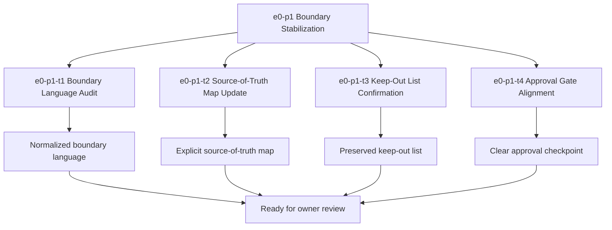

# E0-P1 Boundary Stabilization Tasks

Updated: 2026-05-21

Branch: `tasks/e0-p1-boundary-stabilization`

Status: planning-only

This task list is scoped only to `e0-p1 Boundary Stabilization`.
It is generated from the approved build-ready report and does not include `e1-p1` or any later queue items.

## Scope Reminder

- KVDOS is the commercial product.
- KVDF is the governance/tooling layer.
- KVDOS v1 commercial boundary = Local IDE Studio + Local Runtime + Cloud subscription/license control.
- Private code, secrets, customer data, local reports, and local runtime state stay local.
- Cloud commercial control only handles account, subscription, license entitlement, activation, plan access, release access, and update access.

## Generated Tasks

### `e0-p1-t1` Boundary Language Audit

Title:
- Audit and normalize the app-local boundary language

Allowed files:
- `workspaces/apps/kvdos/docs/roadmap/KVDOS_VERSION_PLAN.md`
- `workspaces/apps/kvdos/docs/roadmap/KVDOS_EVOLUTION_PLAN.md`
- `workspaces/apps/kvdos/docs/roadmap/KVDOS_EVOLUTION_TASK_PUNCH.md`
- `workspaces/apps/kvdos/docs/roadmap/KVDOS_IMPLEMENTATION_READINESS_QUEUE.md`
- `workspaces/apps/kvdos/docs/roadmap/E0_P1_BOUNDARY_STABILIZATION_TASKS.md`
- `workspaces/apps/kvdos/docs/reports/e0-p1-boundary-stabilization-build-ready-report.md`
- `workspaces/apps/kvdos/docs/product/PRODUCT_DEFINITION.md`
- `workspaces/apps/kvdos/docs/product/PRODUCT_STRATEGY.md`
- `workspaces/apps/kvdos/docs/product/MVP_SCOPE.md`

Forbidden files:
- repo-root KVDF core files
- any file outside `workspaces/apps/kvdos/`
- `workspaces/apps/kvdos/docs/roadmap/KVDOS_EVOLUTION_PLAN.md` sections unrelated to boundary wording
- `workspaces/apps/kvdos/docs/roadmap/KVDOS_IMPLEMENTATION_READINESS_QUEUE.md` items unrelated to `e0-p1`
- `workspaces/apps/kvdos/docs/reports/planning-versions-evos-tasks-pipeline.html`

Acceptance criteria:
- Boundary language consistently states KVDOS vs KVDF separation.
- The commercial boundary is expressed without old version-history confusion.
- The local privacy boundary is explicit.
- The file list and keep-out scope stay app-local.

Validation commands:
- `rg -n "KVDF|KVDOS|commercial boundary|local privacy|keep-out" workspaces/apps/kvdos/docs/roadmap workspaces/apps/kvdos/docs/product workspaces/apps/kvdos/docs/reports`
- `git diff --check`

### `e0-p1-t2` Source-of-Truth Map Update

Title:
- Refresh the source-of-truth map for the boundary slice

Allowed files:
- `workspaces/apps/kvdos/docs/roadmap/KVDOS_EVOLUTION_PLAN.md`
- `workspaces/apps/kvdos/docs/roadmap/KVDOS_IMPLEMENTATION_READINESS_QUEUE.md`
- `workspaces/apps/kvdos/docs/reports/e0-p1-boundary-stabilization-build-ready-report.md`
- `workspaces/apps/kvdos/docs/roadmap/E0_P1_BOUNDARY_STABILIZATION_TASKS.md`

Forbidden files:
- repo-root KVDF core files
- any file outside `workspaces/apps/kvdos/`
- `workspaces/apps/kvdos/docs/reports/kvdos-browser-report.html`
- `workspaces/apps/kvdos/docs/reports/planning-versions-evos-tasks-pipeline.html` unless only a boundary-note correction is needed after approval

Acceptance criteria:
- The source-of-truth map shows app-local docs as authoritative for KVDOS planning.
- No repo-root KVDF files are introduced into the boundary slice.
- The map clearly points to the commercial foundation stage plan and e0-p1 report.

Validation commands:
- `rg -n "Source of truth|app-local|workspaces/apps/kvdos|KVDOS Commercial Foundation Stage Plan" workspaces/apps/kvdos/docs/roadmap workspaces/apps/kvdos/docs/reports`
- `git diff --check`

### `e0-p1-t3` Keep-Out List Confirmation

Title:
- Confirm and preserve the e0-p1 keep-out list

Allowed files:
- `workspaces/apps/kvdos/docs/reports/e0-p1-boundary-stabilization-build-ready-report.md`
- `workspaces/apps/kvdos/docs/roadmap/E0_P1_BOUNDARY_STABILIZATION_TASKS.md`

Forbidden files:
- repo-root KVDF core files
- any file outside `workspaces/apps/kvdos/`
- `workspaces/apps/kvdos/src/**`
- `workspaces/apps/kvdos/.kabeeri/tasks.json`
- `workspaces/apps/kvdos/docs/roadmap/KVDOS_EVOLUTION_TASK_PUNCH.md` unless a citation update is needed

Acceptance criteria:
- The keep-out list clearly excludes code implementation, cloud API code, and later-track work.
- The keep-out list clearly excludes repo-root KVDF files.
- The keep-out list is easy to reuse in later approvals.

Validation commands:
- `rg -n "Keep-Out|keep-out|forbidden|excluded|do not" workspaces/apps/kvdos/docs/reports/e0-p1-boundary-stabilization-build-ready-report.md workspaces/apps/kvdos/docs/roadmap/E0_P1_BOUNDARY_STABILIZATION_TASKS.md`
- `git diff --check`

### `e0-p1-t4` Approval Gate Alignment

Title:
- Align approval gate wording for boundary stabilization

Allowed files:
- `workspaces/apps/kvdos/docs/reports/e0-p1-boundary-stabilization-build-ready-report.md`
- `workspaces/apps/kvdos/docs/roadmap/E0_P1_BOUNDARY_STABILIZATION_TASKS.md`

Forbidden files:
- repo-root KVDF core files
- any file outside `workspaces/apps/kvdos/`
- `workspaces/apps/kvdos/docs/roadmap/KVDOS_VERSION_PLAN.md` if the only change would be to reintroduce historical version numbering

Acceptance criteria:
- The owner approval checkpoint is clearly written.
- The report states that scoped implementation tasks may be generated only after approval.
- The report remains strictly pre-implementation.

Validation commands:
- `rg -n "Owner Approval|approval checkpoint|scoped implementation tasks|build-ready report" workspaces/apps/kvdos/docs/reports/e0-p1-boundary-stabilization-build-ready-report.md workspaces/apps/kvdos/docs/roadmap/E0_P1_BOUNDARY_STABILIZATION_TASKS.md`
- `git diff --check`

## Visualization



```text
Task flow

e0-p1
  -> t1 Boundary Language Audit
  -> t2 Source-of-Truth Map Update
  -> t3 Keep-Out List Confirmation
  -> t4 Approval Gate Alignment
  -> owner review
```

## Build-Ready Completion Criteria

The `e0-p1` task set is ready to hand off when:

- the boundary language is normalized
- the source-of-truth map is explicit
- the keep-out list is preserved
- the approval gate is clear
- no repo-root KVDF files were touched
- no `e1-p1` work was started

## PR Title

`e0-p1: boundary stabilization readiness and scoped task generation`

## PR Checklist

- [ ] Branch created from the current workspace state
- [ ] Changes stay inside `workspaces/apps/kvdos/`
- [ ] No repo-root KVDF core files modified
- [ ] No `e1-p1` work started
- [ ] No global implementation task queue generated
- [ ] Boundary language is normalized
- [ ] Source-of-truth map is explicit
- [ ] Keep-out list is explicit
- [ ] Owner approval checkpoint is clear
- [ ] `git diff --check` passes
- [ ] Validation commands are included for each task

## Review Gate

Do not start implementation until this task list is reviewed and approved.
