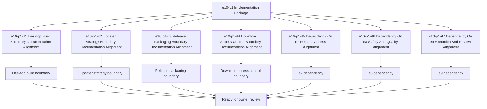

# E10-P1 Release Packaging Implementation Tasks

Updated: 2026-05-22

Branch: `tasks/e10-p1-release-packaging-implementation`

Status: planning-only

This task package is scoped only to `e10-p1 Release Packaging` implementation planning.
It remains documentation/spec-boundary implementation planning only and does not include
desktop build code, updater code, release packaging code, or download access control code.

## Scope Reminder

- `KVDOS` is the commercial product.
- `KVDF` is the governance/tooling layer.
- KVDOS app work stays inside `workspaces/apps/kvdos/`.
- KVDOS v1 commercial boundary = Local IDE Studio + Local Runtime + Cloud subscription/license control.
- Private code, secrets, customer data, local reports, and local runtime state stay local.
- Cloud commercial control only handles account, subscription, license entitlement, activation, plan access, release access, and update access.

## Generated Tasks

### `e10-p1-it1` Desktop Build Boundary Documentation Alignment

- Title: Define the desktop build boundary for KVDOS packaging
- Build type: packaging specification
- In scope:
  - desktop build boundary notes
  - desktop packaging purpose wording
  - release artifact framing
- Out of scope:
  - desktop build implementation code
  - packaging runtime code
  - updater implementation code
- Acceptance criteria:
  - desktop build boundary is explicit
  - the wording stays app-local
  - the boundary does not imply build code
- Validation commands:
  - `rg -n "desktop build|desktop|packaging|release|update|KVDOS|KVDF" workspaces/apps/kvdos/docs/reports workspaces/apps/kvdos/docs/roadmap workspaces/apps/kvdos/docs/product workspaces/apps/kvdos/docs/architecture`
  - `git diff --check`

### `e10-p1-it2` Updater Strategy Boundary Documentation Alignment

- Title: Define the updater strategy boundary for release distribution
- Build type: packaging policy specification
- In scope:
  - updater strategy notes
  - release update wording
  - packaging update framing
- Out of scope:
  - updater implementation code
  - release distribution code
  - cloud API coding
- Acceptance criteria:
  - updater strategy boundary is explicit
  - the wording stays pre-implementation
  - the boundary remains app-local
- Validation commands:
  - `rg -n "updater|update|release|download|packaging|KVDOS|KVDF" workspaces/apps/kvdos/docs/reports workspaces/apps/kvdos/docs/roadmap workspaces/apps/kvdos/docs/product workspaces/apps/kvdos/docs/architecture`
  - `git diff --check`

### `e10-p1-it3` Release Packaging Boundary Documentation Alignment

- Title: Define the release packaging boundary for distributable builds
- Build type: release packaging specification
- In scope:
  - release packaging notes
  - packaging release wording
  - artifact handoff framing
- Out of scope:
  - release packaging implementation code
  - build pipeline code
  - updater implementation code
- Acceptance criteria:
  - release packaging boundary is explicit
  - the wording is reviewable and app-local
  - the boundary does not imply code generation
- Validation commands:
  - `rg -n "release packaging|package|packaging|build|artifact|KVDOS|KVDF" workspaces/apps/kvdos/docs/reports workspaces/apps/kvdos/docs/roadmap workspaces/apps/kvdos/docs/product workspaces/apps/kvdos/docs/architecture`
  - `git diff --check`

### `e10-p1-it4` Download Access Control Boundary Documentation Alignment

- Title: Define the download access control boundary for packaged releases
- Build type: access-control specification
- In scope:
  - download access control notes
  - entitlement-aware download wording
  - release download framing
- Out of scope:
  - download access control implementation code
  - download delivery code
  - cloud API coding
- Acceptance criteria:
  - download access control boundary is explicit
  - the wording remains pre-implementation
  - the boundary stays app-local
- Validation commands:
  - `rg -n "download access|download|release access|entitlement|package|KVDOS|KVDF" workspaces/apps/kvdos/docs/reports workspaces/apps/kvdos/docs/roadmap workspaces/apps/kvdos/docs/product workspaces/apps/kvdos/docs/architecture`
  - `git diff --check`

### `e10-p1-it5` Dependency On e7 Release Access Alignment

- Title: Align the e10 dependency on e7 release access
- Build type: dependency specification
- In scope:
  - e7 dependency wording
  - release-access prerequisite notes
  - packaging-after-access framing
- Out of scope:
  - release access implementation code
  - packaging implementation code
  - updater implementation code
- Acceptance criteria:
  - dependency on e7-p1 is explicit
  - the wording stays app-local
  - the boundary does not imply release code
- Validation commands:
  - `rg -n "e7|release access|dependency|packaging|update|KVDOS|KVDF" workspaces/apps/kvdos/docs/reports workspaces/apps/kvdos/docs/roadmap workspaces/apps/kvdos/docs/product workspaces/apps/kvdos/docs/architecture`
  - `git diff --check`

### `e10-p1-it6` Dependency On e8 Safety And Quality Alignment

- Title: Align the e10 dependency on e8 safety and quality
- Build type: dependency specification
- In scope:
  - e8 dependency wording
  - safety prerequisite notes
  - packaging-after-safety framing
- Out of scope:
  - safety implementation code
  - packaging implementation code
  - updater implementation code
- Acceptance criteria:
  - dependency on e8-p1 is explicit
  - the wording stays app-local
  - the boundary does not imply build code
- Validation commands:
  - `rg -n "e8|safety|quality|dependency|packaging|KVDOS|KVDF" workspaces/apps/kvdos/docs/reports workspaces/apps/kvdos/docs/roadmap workspaces/apps/kvdos/docs/product workspaces/apps/kvdos/docs/architecture`
  - `git diff --check`

### `e10-p1-it7` Dependency On e9 Execution And Review Alignment

- Title: Align the e10 dependency on e9 execution and review
- Build type: dependency specification
- In scope:
  - e9 dependency wording
  - execution prerequisite notes
  - packaging-after-review framing
- Out of scope:
  - execution implementation code
  - packaging implementation code
  - updater implementation code
- Acceptance criteria:
  - dependency on e9-p1 is explicit
  - the wording stays app-local
  - the boundary does not imply execution code
- Validation commands:
  - `rg -n "e9|execution|review|dependency|packaging|KVDOS|KVDF" workspaces/apps/kvdos/docs/reports workspaces/apps/kvdos/docs/roadmap workspaces/apps/kvdos/docs/product workspaces/apps/kvdos/docs/architecture`
  - `git diff --check`

## Visualization

## PR Title

`e10-p1: release packaging implementation package`

## PR Checklist

- [ ] Changes stay inside `workspaces/apps/kvdos/`
- [ ] No repo-root KVDF core files modified
- [ ] No `e11-p1` work started
- [ ] No desktop build implementation added
- [ ] No updater implementation added
- [ ] No release packaging implementation added
- [ ] No download access control implementation added
- [ ] No runtime, SQLite, cloud API, execution, or packaging work added
- [ ] No feature code added
- [ ] Desktop build boundary is explicit
- [ ] Updater strategy boundary is explicit
- [ ] Release packaging boundary is explicit
- [ ] Download access control boundary is explicit
- [ ] Dependency on e7 release access is explicit
- [ ] Dependency on e8 safety and quality is explicit
- [ ] Dependency on e9 execution and review is explicit
- [ ] `git diff --check` passes
- [ ] `.vscode/settings.json` remains untouched
