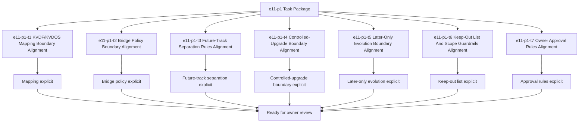

# E11-P1 VDF Bridge And Later Evolution Task Package

Updated: 2026-05-22

Branch: `tasks/e11-p1-vdf-bridge-and-later-evolution`

Status: planning-only

This task package is scoped only to `e11-p1 VDF Bridge And Later Evolution`
implementation planning.
It remains documentation/spec-boundary implementation planning only and does
not include bridge code, upgrade logic, plugin/package registry code, cloud
runner code, marketplace code, enterprise code, or Web3-related code.

## Scope Reminder

- `KVDOS` is the commercial product.
- `KVDF` is the governance/tooling layer.
- KVDOS app work stays inside `workspaces/apps/kvdos/`.
- KVDOS v1 commercial boundary = Local IDE Studio + Local Runtime + Cloud
  subscription/license control.
- Private code, secrets, customer data, local reports, and local runtime state
  stay local.
- Cloud commercial control only handles account, subscription, license
  entitlement, activation, plan access, release access, and update access.

## Generated Tasks

### `e11-p1-t1` KVDF/KVDOS Mapping Boundary Alignment

- Title: Define the KVDF/KVDOS mapping boundary for later evolution
- Build type: mapping specification
- In scope:
  - KVDF/KVDOS separation language
  - app-to-core mapping wording
  - later-track handoff wording
- Out of scope:
  - repo-root KVDF core edits
  - bridge code implementation
  - upgrade logic implementation
- Acceptance criteria:
  - the mapping boundary is explicit
  - the wording stays app-local
  - the boundary does not imply code changes
- Validation commands:
  - `rg -n "KVDF|KVDOS|bridge|later|mapping|handoff" workspaces/apps/kvdos/docs/reports workspaces/apps/kvdos/docs/roadmap workspaces/apps/kvdos/docs/product workspaces/apps/kvdos/docs/architecture`
  - `git diff --check`

### `e11-p1-t2` Bridge Policy Boundary Alignment

- Title: Define the bridge policy boundary for later track handoff
- Build type: policy specification
- In scope:
  - bridge policy wording
  - controlled handoff wording
  - explicit app-to-core separation wording
- Out of scope:
  - bridge implementation code
  - upgrade code
  - plugin registry code
- Acceptance criteria:
  - the bridge policy boundary is explicit
  - the wording stays pre-implementation
  - the boundary remains app-local
- Validation commands:
  - `rg -n "bridge|handoff|policy|mapping|later|KVDOS|KVDF" workspaces/apps/kvdos/docs/reports workspaces/apps/kvdos/docs/roadmap workspaces/apps/kvdos/docs/product workspaces/apps/kvdos/docs/architecture`
  - `git diff --check`

### `e11-p1-t3` Future-Track Separation Rules Alignment

- Title: Define future-track separation rules for later evolution
- Build type: separation specification
- In scope:
  - future-track wording
  - later-only wording
  - explicit non-automatic expansion wording
- Out of scope:
  - feature implementation
  - plugin loading code
  - package registry code
- Acceptance criteria:
  - future-track separation is explicit
  - the wording stays reviewable and app-local
  - the boundary does not imply feature delivery
- Validation commands:
  - `rg -n "future|later|separation|track|bridge|KVDOS|KVDF" workspaces/apps/kvdos/docs/reports workspaces/apps/kvdos/docs/roadmap workspaces/apps/kvdos/docs/product workspaces/apps/kvdos/docs/architecture`
  - `git diff --check`

### `e11-p1-t4` Controlled-Upgrade Boundary Alignment

- Title: Define the controlled-upgrade boundary for later evolution
- Build type: upgrade specification
- In scope:
  - controlled-upgrade wording
  - migration handoff wording
  - version boundary wording
- Out of scope:
  - upgrade implementation code
  - installer code
  - patching logic
- Acceptance criteria:
  - controlled-upgrade boundary is explicit
  - the wording remains pre-implementation
  - the boundary stays app-local
- Validation commands:
  - `rg -n "upgrade|migration|version|handoff|bridge|KVDOS|KVDF" workspaces/apps/kvdos/docs/reports workspaces/apps/kvdos/docs/roadmap workspaces/apps/kvdos/docs/product workspaces/apps/kvdos/docs/architecture`
  - `git diff --check`

### `e11-p1-t5` Later-Only Evolution Boundary Alignment

- Title: Define the later-only evolution boundary for future tracks
- Build type: evolution specification
- In scope:
  - later-only wording
  - post-v1 handoff wording
  - future KVDF integration wording
- Out of scope:
  - bridge runtime code
  - registry service code
  - cloud runner code
- Acceptance criteria:
  - later-only evolution is explicit
  - the wording stays app-local
  - the boundary does not imply immediate implementation
- Validation commands:
  - `rg -n "later|future|evolution|bridge|handoff|KVDOS|KVDF" workspaces/apps/kvdos/docs/reports workspaces/apps/kvdos/docs/roadmap workspaces/apps/kvdos/docs/product workspaces/apps/kvdos/docs/architecture`
  - `git diff --check`

### `e11-p1-t6` Keep-Out List And Scope Guardrails Alignment

- Title: Define keep-out rules for bridge and later evolution
- Build type: guardrail specification
- In scope:
  - keep-out list wording
  - app-local guardrails
  - repository boundary wording
- Out of scope:
  - marketplace code
  - enterprise code
  - Web3 code
  - plugin/package registry code
- Acceptance criteria:
  - the keep-out list is explicit
  - the wording stays app-local
  - the boundary does not imply implementation
- Validation commands:
  - `rg -n "keep-out|guardrail|bridge|later|marketplace|enterprise|Web3|KVDOS|KVDF" workspaces/apps/kvdos/docs/reports workspaces/apps/kvdos/docs/roadmap workspaces/apps/kvdos/docs/product workspaces/apps/kvdos/docs/architecture`
  - `git diff --check`

### `e11-p1-t7` Owner Approval Rules Alignment

- Title: Define owner approval rules for later-track evolution
- Build type: approval specification
- In scope:
  - owner approval wording
  - pre-implementation gating wording
  - task-generation approval wording
- Out of scope:
  - task execution
  - implementation code
  - repo-root KVDF changes
- Acceptance criteria:
  - owner approval rules are explicit
  - the wording stays app-local
  - the boundary does not imply automatic execution
- Validation commands:
  - `rg -n "approval|owner|task generation|later|bridge|KVDOS|KVDF" workspaces/apps/kvdos/docs/reports workspaces/apps/kvdos/docs/roadmap workspaces/apps/kvdos/docs/product workspaces/apps/kvdos/docs/architecture`
  - `git diff --check`

## Visualization

## PR Title

`e11-p1: vdf bridge and later evolution task package`

## PR Checklist

- [ ] Changes stay inside `workspaces/apps/kvdos/`
- [ ] No repo-root KVDF core files modified
- [ ] No `e11-p1` implementation started
- [ ] No bridge code added
- [ ] No controlled-upgrade code added
- [ ] No plugin/package registry work added
- [ ] No cloud runner work added
- [ ] No marketplace, enterprise, or Web3 work added
- [ ] No runtime, SQLite, cloud API, execution, or packaging work added
- [ ] KVDF/KVDOS mapping boundary is explicit
- [ ] Bridge policy boundary is explicit
- [ ] Future-track separation rules are explicit
- [ ] Controlled-upgrade boundary is explicit
- [ ] Later-only evolution boundary is explicit
- [ ] Keep-out list is explicit
- [ ] Owner approval rules are explicit
- [ ] `git diff --check` passes

Do not start implementation from this package.
Do not generate later-track implementation tasks automatically.
Do not touch repo-root KVDF core files.
