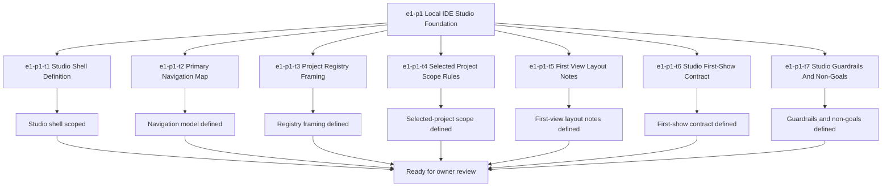

# E1-P1 Local IDE Studio Foundation Tasks

Updated: 2026-05-21

Branch: `tasks/e1-p1-local-ide-studio-foundation`

Status: planning-only

This task package is scoped only to `e1-p1 Local IDE Studio Foundation`.
It is generated from the approved build-ready report and does not include `e2-p1` or any later queue items.

## Scope Reminder

- KVDOS is the commercial product.
- KVDF is the governance/tooling layer.
- KVDOS v1 commercial boundary = Local IDE Studio + Local Runtime + Cloud subscription/license control.
- Private code, secrets, customer data, local reports, and local runtime state stay local.
- Cloud commercial control only handles account, subscription, license entitlement, activation, plan access, release access, and update access.

## Generated Tasks

### `e1-p1-t1` Studio Shell Definition

Title:
- Define the KVDOS Studio shell scope and frame

Allowed files:
- `workspaces/apps/kvdos/docs/reports/e1-p1-local-ide-studio-foundation-build-ready-report.md`
- `workspaces/apps/kvdos/docs/roadmap/E1_P1_LOCAL_IDE_STUDIO_FOUNDATION_TASKS.md`
- `workspaces/apps/kvdos/docs/roadmap/KVDOS_VERSION_PLAN.md`
- `workspaces/apps/kvdos/docs/roadmap/KVDOS_EVOLUTION_PLAN.md`
- `workspaces/apps/kvdos/docs/roadmap/KVDOS_EVOLUTION_TASK_PUNCH.md`
- `workspaces/apps/kvdos/docs/roadmap/KVDOS_IMPLEMENTATION_READINESS_QUEUE.md`
- `workspaces/apps/kvdos/docs/roadmap/EVOLUTION_MASTER_PLAN.md`
- `workspaces/apps/kvdos/docs/product/PRODUCT_DEFINITION.md`
- `workspaces/apps/kvdos/docs/product/PRODUCT_STRATEGY.md`
- `workspaces/apps/kvdos/docs/product/MVP_SCOPE.md`

Forbidden files:
- repo-root KVDF core files
- any file outside `workspaces/apps/kvdos/`
- `workspaces/apps/kvdos/src/**`
- `workspaces/apps/kvdos/.kabeeri/tasks.json`
- `workspaces/apps/kvdos/docs/reports/planning-versions-evos-tasks-pipeline.html`

Acceptance criteria:
- The Studio shell scope is described without implying runtime, cloud, or execution work.
- The report keeps KVDOS and KVDF boundary language explicit.
- The shell frame is app-local and pre-implementation.

Validation commands:
- `rg -n "Studio shell|KVDOS|KVDF|commercial boundary|Local IDE Studio" workspaces/apps/kvdos/docs/reports workspaces/apps/kvdos/docs/roadmap workspaces/apps/kvdos/docs/product`
- `git diff --check`

### `e1-p1-t2` Primary Navigation Map

Title:
- Define the primary Studio navigation model

Allowed files:
- `workspaces/apps/kvdos/docs/reports/e1-p1-local-ide-studio-foundation-build-ready-report.md`
- `workspaces/apps/kvdos/docs/roadmap/E1_P1_LOCAL_IDE_STUDIO_FOUNDATION_TASKS.md`

Forbidden files:
- repo-root KVDF core files
- any file outside `workspaces/apps/kvdos/`
- `workspaces/apps/kvdos/src/**`
- `workspaces/apps/kvdos/.kabeeri/tasks.json`

Acceptance criteria:
- The navigation model identifies the core Studio destinations.
- The map stays focused on the first visible app shell.
- The model does not introduce runtime, cloud, or execution behaviors.

Validation commands:
- `rg -n "navigation|Studio|dashboard|projects|reports|approvals" workspaces/apps/kvdos/docs/reports/e1-p1-local-ide-studio-foundation-build-ready-report.md workspaces/apps/kvdos/docs/roadmap/E1_P1_LOCAL_IDE_STUDIO_FOUNDATION_TASKS.md`
- `git diff --check`

### `e1-p1-t3` Project Registry Framing

Title:
- Define the project registry framing for the Studio

Allowed files:
- `workspaces/apps/kvdos/docs/reports/e1-p1-local-ide-studio-foundation-build-ready-report.md`
- `workspaces/apps/kvdos/docs/roadmap/E1_P1_LOCAL_IDE_STUDIO_FOUNDATION_TASKS.md`
- `workspaces/apps/kvdos/docs/product/PRODUCT_DEFINITION.md`

Forbidden files:
- repo-root KVDF core files
- any file outside `workspaces/apps/kvdos/`
- `workspaces/apps/kvdos/src/**`
- `workspaces/apps/kvdos/.kabeeri/tasks.json`

Acceptance criteria:
- The registry framing clearly explains how projects are listed and selected.
- The framing does not imply runtime execution or cloud access.
- The registry remains a Studio-facing concept only.

Validation commands:
- `rg -n "project registry|project list|selected project|workspace|Studio" workspaces/apps/kvdos/docs/reports/e1-p1-local-ide-studio-foundation-build-ready-report.md workspaces/apps/kvdos/docs/product/PRODUCT_DEFINITION.md workspaces/apps/kvdos/docs/roadmap/E1_P1_LOCAL_IDE_STUDIO_FOUNDATION_TASKS.md`
- `git diff --check`

### `e1-p1-t4` Selected Project Scope Rules

Title:
- Define the selected-project scope rules

Allowed files:
- `workspaces/apps/kvdos/docs/reports/e1-p1-local-ide-studio-foundation-build-ready-report.md`
- `workspaces/apps/kvdos/docs/roadmap/E1_P1_LOCAL_IDE_STUDIO_FOUNDATION_TASKS.md`
- `workspaces/apps/kvdos/docs/roadmap/KVDOS_IMPLEMENTATION_READINESS_QUEUE.md`

Forbidden files:
- repo-root KVDF core files
- any file outside `workspaces/apps/kvdos/`
- `workspaces/apps/kvdos/src/**`
- `workspaces/apps/kvdos/.kabeeri/tasks.json`

Acceptance criteria:
- The selected-project scope is explicit and unambiguous.
- The scope stays limited to the active Studio context.
- The rules do not pull in runtime, execution, or cloud license behavior.

Validation commands:
- `rg -n "selected project|current selected project|scope|active project" workspaces/apps/kvdos/docs/reports/e1-p1-local-ide-studio-foundation-build-ready-report.md workspaces/apps/kvdos/docs/roadmap/KVDOS_IMPLEMENTATION_READINESS_QUEUE.md workspaces/apps/kvdos/docs/roadmap/E1_P1_LOCAL_IDE_STUDIO_FOUNDATION_TASKS.md`
- `git diff --check`

### `e1-p1-t5` First View Layout Notes

Title:
- Define the first-view layout notes for Studio landing

Allowed files:
- `workspaces/apps/kvdos/docs/reports/e1-p1-local-ide-studio-foundation-build-ready-report.md`
- `workspaces/apps/kvdos/docs/roadmap/E1_P1_LOCAL_IDE_STUDIO_FOUNDATION_TASKS.md`
- `workspaces/apps/kvdos/docs/reports/planning-versions-evos-tasks-pipeline.html`

Forbidden files:
- repo-root KVDF core files
- any file outside `workspaces/apps/kvdos/`
- `workspaces/apps/kvdos/src/**`
- `workspaces/apps/kvdos/.kabeeri/tasks.json`

Acceptance criteria:
- The first-view layout notes describe what should appear above the fold.
- The layout notes keep the Studio landing calm, technical, and trustworthy.
- The notes remain design guidance, not implementation code.

Validation commands:
- `rg -n "first view|landing|above the fold|layout|Studio" workspaces/apps/kvdos/docs/reports/e1-p1-local-ide-studio-foundation-build-ready-report.md workspaces/apps/kvdos/docs/reports/planning-versions-evos-tasks-pipeline.html workspaces/apps/kvdos/docs/roadmap/E1_P1_LOCAL_IDE_STUDIO_FOUNDATION_TASKS.md`
- `git diff --check`

### `e1-p1-t6` Studio First-Show Contract

Title:
- Define what Studio must show first

Allowed files:
- `workspaces/apps/kvdos/docs/reports/e1-p1-local-ide-studio-foundation-build-ready-report.md`
- `workspaces/apps/kvdos/docs/roadmap/E1_P1_LOCAL_IDE_STUDIO_FOUNDATION_TASKS.md`

Forbidden files:
- repo-root KVDF core files
- any file outside `workspaces/apps/kvdos/`
- `workspaces/apps/kvdos/src/**`
- `workspaces/apps/kvdos/.kabeeri/tasks.json`

Acceptance criteria:
- The report states the first visible Studio elements clearly.
- The contract includes current project visibility and navigation entry points.
- The contract does not reach into runtime, cloud, or task execution.

Validation commands:
- `rg -n "show first|first show|current project|navigation entry|Studio" workspaces/apps/kvdos/docs/reports/e1-p1-local-ide-studio-foundation-build-ready-report.md workspaces/apps/kvdos/docs/roadmap/E1_P1_LOCAL_IDE_STUDIO_FOUNDATION_TASKS.md`
- `git diff --check`

### `e1-p1-t7` Studio Guardrails And Non-Goals

Title:
- Define what Studio must not do yet

Allowed files:
- `workspaces/apps/kvdos/docs/reports/e1-p1-local-ide-studio-foundation-build-ready-report.md`
- `workspaces/apps/kvdos/docs/roadmap/E1_P1_LOCAL_IDE_STUDIO_FOUNDATION_TASKS.md`
- `workspaces/apps/kvdos/docs/roadmap/KVDOS_EVOLUTION_PLAN.md`

Forbidden files:
- repo-root KVDF core files
- any file outside `workspaces/apps/kvdos/`
- `workspaces/apps/kvdos/src/**`
- `workspaces/apps/kvdos/.kabeeri/tasks.json`

Acceptance criteria:
- The guardrails explicitly exclude runtime, cloud, license, execution, and packaging work.
- The guardrails explicitly exclude `e2-p1`.
- The non-goals keep the slice strictly pre-implementation.

Validation commands:
- `rg -n "must not|non-goal|runtime|cloud|license|execution|packaging|e2-p1" workspaces/apps/kvdos/docs/reports/e1-p1-local-ide-studio-foundation-build-ready-report.md workspaces/apps/kvdos/docs/roadmap/KVDOS_EVOLUTION_PLAN.md workspaces/apps/kvdos/docs/roadmap/E1_P1_LOCAL_IDE_STUDIO_FOUNDATION_TASKS.md`
- `git diff --check`

## Visualization



```text
Task flow

e1-p1
  -> t1 Studio Shell Definition
  -> t2 Primary Navigation Map
  -> t3 Project Registry Framing
  -> t4 Selected Project Scope Rules
  -> t5 First View Layout Notes
  -> t6 Studio First-Show Contract
  -> t7 Studio Guardrails And Non-Goals
  -> owner review
```

## Build-Ready Completion Criteria

The `e1-p1` task set is ready to hand off when:

- the Studio shell scope is defined
- the navigation model is defined
- the project registry framing is clear
- the selected-project scope rules are explicit
- the first-view layout notes are written
- the first-show contract is clear
- the guardrails and non-goals keep runtime/cloud/execution work out of the slice
- no repo-root KVDF files were touched
- no `e2-p1` work was started

## PR Title

`e1-p1: local IDE studio foundation readiness and scoped task generation`

## PR Checklist

- [ ] Branch created from the current workspace state
- [ ] Changes stay inside `workspaces/apps/kvdos/`
- [ ] No repo-root KVDF core files modified
- [ ] No `e2-p1` work started
- [ ] No global implementation task queue generated
- [ ] Studio shell scope is explicit
- [ ] Navigation model is explicit
- [ ] Project registry framing is explicit
- [ ] Selected-project scope is explicit
- [ ] First-view layout notes are explicit
- [ ] First-show contract is explicit
- [ ] Guardrails and non-goals are explicit
- [ ] `git diff --check` passes
- [ ] Validation commands are included for each task

## Review Gate

Do not start implementation until this task package is reviewed and approved.
