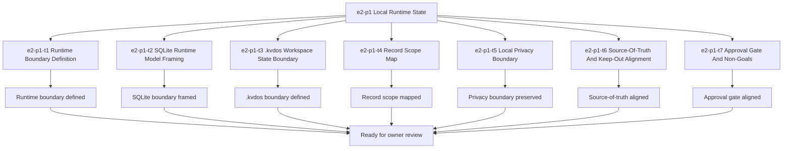

# E2-P1 Local Runtime State Tasks

Updated: 2026-05-21

Branch: `tasks/e2-p1-local-runtime-state`

Status: planning-only

This task package is scoped only to `e2-p1 Local Runtime State`.
It is generated from the approved build-ready report and does not include `e3-p1` or any later queue items.

## Scope Reminder

- KVDOS is the commercial product.
- KVDF is the governance/tooling layer.
- KVDOS v1 commercial boundary = Local IDE Studio + Local Runtime + Cloud subscription/license control.
- Private code, secrets, customer data, local reports, and local runtime state stay local.
- Cloud commercial control only handles account, subscription, license entitlement, activation, plan access, release access, and update access.

## Generated Tasks

### `e2-p1-t1` Runtime Boundary Definition

Title:
- Define the durable local runtime boundary for KVDOS

Allowed files:
- `workspaces/apps/kvdos/docs/reports/e2-p1-local-runtime-state-build-ready-report.md`
- `workspaces/apps/kvdos/docs/roadmap/E2_P1_LOCAL_RUNTIME_STATE_TASKS.md`
- `workspaces/apps/kvdos/docs/roadmap/KVDOS_VERSION_PLAN.md`
- `workspaces/apps/kvdos/docs/roadmap/KVDOS_EVOLUTION_PLAN.md`
- `workspaces/apps/kvdos/docs/roadmap/KVDOS_EVOLUTION_TASK_PUNCH.md`
- `workspaces/apps/kvdos/docs/roadmap/KVDOS_IMPLEMENTATION_READINESS_QUEUE.md`
- `workspaces/apps/kvdos/docs/product/PRODUCT_DEFINITION.md`
- `workspaces/apps/kvdos/docs/product/PRODUCT_STRATEGY.md`
- `workspaces/apps/kvdos/docs/product/MVP_SCOPE.md`
- `workspaces/apps/kvdos/docs/architecture/KVDOS_ARCHITECTURE.md`

Forbidden files:
- repo-root KVDF core files
- any file outside `workspaces/apps/kvdos/`
- `workspaces/apps/kvdos/src/**`
- `workspaces/apps/kvdos/.kabeeri/tasks.json`
- `workspaces/apps/kvdos/docs/reports/planning-versions-evos-tasks-pipeline.html`

Acceptance criteria:
- The local runtime boundary is described clearly and stays durable/resumable in language only.
- The boundary does not imply cloud, execution, or packaging behavior.
- The file list and keep-out scope stay app-local.

Validation commands:
- `rg -n "runtime boundary|SQLite|\\.kvdos|workspace records|project records|task records|report records|approval records|audit records" workspaces/apps/kvdos/docs/reports workspaces/apps/kvdos/docs/roadmap workspaces/apps/kvdos/docs/product workspaces/apps/kvdos/docs/architecture`
- `git diff --check`

### `e2-p1-t2` SQLite Runtime Model Framing

Title:
- Frame the SQLite-backed runtime model without implementation details

Allowed files:
- `workspaces/apps/kvdos/docs/reports/e2-p1-local-runtime-state-build-ready-report.md`
- `workspaces/apps/kvdos/docs/roadmap/E2_P1_LOCAL_RUNTIME_STATE_TASKS.md`
- `workspaces/apps/kvdos/docs/architecture/KVDOS_ARCHITECTURE.md`
- `workspaces/apps/kvdos/docs/product/MVP_SCOPE.md`

Forbidden files:
- repo-root KVDF core files
- any file outside `workspaces/apps/kvdos/`
- `workspaces/apps/kvdos/src/**`
- `workspaces/apps/kvdos/.kabeeri/tasks.json`

Acceptance criteria:
- The SQLite runtime boundary is described as a planning boundary only.
- The document does not turn into schema implementation.
- The runtime model stays local-first and app-local.

Validation commands:
- `rg -n "SQLite|local runtime|runtime model|durable local state|schema" workspaces/apps/kvdos/docs/reports/e2-p1-local-runtime-state-build-ready-report.md workspaces/apps/kvdos/docs/architecture/KVDOS_ARCHITECTURE.md workspaces/apps/kvdos/docs/product/MVP_SCOPE.md workspaces/apps/kvdos/docs/roadmap/E2_P1_LOCAL_RUNTIME_STATE_TASKS.md`
- `git diff --check`

### `e2-p1-t3` `.kvdos` Workspace State Boundary

Title:
- Define the `.kvdos` workspace state boundary

Allowed files:
- `workspaces/apps/kvdos/docs/reports/e2-p1-local-runtime-state-build-ready-report.md`
- `workspaces/apps/kvdos/docs/roadmap/E2_P1_LOCAL_RUNTIME_STATE_TASKS.md`
- `workspaces/apps/kvdos/docs/architecture/KVDOS_ARCHITECTURE.md`

Forbidden files:
- repo-root KVDF core files
- any file outside `workspaces/apps/kvdos/`
- `workspaces/apps/kvdos/src/**`
- `workspaces/apps/kvdos/.kabeeri/tasks.json`

Acceptance criteria:
- The `.kvdos` boundary is explicit and local-first.
- The document treats `.kvdos` as runtime state, not code.
- The boundary does not pull in cloud or execution behavior.

Validation commands:
- `rg -n "\\.kvdos|workspace state|runtime state|local-first" workspaces/apps/kvdos/docs/reports/e2-p1-local-runtime-state-build-ready-report.md workspaces/apps/kvdos/docs/architecture/KVDOS_ARCHITECTURE.md workspaces/apps/kvdos/docs/roadmap/E2_P1_LOCAL_RUNTIME_STATE_TASKS.md`
- `git diff --check`

### `e2-p1-t4` Record Scope Map

Title:
- Map workspace/project/task/report/approval/audit records

Allowed files:
- `workspaces/apps/kvdos/docs/reports/e2-p1-local-runtime-state-build-ready-report.md`
- `workspaces/apps/kvdos/docs/roadmap/E2_P1_LOCAL_RUNTIME_STATE_TASKS.md`
- `workspaces/apps/kvdos/docs/architecture/KVDOS_ARCHITECTURE.md`
- `workspaces/apps/kvdos/docs/product/PRODUCT_DEFINITION.md`

Forbidden files:
- repo-root KVDF core files
- any file outside `workspaces/apps/kvdos/`
- `workspaces/apps/kvdos/src/**`
- `workspaces/apps/kvdos/.kabeeri/tasks.json`

Acceptance criteria:
- The record scope list is explicit.
- The mapping explains why each record type exists in local runtime state.
- The mapping does not imply execution, cloud sync, or packaging.

Validation commands:
- `rg -n "workspace records|project records|task records|report records|approval records|audit records" workspaces/apps/kvdos/docs/reports/e2-p1-local-runtime-state-build-ready-report.md workspaces/apps/kvdos/docs/architecture/KVDOS_ARCHITECTURE.md workspaces/apps/kvdos/docs/product/PRODUCT_DEFINITION.md workspaces/apps/kvdos/docs/roadmap/E2_P1_LOCAL_RUNTIME_STATE_TASKS.md`
- `git diff --check`

### `e2-p1-t5` Local Privacy Boundary

Title:
- Preserve the local privacy boundary for runtime state

Allowed files:
- `workspaces/apps/kvdos/docs/reports/e2-p1-local-runtime-state-build-ready-report.md`
- `workspaces/apps/kvdos/docs/roadmap/E2_P1_LOCAL_RUNTIME_STATE_TASKS.md`
- `workspaces/apps/kvdos/docs/product/PRODUCT_DEFINITION.md`
- `workspaces/apps/kvdos/docs/product/PRODUCT_STRATEGY.md`

Forbidden files:
- repo-root KVDF core files
- any file outside `workspaces/apps/kvdos/`
- `workspaces/apps/kvdos/src/**`
- `workspaces/apps/kvdos/.kabeeri/tasks.json`

Acceptance criteria:
- The report states that private code, secrets, customer data, and sensitive reports stay local.
- The runtime boundary does not invite cloud movement of private runtime data.
- The privacy language is consistent with the KVDOS commercial boundary.

Validation commands:
- `rg -n "private code|secrets|customer data|sensitive reports|local runtime state|stay local" workspaces/apps/kvdos/docs/reports/e2-p1-local-runtime-state-build-ready-report.md workspaces/apps/kvdos/docs/product/PRODUCT_DEFINITION.md workspaces/apps/kvdos/docs/product/PRODUCT_STRATEGY.md workspaces/apps/kvdos/docs/roadmap/E2_P1_LOCAL_RUNTIME_STATE_TASKS.md`
- `git diff --check`

### `e2-p1-t6` Source-Of-Truth And Keep-Out Alignment

Title:
- Align source-of-truth language and keep-out boundaries

Allowed files:
- `workspaces/apps/kvdos/docs/reports/e2-p1-local-runtime-state-build-ready-report.md`
- `workspaces/apps/kvdos/docs/roadmap/E2_P1_LOCAL_RUNTIME_STATE_TASKS.md`
- `workspaces/apps/kvdos/docs/roadmap/KVDOS_IMPLEMENTATION_READINESS_QUEUE.md`

Forbidden files:
- repo-root KVDF core files
- any file outside `workspaces/apps/kvdos/`
- `workspaces/apps/kvdos/src/**`
- `workspaces/apps/kvdos/.kabeeri/tasks.json`

Acceptance criteria:
- The source-of-truth wording points to app-local KVDOS docs.
- The keep-out list excludes runtime implementation, SQLite implementation, cloud, license, execution, and packaging work.
- The alignment stays pre-implementation.

Validation commands:
- `rg -n "Source of truth|keep-out|runtime implementation|SQLite implementation|cloud|license|execution|packaging" workspaces/apps/kvdos/docs/reports/e2-p1-local-runtime-state-build-ready-report.md workspaces/apps/kvdos/docs/roadmap/KVDOS_IMPLEMENTATION_READINESS_QUEUE.md workspaces/apps/kvdos/docs/roadmap/E2_P1_LOCAL_RUNTIME_STATE_TASKS.md`
- `git diff --check`

### `e2-p1-t7` Approval Gate And Non-Goals

Title:
- Align approval gate wording and preserve non-goals

Allowed files:
- `workspaces/apps/kvdos/docs/reports/e2-p1-local-runtime-state-build-ready-report.md`
- `workspaces/apps/kvdos/docs/roadmap/E2_P1_LOCAL_RUNTIME_STATE_TASKS.md`

Forbidden files:
- repo-root KVDF core files
- any file outside `workspaces/apps/kvdos/`
- `workspaces/apps/kvdos/src/**`
- `workspaces/apps/kvdos/.kabeeri/tasks.json`

Acceptance criteria:
- The owner approval checkpoint is clear.
- The report states that scoped implementation tasks may be generated only after approval.
- The non-goals keep runtime implementation, SQLite implementation, cloud/license/execution/packaging, and repo-root KVDF work out of the slice.

Validation commands:
- `rg -n "Owner Approval|approval checkpoint|scoped implementation tasks|runtime implementation|SQLite implementation|cloud|license|execution|packaging" workspaces/apps/kvdos/docs/reports/e2-p1-local-runtime-state-build-ready-report.md workspaces/apps/kvdos/docs/roadmap/E2_P1_LOCAL_RUNTIME_STATE_TASKS.md`
- `git diff --check`

## Visualization



```text
Task flow

e2-p1
  -> t1 Runtime Boundary Definition
  -> t2 SQLite Runtime Model Framing
  -> t3 .kvdos Workspace State Boundary
  -> t4 Record Scope Map
  -> t5 Local Privacy Boundary
  -> t6 Source-Of-Truth And Keep-Out Alignment
  -> t7 Approval Gate And Non-Goals
  -> owner review
```

## Build-Ready Completion Criteria

The `e2-p1` task set is ready to hand off when:

- the runtime boundary is explicit
- the SQLite boundary is explicit
- the `.kvdos` state boundary is explicit
- the record scope map is explicit
- the local privacy boundary is explicit
- the source-of-truth and keep-out scope are explicit
- the approval gate and non-goals are explicit
- no repo-root KVDF files were touched
- no `e3-p1` work was started

## PR Title

`e2-p1: local runtime state readiness and scoped task generation`

## PR Checklist

- [ ] Branch created from the current workspace state
- [ ] Changes stay inside `workspaces/apps/kvdos/`
- [ ] No repo-root KVDF core files modified
- [ ] No `e3-p1` work started
- [ ] No runtime code added
- [ ] No SQLite implementation added
- [ ] No cloud, license, execution runner, packaging, or KVDF-core work added
- [ ] Runtime boundary is explicit
- [ ] SQLite boundary is explicit
- [ ] `.kvdos` boundary is explicit
- [ ] Record scope is explicit
- [ ] Local privacy boundary is explicit
- [ ] Source-of-truth and keep-out alignment is explicit
- [ ] Approval gate and non-goals are explicit
- [ ] `git diff --check` passes
- [ ] Validation commands are included for each task

## Review Gate

Do not start implementation until this task list is reviewed and approved.
