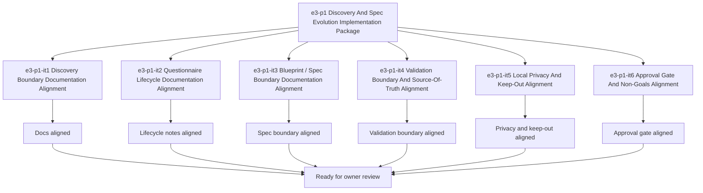

# E3-P1 Discovery And Spec Evolution Implementation Tasks

Updated: 2026-05-21

Branch: `tasks/e3-p1-discovery-and-spec-evolution-implementation`

Status: planning-only

This task package is scoped only to `e3-p1 Discovery And Spec Evolution` execution-prep work.
It remains documentation/spec-boundary implementation planning only and does not include
questionnaire UI, blueprint/spec generator code, or `app.kvdos.yaml` generation logic.

## Scope Reminder

- KVDOS is the commercial product.
- KVDF is the governance/tooling layer.
- KVDOS v1 commercial boundary = Local IDE Studio + Local Runtime + Cloud subscription/license control.
- Private code, secrets, customer data, local reports, and local runtime state stay local.
- Cloud commercial control only handles account, subscription, license entitlement, activation, plan access, release access, and update access.

## Generated Tasks

### `e3-p1-it1` Discovery Boundary Documentation Alignment

Title:
- Align the discovery boundary wording across app-local KVDOS docs

Allowed files:
- `workspaces/apps/kvdos/docs/reports/e3-p1-discovery-and-spec-evolution-build-ready-report.md`
- `workspaces/apps/kvdos/docs/reports/e3-p1-discovery-and-spec-evolution-execution-report.md`
- `workspaces/apps/kvdos/docs/roadmap/E3_P1_DISCOVERY_AND_SPEC_EVOLUTION_TASKS.md`
- `workspaces/apps/kvdos/docs/roadmap/E3_P1_DISCOVERY_AND_SPEC_EVOLUTION_IMPLEMENTATION_TASKS.md`
- `workspaces/apps/kvdos/docs/roadmap/KVDOS_EVOLUTION_PLAN.md`
- `workspaces/apps/kvdos/docs/roadmap/KVDOS_IMPLEMENTATION_READINESS_QUEUE.md`
- `workspaces/apps/kvdos/docs/product/PRODUCT_DEFINITION.md`
- `workspaces/apps/kvdos/docs/product/PRODUCT_STRATEGY.md`

Forbidden files:
- repo-root KVDF core files
- any file outside `workspaces/apps/kvdos/`
- `workspaces/apps/kvdos/src/**`
- `workspaces/apps/kvdos/.kabeeri/tasks.json`
- `workspaces/apps/kvdos/app.kvdos.yaml`

Acceptance criteria:
- Discovery boundary wording is consistent across the app-local docs.
- The wording stays docs-only and does not imply questionnaire UI code.
- The boundary remains pre-implementation and app-local.

Validation commands:
- `rg -n "discovery boundary|questionnaire|spec boundary|KVDOS|KVDF" workspaces/apps/kvdos/docs/reports workspaces/apps/kvdos/docs/roadmap workspaces/apps/kvdos/docs/product`
- `git diff --check`

### `e3-p1-it2` Questionnaire Lifecycle Documentation Alignment

Title:
- Align questionnaire lifecycle notes without building questionnaire UI

Allowed files:
- `workspaces/apps/kvdos/docs/reports/e3-p1-discovery-and-spec-evolution-build-ready-report.md`
- `workspaces/apps/kvdos/docs/reports/e3-p1-discovery-and-spec-evolution-execution-report.md`
- `workspaces/apps/kvdos/docs/roadmap/E3_P1_DISCOVERY_AND_SPEC_EVOLUTION_TASKS.md`
- `workspaces/apps/kvdos/docs/roadmap/E3_P1_DISCOVERY_AND_SPEC_EVOLUTION_IMPLEMENTATION_TASKS.md`
- `workspaces/apps/kvdos/docs/product/PRODUCT_DEFINITION.md`
- `workspaces/apps/kvdos/docs/product/MVP_SCOPE.md`

Forbidden files:
- repo-root KVDF core files
- any file outside `workspaces/apps/kvdos/`
- `workspaces/apps/kvdos/src/**`
- `workspaces/apps/kvdos/.kabeeri/tasks.json`
- `workspaces/apps/kvdos/app.kvdos.yaml`

Acceptance criteria:
- The questionnaire lifecycle is described as discovery documentation only.
- The wording does not introduce UI, runtime, or generator behavior.
- The flow stays anchored to app-local product docs.

Validation commands:
- `rg -n "questionnaire|lifecycle|discovery|answers|capture" workspaces/apps/kvdos/docs/reports workspaces/apps/kvdos/docs/roadmap workspaces/apps/kvdos/docs/product`
- `git diff --check`

### `e3-p1-it3` Blueprint / Spec Boundary Documentation Alignment

Title:
- Align the blueprint/spec boundary without building generator code

Allowed files:
- `workspaces/apps/kvdos/docs/reports/e3-p1-discovery-and-spec-evolution-build-ready-report.md`
- `workspaces/apps/kvdos/docs/reports/e3-p1-discovery-and-spec-evolution-execution-report.md`
- `workspaces/apps/kvdos/docs/roadmap/E3_P1_DISCOVERY_AND_SPEC_EVOLUTION_TASKS.md`
- `workspaces/apps/kvdos/docs/roadmap/E3_P1_DISCOVERY_AND_SPEC_EVOLUTION_IMPLEMENTATION_TASKS.md`
- `workspaces/apps/kvdos/docs/product/PRODUCT_DEFINITION.md`
- `workspaces/apps/kvdos/docs/product/PRODUCT_STRATEGY.md`
- `workspaces/apps/kvdos/docs/architecture/KVDOS_ARCHITECTURE.md`

Forbidden files:
- repo-root KVDF core files
- any file outside `workspaces/apps/kvdos/`
- `workspaces/apps/kvdos/src/**`
- `workspaces/apps/kvdos/.kabeeri/tasks.json`
- `workspaces/apps/kvdos/app.kvdos.yaml`

Acceptance criteria:
- The blueprint/spec boundary remains documentation-only.
- `app.kvdos.yaml` is treated as a specification reference, not a generation target.
- No blueprint generator implementation is implied.

Validation commands:
- `rg -n "blueprint|spec|generation|product specification|app.kvdos.yaml" workspaces/apps/kvdos/docs/reports workspaces/apps/kvdos/docs/roadmap workspaces/apps/kvdos/docs/product workspaces/apps/kvdos/docs/architecture`
- `git diff --check`

### `e3-p1-it4` Validation Boundary And Source-Of-Truth Alignment

Title:
- Align validation boundaries and source-of-truth wording

Allowed files:
- `workspaces/apps/kvdos/docs/reports/e3-p1-discovery-and-spec-evolution-build-ready-report.md`
- `workspaces/apps/kvdos/docs/reports/e3-p1-discovery-and-spec-evolution-execution-report.md`
- `workspaces/apps/kvdos/docs/roadmap/E3_P1_DISCOVERY_AND_SPEC_EVOLUTION_TASKS.md`
- `workspaces/apps/kvdos/docs/roadmap/E3_P1_DISCOVERY_AND_SPEC_EVOLUTION_IMPLEMENTATION_TASKS.md`
- `workspaces/apps/kvdos/docs/roadmap/KVDOS_IMPLEMENTATION_READINESS_QUEUE.md`
- `workspaces/apps/kvdos/docs/architecture/KVDOS_ARCHITECTURE.md`

Forbidden files:
- repo-root KVDF core files
- any file outside `workspaces/apps/kvdos/`
- `workspaces/apps/kvdos/src/**`
- `workspaces/apps/kvdos/.kabeeri/tasks.json`
- `workspaces/apps/kvdos/app.kvdos.yaml`

Acceptance criteria:
- The validation boundary keeps `app.kvdos.yaml` as the product source of truth reference.
- The source-of-truth language stays app-local and pre-implementation.
- The validation wording does not imply generation logic changes.

Validation commands:
- `rg -n "validation|source of truth|app.kvdos.yaml|keep-out|boundary" workspaces/apps/kvdos/docs/reports workspaces/apps/kvdos/docs/roadmap workspaces/apps/kvdos/docs/architecture`
- `git diff --check`

### `e3-p1-it5` Local Privacy And Keep-Out Alignment

Title:
- Preserve local privacy and keep-out boundaries for discovery/spec planning

Allowed files:
- `workspaces/apps/kvdos/docs/reports/e3-p1-discovery-and-spec-evolution-build-ready-report.md`
- `workspaces/apps/kvdos/docs/reports/e3-p1-discovery-and-spec-evolution-execution-report.md`
- `workspaces/apps/kvdos/docs/roadmap/E3_P1_DISCOVERY_AND_SPEC_EVOLUTION_TASKS.md`
- `workspaces/apps/kvdos/docs/roadmap/E3_P1_DISCOVERY_AND_SPEC_EVOLUTION_IMPLEMENTATION_TASKS.md`
- `workspaces/apps/kvdos/docs/product/PRODUCT_DEFINITION.md`
- `workspaces/apps/kvdos/docs/product/PRODUCT_STRATEGY.md`

Forbidden files:
- repo-root KVDF core files
- any file outside `workspaces/apps/kvdos/`
- `workspaces/apps/kvdos/src/**`
- `workspaces/apps/kvdos/.kabeeri/tasks.json`
- `workspaces/apps/kvdos/app.kvdos.yaml`

Acceptance criteria:
- Private code, secrets, customer data, local reports, and local runtime state remain local in the wording.
- The keep-out list excludes runtime, SQLite, cloud, license, execution, and packaging work.
- The privacy framing stays consistent with the commercial boundary.

Validation commands:
- `rg -n "private code|secrets|customer data|local reports|local runtime state|keep-out|cloud|license|execution|packaging" workspaces/apps/kvdos/docs/reports workspaces/apps/kvdos/docs/roadmap workspaces/apps/kvdos/docs/product`
- `git diff --check`

### `e3-p1-it6` Approval Gate And Non-Goals Alignment

Title:
- Align the approval gate and preserve non-goals for e3-p1

Allowed files:
- `workspaces/apps/kvdos/docs/reports/e3-p1-discovery-and-spec-evolution-build-ready-report.md`
- `workspaces/apps/kvdos/docs/reports/e3-p1-discovery-and-spec-evolution-execution-report.md`
- `workspaces/apps/kvdos/docs/roadmap/E3_P1_DISCOVERY_AND_SPEC_EVOLUTION_TASKS.md`
- `workspaces/apps/kvdos/docs/roadmap/E3_P1_DISCOVERY_AND_SPEC_EVOLUTION_IMPLEMENTATION_TASKS.md`

Forbidden files:
- repo-root KVDF core files
- any file outside `workspaces/apps/kvdos/`
- `workspaces/apps/kvdos/src/**`
- `workspaces/apps/kvdos/.kabeeri/tasks.json`
- `workspaces/apps/kvdos/app.kvdos.yaml`

Acceptance criteria:
- The owner approval checkpoint is clear.
- The package states that actual UI/generator/code work is not part of this step.
- The non-goals keep `e4-p1` and implementation code out of scope.

Validation commands:
- `rg -n "Owner Approval|approval checkpoint|non-goals|e4-p1|implementation code|questionnaire UI|generator" workspaces/apps/kvdos/docs/reports workspaces/apps/kvdos/docs/roadmap`
- `git diff --check`

## Visualization



```text
Task flow

e3-p1 implementation package
  -> it1 Discovery Boundary Documentation Alignment
  -> it2 Questionnaire Lifecycle Documentation Alignment
  -> it3 Blueprint / Spec Boundary Documentation Alignment
  -> it4 Validation Boundary And Source-Of-Truth Alignment
  -> it5 Local Privacy And Keep-Out Alignment
  -> it6 Approval Gate And Non-Goals Alignment
  -> owner review
```

## Build-Ready Completion Criteria

The `e3-p1` scoped implementation package is ready for handoff when:

- discovery/spec docs are aligned
- questionnaire lifecycle notes are aligned
- blueprint/spec boundary notes are aligned
- validation boundary and source-of-truth notes are aligned
- local privacy and keep-out wording are aligned
- approval gate and non-goals are aligned
- no repo-root KVDF files were touched
- no `e4-p1` work was started
- no questionnaire UI, blueprint generator code, or `app.kvdos.yaml` generation logic was added

## PR Title

`e3-p1: discovery and spec evolution implementation package`

## PR Checklist

- [ ] Branch created from the current workspace state
- [ ] Changes stay inside `workspaces/apps/kvdos/`
- [ ] No repo-root KVDF core files modified
- [ ] No `e4-p1` work started
- [ ] No questionnaire UI added
- [ ] No blueprint/spec generator code added
- [ ] No `app.kvdos.yaml` generation logic modified
- [ ] Discovery boundary is explicit
- [ ] Questionnaire lifecycle boundary is explicit
- [ ] Blueprint/spec boundary is explicit
- [ ] Validation boundary and source-of-truth are explicit
- [ ] Local privacy and keep-out alignment are explicit
- [ ] Approval gate and non-goals are explicit
- [ ] `git diff --check` passes
- [ ] `.vscode/settings.json` remains untouched
