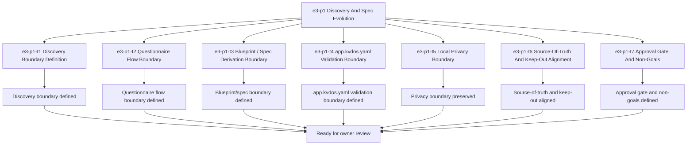

# E3-P1 Discovery And Spec Evolution Tasks

Updated: 2026-05-21

Branch: `tasks/e3-p1-discovery-and-spec-evolution`

Status: planning-only

This task package is scoped only to `e3-p1 Discovery And Spec Evolution`.
It is generated from the approved build-ready report and does not include `e4-p1` or any later queue items.

## Scope Reminder

- KVDOS is the commercial product.
- KVDF is the governance/tooling layer.
- KVDOS v1 commercial boundary = Local IDE Studio + Local Runtime + Cloud subscription/license control.
- Private code, secrets, customer data, local reports, and local runtime state stay local.
- Cloud commercial control only handles account, subscription, license entitlement, activation, plan access, release access, and update access.

## Generated Tasks

### `e3-p1-t1` Discovery Boundary Definition

Title:
- Define the discovery/spec boundary for KVDOS

Allowed files:
- `workspaces/apps/kvdos/docs/reports/e3-p1-discovery-and-spec-evolution-build-ready-report.md`
- `workspaces/apps/kvdos/docs/roadmap/E3_P1_DISCOVERY_AND_SPEC_EVOLUTION_TASKS.md`
- `workspaces/apps/kvdos/docs/roadmap/KVDOS_VERSION_PLAN.md`
- `workspaces/apps/kvdos/docs/roadmap/KVDOS_EVOLUTION_PLAN.md`
- `workspaces/apps/kvdos/docs/roadmap/KVDOS_EVOLUTION_TASK_PUNCH.md`
- `workspaces/apps/kvdos/docs/roadmap/KVDOS_IMPLEMENTATION_READINESS_QUEUE.md`
- `workspaces/apps/kvdos/docs/roadmap/EVOLUTION_MASTER_PLAN.md`
- `workspaces/apps/kvdos/docs/product/PRODUCT_DEFINITION.md`
- `workspaces/apps/kvdos/docs/product/PRODUCT_STRATEGY.md`
- `workspaces/apps/kvdos/docs/product/MVP_SCOPE.md`
- `workspaces/apps/kvdos/docs/architecture/KVDOS_ARCHITECTURE.md`
- `workspaces/apps/kvdos/app.kvdos.yaml`

Forbidden files:
- repo-root KVDF core files
- any file outside `workspaces/apps/kvdos/`
- `workspaces/apps/kvdos/src/**`
- `workspaces/apps/kvdos/.kabeeri/tasks.json`
- `workspaces/apps/kvdos/docs/reports/planning-versions-evos-tasks-pipeline.html`

Acceptance criteria:
- The discovery/spec boundary is explicit and app-local.
- The boundary clearly stops before task execution or implementation.
- The wording stays aligned with KVDOS as the commercial product and KVDF as the governance layer.

Validation commands:
- `rg -n "discovery|spec|questionnaire|blueprint|app.kvdos.yaml|KVDOS|KVDF" workspaces/apps/kvdos/docs/reports workspaces/apps/kvdos/docs/roadmap workspaces/apps/kvdos/docs/product workspaces/apps/kvdos/docs/architecture workspaces/apps/kvdos/app.kvdos.yaml`
- `git diff --check`

### `e3-p1-t2` Questionnaire Flow Boundary

Title:
- Define the questionnaire flow boundary and lifecycle notes

Allowed files:
- `workspaces/apps/kvdos/docs/reports/e3-p1-discovery-and-spec-evolution-build-ready-report.md`
- `workspaces/apps/kvdos/docs/roadmap/E3_P1_DISCOVERY_AND_SPEC_EVOLUTION_TASKS.md`
- `workspaces/apps/kvdos/app.kvdos.yaml`
- `workspaces/apps/kvdos/docs/product/PRODUCT_DEFINITION.md`

Forbidden files:
- repo-root KVDF core files
- any file outside `workspaces/apps/kvdos/`
- `workspaces/apps/kvdos/src/**`
- `workspaces/apps/kvdos/.kabeeri/tasks.json`

Acceptance criteria:
- The questionnaire flow is described as a discovery boundary only.
- The lifecycle notes do not imply execution, runtime mutation, or cloud sync.
- The flow stays focused on capturing and organizing discovery answers.

Validation commands:
- `rg -n "questionnaire|discovery flow|lifecycle|capture|answers" workspaces/apps/kvdos/docs/reports/e3-p1-discovery-and-spec-evolution-build-ready-report.md workspaces/apps/kvdos/app.kvdos.yaml workspaces/apps/kvdos/docs/product/PRODUCT_DEFINITION.md workspaces/apps/kvdos/docs/roadmap/E3_P1_DISCOVERY_AND_SPEC_EVOLUTION_TASKS.md`
- `git diff --check`

### `e3-p1-t3` Blueprint / Spec Derivation Boundary

Title:
- Define the blueprint and spec derivation boundary

Allowed files:
- `workspaces/apps/kvdos/docs/reports/e3-p1-discovery-and-spec-evolution-build-ready-report.md`
- `workspaces/apps/kvdos/docs/roadmap/E3_P1_DISCOVERY_AND_SPEC_EVOLUTION_TASKS.md`
- `workspaces/apps/kvdos/docs/product/PRODUCT_DEFINITION.md`
- `workspaces/apps/kvdos/docs/product/PRODUCT_STRATEGY.md`

Forbidden files:
- repo-root KVDF core files
- any file outside `workspaces/apps/kvdos/`
- `workspaces/apps/kvdos/src/**`
- `workspaces/apps/kvdos/.kabeeri/tasks.json`

Acceptance criteria:
- The blueprint/spec derivation boundary is explicit.
- The wording keeps `app.kvdos.yaml` as the main product specification reference.
- The boundary stays pre-implementation and does not become code-generation guidance.

Validation commands:
- `rg -n "blueprint|spec derivation|product specification|app.kvdos.yaml|grounded spec" workspaces/apps/kvdos/docs/reports/e3-p1-discovery-and-spec-evolution-build-ready-report.md workspaces/apps/kvdos/docs/product/PRODUCT_DEFINITION.md workspaces/apps/kvdos/docs/product/PRODUCT_STRATEGY.md workspaces/apps/kvdos/docs/roadmap/E3_P1_DISCOVERY_AND_SPEC_EVOLUTION_TASKS.md`
- `git diff --check`

### `e3-p1-t4` app.kvdos.yaml Validation Boundary

Title:
- Define the `app.kvdos.yaml` validation boundary

Allowed files:
- `workspaces/apps/kvdos/docs/reports/e3-p1-discovery-and-spec-evolution-build-ready-report.md`
- `workspaces/apps/kvdos/docs/roadmap/E3_P1_DISCOVERY_AND_SPEC_EVOLUTION_TASKS.md`
- `workspaces/apps/kvdos/app.kvdos.yaml`
- `workspaces/apps/kvdos/docs/architecture/KVDOS_ARCHITECTURE.md`

Forbidden files:
- repo-root KVDF core files
- any file outside `workspaces/apps/kvdos/`
- `workspaces/apps/kvdos/src/**`
- `workspaces/apps/kvdos/.kabeeri/tasks.json`

Acceptance criteria:
- The validation boundary clearly states that `app.kvdos.yaml` is the product source of truth for the slice.
- The wording distinguishes validation from implementation.
- The boundary remains app-local and reviewable before tasks are executed.

Validation commands:
- `rg -n "app.kvdos.yaml|validation|source of truth|product specification|KVDOS" workspaces/apps/kvdos/docs/reports/e3-p1-discovery-and-spec-evolution-build-ready-report.md workspaces/apps/kvdos/app.kvdos.yaml workspaces/apps/kvdos/docs/architecture/KVDOS_ARCHITECTURE.md workspaces/apps/kvdos/docs/roadmap/E3_P1_DISCOVERY_AND_SPEC_EVOLUTION_TASKS.md`
- `git diff --check`

### `e3-p1-t5` Local Privacy Boundary

Title:
- Preserve the local privacy boundary for discovery and spec work

Allowed files:
- `workspaces/apps/kvdos/docs/reports/e3-p1-discovery-and-spec-evolution-build-ready-report.md`
- `workspaces/apps/kvdos/docs/roadmap/E3_P1_DISCOVERY_AND_SPEC_EVOLUTION_TASKS.md`
- `workspaces/apps/kvdos/docs/product/PRODUCT_DEFINITION.md`
- `workspaces/apps/kvdos/docs/product/PRODUCT_STRATEGY.md`

Forbidden files:
- repo-root KVDF core files
- any file outside `workspaces/apps/kvdos/`
- `workspaces/apps/kvdos/src/**`
- `workspaces/apps/kvdos/.kabeeri/tasks.json`

Acceptance criteria:
- The report states that private code, secrets, customer data, local reports, and local runtime state stay local.
- The privacy boundary does not invite cloud movement of protected content.
- The privacy wording is consistent with the commercial boundary.

Validation commands:
- `rg -n "private code|secrets|customer data|local reports|local runtime state|stay local" workspaces/apps/kvdos/docs/reports/e3-p1-discovery-and-spec-evolution-build-ready-report.md workspaces/apps/kvdos/docs/product/PRODUCT_DEFINITION.md workspaces/apps/kvdos/docs/product/PRODUCT_STRATEGY.md workspaces/apps/kvdos/docs/roadmap/E3_P1_DISCOVERY_AND_SPEC_EVOLUTION_TASKS.md`
- `git diff --check`

### `e3-p1-t6` Source-Of-Truth And Keep-Out Alignment

Title:
- Align source-of-truth language and keep-out boundaries

Allowed files:
- `workspaces/apps/kvdos/docs/reports/e3-p1-discovery-and-spec-evolution-build-ready-report.md`
- `workspaces/apps/kvdos/docs/roadmap/E3_P1_DISCOVERY_AND_SPEC_EVOLUTION_TASKS.md`
- `workspaces/apps/kvdos/docs/roadmap/KVDOS_IMPLEMENTATION_READINESS_QUEUE.md`

Forbidden files:
- repo-root KVDF core files
- any file outside `workspaces/apps/kvdos/`
- `workspaces/apps/kvdos/src/**`
- `workspaces/apps/kvdos/.kabeeri/tasks.json`

Acceptance criteria:
- The source-of-truth wording points to app-local KVDOS docs.
- The keep-out list excludes runtime implementation, SQLite implementation, cloud, license, execution, and packaging work.
- The alignment stays pre-implementation.

Validation commands:
- `rg -n "Source of truth|keep-out|runtime implementation|SQLite implementation|cloud|license|execution|packaging" workspaces/apps/kvdos/docs/reports/e3-p1-discovery-and-spec-evolution-build-ready-report.md workspaces/apps/kvdos/docs/roadmap/KVDOS_IMPLEMENTATION_READINESS_QUEUE.md workspaces/apps/kvdos/docs/roadmap/E3_P1_DISCOVERY_AND_SPEC_EVOLUTION_TASKS.md`
- `git diff --check`

### `e3-p1-t7` Approval Gate And Non-Goals

Title:
- Align the approval gate wording and preserve non-goals

Allowed files:
- `workspaces/apps/kvdos/docs/reports/e3-p1-discovery-and-spec-evolution-build-ready-report.md`
- `workspaces/apps/kvdos/docs/roadmap/E3_P1_DISCOVERY_AND_SPEC_EVOLUTION_TASKS.md`

Forbidden files:
- repo-root KVDF core files
- any file outside `workspaces/apps/kvdos/`
- `workspaces/apps/kvdos/src/**`
- `workspaces/apps/kvdos/.kabeeri/tasks.json`

Acceptance criteria:
- The owner approval checkpoint is clear.
- The report states that scoped implementation tasks may be generated only after approval.
- The non-goals keep tasks, implementation, runtime, SQLite, cloud/license, execution, packaging, and repo-root KVDF work out of the slice.

Validation commands:
- `rg -n "Owner Approval|approval checkpoint|scoped implementation tasks|tasks|implementation|runtime|SQLite|cloud|license|execution|packaging" workspaces/apps/kvdos/docs/reports/e3-p1-discovery-and-spec-evolution-build-ready-report.md workspaces/apps/kvdos/docs/roadmap/E3_P1_DISCOVERY_AND_SPEC_EVOLUTION_TASKS.md`
- `git diff --check`

## Visualization



```text
Task flow

e3-p1
  -> t1 Discovery Boundary Definition
  -> t2 Questionnaire Flow Boundary
  -> t3 Blueprint / Spec Derivation Boundary
  -> t4 app.kvdos.yaml Validation Boundary
  -> t5 Local Privacy Boundary
  -> t6 Source-Of-Truth And Keep-Out Alignment
  -> t7 Approval Gate And Non-Goals
  -> owner review
```

## Build-Ready Completion Criteria

The `e3-p1` task set is ready to hand off when:

- the discovery/spec boundary is explicit
- the questionnaire flow boundary is explicit
- the blueprint/spec derivation boundary is explicit
- the `app.kvdos.yaml` validation boundary is explicit
- the local privacy boundary is explicit
- the source-of-truth and keep-out scope are explicit
- the approval gate and non-goals are explicit
- no repo-root KVDF files were touched
- no `e4-p1` work was started

## PR Title

`e3-p1: discovery and spec evolution readiness`

## PR Checklist

- [ ] Branch created from the current workspace state
- [ ] Changes stay inside `workspaces/apps/kvdos/`
- [ ] No repo-root KVDF core files modified
- [ ] No `e4-p1` work started
- [ ] No implementation code added
- [ ] No runtime, SQLite, cloud, license, execution, or packaging work added
- [ ] Discovery boundary is explicit
- [ ] Questionnaire flow boundary is explicit
- [ ] Blueprint/spec derivation boundary is explicit
- [ ] `app.kvdos.yaml` validation boundary is explicit
- [ ] Local privacy boundary is explicit
- [ ] Source-of-truth and keep-out alignment is explicit
- [ ] Approval gate and non-goals are explicit
- [ ] `git diff --check` passes
