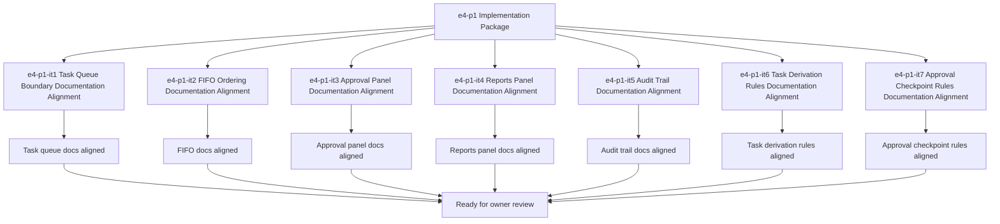

# E4-P1 Tasking And Approval Evolution Implementation Tasks

Updated: 2026-05-22

Branch: `tasks/e4-p1-tasking-and-approval-evolution-implementation`

Status: planning-only

This task package is scoped only to `e4-p1 Tasking And Approval Evolution` execution-prep work.
It remains documentation/spec-boundary implementation planning only and does not include
task queue behavior, approval UI, reports UI, or execution code.

## Scope Reminder

- KVDOS is the commercial product.
- KVDF is the governance/tooling layer.
- KVDOS v1 commercial boundary = Local IDE Studio + Local Runtime + Cloud subscription/license control.
- Private code, secrets, customer data, local reports, and local runtime state stay local.
- Cloud commercial control only handles account, subscription, license entitlement, activation, plan access, release access, and update access.

## Generated Tasks

### `e4-p1-it1` Task Queue Boundary Documentation Alignment

Title:
- Align the governed task queue boundary across app-local KVDOS docs

Allowed files:
- `workspaces/apps/kvdos/docs/reports/e4-p1-tasking-and-approval-evolution-build-ready-report.md`
- `workspaces/apps/kvdos/docs/reports/e4-p1-tasking-and-approval-evolution-execution-report.md`
- `workspaces/apps/kvdos/docs/roadmap/E4_P1_TASKING_AND_APPROVAL_EVOLUTION_TASKS.md`
- `workspaces/apps/kvdos/docs/roadmap/E4_P1_TASKING_AND_APPROVAL_EVOLUTION_IMPLEMENTATION_TASKS.md`
- `workspaces/apps/kvdos/docs/roadmap/KVDOS_EVOLUTION_PLAN.md`
- `workspaces/apps/kvdos/docs/roadmap/KVDOS_IMPLEMENTATION_READINESS_QUEUE.md`
- `workspaces/apps/kvdos/docs/product/PRODUCT_DEFINITION.md`
- `workspaces/apps/kvdos/docs/product/PRODUCT_STRATEGY.md`

Forbidden files:
- repo-root KVDF core files
- any file outside `workspaces/apps/kvdos/`
- `workspaces/apps/kvdos/src/**`
- `workspaces/apps/kvdos/.kabeeri/tasks.json`
- `workspaces/apps/kvdos/app.kvdos.yaml`

Acceptance criteria:
- Task queue boundary wording is consistent across app-local docs.
- The wording stays docs-only and does not imply queue execution code.
- The boundary remains pre-implementation and app-local.

Validation commands:
- `rg -n "task queue|governed task|FIFO|approval panel|reports panel|audit trail|KVDOS|KVDF" workspaces/apps/kvdos/docs/reports workspaces/apps/kvdos/docs/roadmap workspaces/apps/kvdos/docs/product`
- `git diff --check`

### `e4-p1-it2` FIFO Ordering Documentation Alignment

Title:
- Align FIFO ordering notes without building queue worker logic

Allowed files:
- `workspaces/apps/kvdos/docs/reports/e4-p1-tasking-and-approval-evolution-build-ready-report.md`
- `workspaces/apps/kvdos/docs/reports/e4-p1-tasking-and-approval-evolution-execution-report.md`
- `workspaces/apps/kvdos/docs/roadmap/E4_P1_TASKING_AND_APPROVAL_EVOLUTION_TASKS.md`
- `workspaces/apps/kvdos/docs/roadmap/E4_P1_TASKING_AND_APPROVAL_EVOLUTION_IMPLEMENTATION_TASKS.md`
- `workspaces/apps/kvdos/docs/roadmap/KVDOS_IMPLEMENTATION_READINESS_QUEUE.md`

Forbidden files:
- repo-root KVDF core files
- any file outside `workspaces/apps/kvdos/`
- `workspaces/apps/kvdos/src/**`
- `workspaces/apps/kvdos/.kabeeri/tasks.json`
- `workspaces/apps/kvdos/app.kvdos.yaml`

Acceptance criteria:
- FIFO ordering remains a planning boundary only.
- The wording does not imply queue worker implementation.
- The ordering notes stay app-local and reviewable.

Validation commands:
- `rg -n "FIFO|ordering|queue|task layer|tasking" workspaces/apps/kvdos/docs/reports workspaces/apps/kvdos/docs/roadmap`
- `git diff --check`

### `e4-p1-it3` Approval Panel Documentation Alignment

Title:
- Align approval panel notes without building approval UI

Allowed files:
- `workspaces/apps/kvdos/docs/reports/e4-p1-tasking-and-approval-evolution-build-ready-report.md`
- `workspaces/apps/kvdos/docs/reports/e4-p1-tasking-and-approval-evolution-execution-report.md`
- `workspaces/apps/kvdos/docs/roadmap/E4_P1_TASKING_AND_APPROVAL_EVOLUTION_TASKS.md`
- `workspaces/apps/kvdos/docs/roadmap/E4_P1_TASKING_AND_APPROVAL_EVOLUTION_IMPLEMENTATION_TASKS.md`
- `workspaces/apps/kvdos/docs/product/PRODUCT_DEFINITION.md`

Forbidden files:
- repo-root KVDF core files
- any file outside `workspaces/apps/kvdos/`
- `workspaces/apps/kvdos/src/**`
- `workspaces/apps/kvdos/.kabeeri/tasks.json`
- `workspaces/apps/kvdos/app.kvdos.yaml`

Acceptance criteria:
- Approval panel wording is explicit and app-local.
- The wording keeps approval as a governed review concept.
- The panel notes do not imply UI implementation.

Validation commands:
- `rg -n "approval panel|approval|review|governed|task" workspaces/apps/kvdos/docs/reports workspaces/apps/kvdos/docs/roadmap workspaces/apps/kvdos/docs/product`
- `git diff --check`

### `e4-p1-it4` Reports Panel Documentation Alignment

Title:
- Align reports panel notes without building reports UI

Allowed files:
- `workspaces/apps/kvdos/docs/reports/e4-p1-tasking-and-approval-evolution-build-ready-report.md`
- `workspaces/apps/kvdos/docs/reports/e4-p1-tasking-and-approval-evolution-execution-report.md`
- `workspaces/apps/kvdos/docs/roadmap/E4_P1_TASKING_AND_APPROVAL_EVOLUTION_TASKS.md`
- `workspaces/apps/kvdos/docs/roadmap/E4_P1_TASKING_AND_APPROVAL_EVOLUTION_IMPLEMENTATION_TASKS.md`
- `workspaces/apps/kvdos/docs/product/PRODUCT_STRATEGY.md`

Forbidden files:
- repo-root KVDF core files
- any file outside `workspaces/apps/kvdos/`
- `workspaces/apps/kvdos/src/**`
- `workspaces/apps/kvdos/.kabeeri/tasks.json`
- `workspaces/apps/kvdos/app.kvdos.yaml`

Acceptance criteria:
- Reports panel wording is explicit and app-local.
- The wording keeps reports as review/governance surfaces.
- The panel notes do not imply runtime or execution behavior.

Validation commands:
- `rg -n "reports panel|reports|review|governance|task" workspaces/apps/kvdos/docs/reports workspaces/apps/kvdos/docs/roadmap workspaces/apps/kvdos/docs/product`
- `git diff --check`

### `e4-p1-it5` Audit Trail Documentation Alignment

Title:
- Align audit trail notes as a documentation/governance surface

Allowed files:
- `workspaces/apps/kvdos/docs/reports/e4-p1-tasking-and-approval-evolution-build-ready-report.md`
- `workspaces/apps/kvdos/docs/reports/e4-p1-tasking-and-approval-evolution-execution-report.md`
- `workspaces/apps/kvdos/docs/roadmap/E4_P1_TASKING_AND_APPROVAL_EVOLUTION_TASKS.md`
- `workspaces/apps/kvdos/docs/roadmap/E4_P1_TASKING_AND_APPROVAL_EVOLUTION_IMPLEMENTATION_TASKS.md`
- `workspaces/apps/kvdos/docs/architecture/KVDOS_ARCHITECTURE.md`

Forbidden files:
- repo-root KVDF core files
- any file outside `workspaces/apps/kvdos/`
- `workspaces/apps/kvdos/src/**`
- `workspaces/apps/kvdos/.kabeeri/tasks.json`
- `workspaces/apps/kvdos/app.kvdos.yaml`

Acceptance criteria:
- Audit trail wording is explicit and local-first.
- The wording keeps audit visibility as documentation/governance, not code.
- The boundary stays pre-implementation.

Validation commands:
- `rg -n "audit trail|audit|governance|approval|tasking" workspaces/apps/kvdos/docs/reports workspaces/apps/kvdos/docs/roadmap workspaces/apps/kvdos/docs/architecture`
- `git diff --check`

### `e4-p1-it6` Task Derivation Rules Documentation Alignment

Title:
- Align task derivation rules for approved evolution slices

Allowed files:
- `workspaces/apps/kvdos/docs/reports/e4-p1-tasking-and-approval-evolution-build-ready-report.md`
- `workspaces/apps/kvdos/docs/reports/e4-p1-tasking-and-approval-evolution-execution-report.md`
- `workspaces/apps/kvdos/docs/roadmap/E4_P1_TASKING_AND_APPROVAL_EVOLUTION_TASKS.md`
- `workspaces/apps/kvdos/docs/roadmap/E4_P1_TASKING_AND_APPROVAL_EVOLUTION_IMPLEMENTATION_TASKS.md`
- `workspaces/apps/kvdos/docs/roadmap/KVDOS_EVOLUTION_TASK_PUNCH.md`
- `workspaces/apps/kvdos/docs/roadmap/KVDOS_IMPLEMENTATION_READINESS_QUEUE.md`

Forbidden files:
- repo-root KVDF core files
- any file outside `workspaces/apps/kvdos/`
- `workspaces/apps/kvdos/src/**`
- `workspaces/apps/kvdos/.kabeeri/tasks.json`
- `workspaces/apps/kvdos/app.kvdos.yaml`

Acceptance criteria:
- The derivation rules describe how approved evolution slices become governed tasks.
- The rules remain doc-only and do not imply code generation.
- The wording keeps approval as a prerequisite.

Validation commands:
- `rg -n "task derivation|derived|approved evolution|governed tasks|approval" workspaces/apps/kvdos/docs/reports workspaces/apps/kvdos/docs/roadmap`
- `git diff --check`

### `e4-p1-it7` Approval Checkpoint Rules Documentation Alignment

Title:
- Align approval checkpoint rules and preserve non-goals

Allowed files:
- `workspaces/apps/kvdos/docs/reports/e4-p1-tasking-and-approval-evolution-build-ready-report.md`
- `workspaces/apps/kvdos/docs/reports/e4-p1-tasking-and-approval-evolution-execution-report.md`
- `workspaces/apps/kvdos/docs/roadmap/E4_P1_TASKING_AND_APPROVAL_EVOLUTION_TASKS.md`
- `workspaces/apps/kvdos/docs/roadmap/E4_P1_TASKING_AND_APPROVAL_EVOLUTION_IMPLEMENTATION_TASKS.md`

Forbidden files:
- repo-root KVDF core files
- any file outside `workspaces/apps/kvdos/`
- `workspaces/apps/kvdos/src/**`
- `workspaces/apps/kvdos/.kabeeri/tasks.json`
- `workspaces/apps/kvdos/app.kvdos.yaml`

Acceptance criteria:
- The approval checkpoint rules are explicit.
- The rules state that implementation tasks only follow approval.
- The wording keeps e4-p1 pre-implementation.

Validation commands:
- `rg -n "approval checkpoint|approval|required before|implementation tasks|tasking" workspaces/apps/kvdos/docs/reports workspaces/apps/kvdos/docs/roadmap`
- `git diff --check`

## Visualization



```text
Task flow

e4-p1 implementation package
  -> it1 Task Queue Boundary Documentation Alignment
  -> it2 FIFO Ordering Documentation Alignment
  -> it3 Approval Panel Documentation Alignment
  -> it4 Reports Panel Documentation Alignment
  -> it5 Audit Trail Documentation Alignment
  -> it6 Task Derivation Rules Documentation Alignment
  -> it7 Approval Checkpoint Rules Documentation Alignment
  -> owner review
```

## Build-Ready Completion Criteria

The `e4-p1` scoped implementation package is ready for handoff when:

- task queue docs are aligned
- FIFO docs are aligned
- approval panel docs are aligned
- reports panel docs are aligned
- audit trail docs are aligned
- task derivation rules are aligned
- approval checkpoint rules are aligned
- no repo-root KVDF files were touched
- no `e5-p1` work was started
- no task queue behavior, approval UI, or feature code was added

## PR Title

`e4-p1: tasking and approval evolution implementation package`

## PR Checklist

- [ ] Branch created from the current workspace state
- [ ] Changes stay inside `workspaces/apps/kvdos/`
- [ ] No repo-root KVDF core files modified
- [ ] No `e5-p1` work started
- [ ] No implementation code added
- [ ] No task queue behavior implemented
- [ ] No approval UI added
- [ ] No runtime, SQLite, cloud, license, execution, or packaging work added
- [ ] Task queue documentation is explicit
- [ ] FIFO ordering documentation is explicit
- [ ] Approval panel documentation is explicit
- [ ] Reports panel documentation is explicit
- [ ] Audit trail documentation is explicit
- [ ] Task derivation rules are explicit
- [ ] Approval checkpoint rules are explicit
- [ ] `git diff --check` passes
- [ ] `.vscode/settings.json` remains untouched
