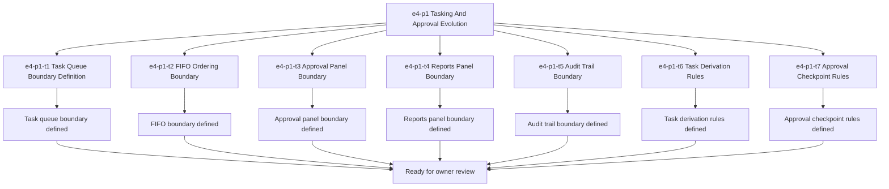

# E4-P1 Tasking And Approval Evolution Tasks

Updated: 2026-05-21

Branch: `tasks/e4-p1-tasking-and-approval-evolution`

Status: planning-only

This task package is scoped only to `e4-p1 Tasking And Approval Evolution`.
It is generated from the approved build-ready report and does not include `e5-p1` or any later queue items.

## Scope Reminder

- KVDOS is the commercial product.
- KVDF is the governance/tooling layer.
- KVDOS v1 commercial boundary = Local IDE Studio + Local Runtime + Cloud subscription/license control.
- Private code, secrets, customer data, local reports, and local runtime state stay local.
- Cloud commercial control only handles account, subscription, license entitlement, activation, plan access, release access, and update access.

## Generated Tasks

### `e4-p1-t1` Task Queue Boundary Definition

Title:
- Define the governed task queue boundary for KVDOS

Allowed files:
- `workspaces/apps/kvdos/docs/reports/e4-p1-tasking-and-approval-evolution-build-ready-report.md`
- `workspaces/apps/kvdos/docs/roadmap/E4_P1_TASKING_AND_APPROVAL_EVOLUTION_TASKS.md`
- `workspaces/apps/kvdos/docs/roadmap/KVDOS_VERSION_PLAN.md`
- `workspaces/apps/kvdos/docs/roadmap/KVDOS_EVOLUTION_PLAN.md`
- `workspaces/apps/kvdos/docs/roadmap/KVDOS_EVOLUTION_TASK_PUNCH.md`
- `workspaces/apps/kvdos/docs/roadmap/KVDOS_IMPLEMENTATION_READINESS_QUEUE.md`
- `workspaces/apps/kvdos/docs/product/PRODUCT_DEFINITION.md`
- `workspaces/apps/kvdos/docs/product/PRODUCT_STRATEGY.md`
- `workspaces/apps/kvdos/docs/roadmap/EVOLUTION_MASTER_PLAN.md`

Forbidden files:
- repo-root KVDF core files
- any file outside `workspaces/apps/kvdos/`
- `workspaces/apps/kvdos/src/**`
- `workspaces/apps/kvdos/.kabeeri/tasks.json`
- `workspaces/apps/kvdos/docs/reports/planning-versions-evos-tasks-pipeline.html`

Acceptance criteria:
- The task queue boundary is explicit and app-local.
- The wording stays docs-only and does not imply task execution code.
- The boundary remains pre-implementation and governed by owner approval.

Validation commands:
- `rg -n "task queue|governed task|FIFO|approval panel|reports panel|audit trail|KVDOS|KVDF" workspaces/apps/kvdos/docs/reports workspaces/apps/kvdos/docs/roadmap workspaces/apps/kvdos/docs/product`
- `git diff --check`

### `e4-p1-t2` FIFO Ordering Boundary

Title:
- Define FIFO ordering rules for the task layer

Allowed files:
- `workspaces/apps/kvdos/docs/reports/e4-p1-tasking-and-approval-evolution-build-ready-report.md`
- `workspaces/apps/kvdos/docs/roadmap/E4_P1_TASKING_AND_APPROVAL_EVOLUTION_TASKS.md`
- `workspaces/apps/kvdos/docs/roadmap/KVDOS_IMPLEMENTATION_READINESS_QUEUE.md`

Forbidden files:
- repo-root KVDF core files
- any file outside `workspaces/apps/kvdos/`
- `workspaces/apps/kvdos/src/**`
- `workspaces/apps/kvdos/.kabeeri/tasks.json`

Acceptance criteria:
- FIFO ordering is described as a planning boundary only.
- The wording does not imply queue worker implementation.
- The ordering logic stays app-local and reviewable.

Validation commands:
- `rg -n "FIFO|ordering|queue|task layer|tasking" workspaces/apps/kvdos/docs/reports/e4-p1-tasking-and-approval-evolution-build-ready-report.md workspaces/apps/kvdos/docs/roadmap/KVDOS_IMPLEMENTATION_READINESS_QUEUE.md workspaces/apps/kvdos/docs/roadmap/E4_P1_TASKING_AND_APPROVAL_EVOLUTION_TASKS.md`
- `git diff --check`

### `e4-p1-t3` Approval Panel Boundary

Title:
- Define the approval panel boundary for governed tasks

Allowed files:
- `workspaces/apps/kvdos/docs/reports/e4-p1-tasking-and-approval-evolution-build-ready-report.md`
- `workspaces/apps/kvdos/docs/roadmap/E4_P1_TASKING_AND_APPROVAL_EVOLUTION_TASKS.md`
- `workspaces/apps/kvdos/docs/product/PRODUCT_DEFINITION.md`

Forbidden files:
- repo-root KVDF core files
- any file outside `workspaces/apps/kvdos/`
- `workspaces/apps/kvdos/src/**`
- `workspaces/apps/kvdos/.kabeeri/tasks.json`

Acceptance criteria:
- The approval panel boundary is explicit and app-local.
- The wording keeps approval as a governed review concept.
- The panel boundary does not imply UI implementation.

Validation commands:
- `rg -n "approval panel|approval|review|governed|task" workspaces/apps/kvdos/docs/reports/e4-p1-tasking-and-approval-evolution-build-ready-report.md workspaces/apps/kvdos/docs/product/PRODUCT_DEFINITION.md workspaces/apps/kvdos/docs/roadmap/E4_P1_TASKING_AND_APPROVAL_EVOLUTION_TASKS.md`
- `git diff --check`

### `e4-p1-t4` Reports Panel Boundary

Title:
- Define the reports panel boundary for task governance

Allowed files:
- `workspaces/apps/kvdos/docs/reports/e4-p1-tasking-and-approval-evolution-build-ready-report.md`
- `workspaces/apps/kvdos/docs/roadmap/E4_P1_TASKING_AND_APPROVAL_EVOLUTION_TASKS.md`
- `workspaces/apps/kvdos/docs/product/PRODUCT_STRATEGY.md`

Forbidden files:
- repo-root KVDF core files
- any file outside `workspaces/apps/kvdos/`
- `workspaces/apps/kvdos/src/**`
- `workspaces/apps/kvdos/.kabeeri/tasks.json`

Acceptance criteria:
- The reports panel boundary is explicit and app-local.
- The wording keeps reports as review/governance surfaces.
- The panel boundary does not imply runtime or execution behavior.

Validation commands:
- `rg -n "reports panel|reports|review|governance|task" workspaces/apps/kvdos/docs/reports/e4-p1-tasking-and-approval-evolution-build-ready-report.md workspaces/apps/kvdos/docs/product/PRODUCT_STRATEGY.md workspaces/apps/kvdos/docs/roadmap/E4_P1_TASKING_AND_APPROVAL_EVOLUTION_TASKS.md`
- `git diff --check`

### `e4-p1-t5` Audit Trail Boundary

Title:
- Define the audit trail boundary for approved tasking

Allowed files:
- `workspaces/apps/kvdos/docs/reports/e4-p1-tasking-and-approval-evolution-build-ready-report.md`
- `workspaces/apps/kvdos/docs/roadmap/E4_P1_TASKING_AND_APPROVAL_EVOLUTION_TASKS.md`
- `workspaces/apps/kvdos/docs/architecture/KVDOS_ARCHITECTURE.md`

Forbidden files:
- repo-root KVDF core files
- any file outside `workspaces/apps/kvdos/`
- `workspaces/apps/kvdos/src/**`
- `workspaces/apps/kvdos/.kabeeri/tasks.json`

Acceptance criteria:
- The audit trail boundary is explicit and local-first.
- The wording keeps audit visibility as documentation/governance, not code.
- The boundary stays pre-implementation.

Validation commands:
- `rg -n "audit trail|audit|governance|approval|tasking" workspaces/apps/kvdos/docs/reports/e4-p1-tasking-and-approval-evolution-build-ready-report.md workspaces/apps/kvdos/docs/architecture/KVDOS_ARCHITECTURE.md workspaces/apps/kvdos/docs/roadmap/E4_P1_TASKING_AND_APPROVAL_EVOLUTION_TASKS.md`
- `git diff --check`

### `e4-p1-t6` Task Derivation Rules

Title:
- Define the task derivation rules for approved evolution slices

Allowed files:
- `workspaces/apps/kvdos/docs/reports/e4-p1-tasking-and-approval-evolution-build-ready-report.md`
- `workspaces/apps/kvdos/docs/roadmap/E4_P1_TASKING_AND_APPROVAL_EVOLUTION_TASKS.md`
- `workspaces/apps/kvdos/docs/roadmap/KVDOS_EVOLUTION_TASK_PUNCH.md`
- `workspaces/apps/kvdos/docs/roadmap/KVDOS_IMPLEMENTATION_READINESS_QUEUE.md`

Forbidden files:
- repo-root KVDF core files
- any file outside `workspaces/apps/kvdos/`
- `workspaces/apps/kvdos/src/**`
- `workspaces/apps/kvdos/.kabeeri/tasks.json`

Acceptance criteria:
- The derivation rules describe how approved evolution slices become governed tasks.
- The rules remain doc-only and do not imply code generation.
- The wording keeps approval as a prerequisite.

Validation commands:
- `rg -n "task derivation|derived|approved evolution|governed tasks|approval" workspaces/apps/kvdos/docs/reports/e4-p1-tasking-and-approval-evolution-build-ready-report.md workspaces/apps/kvdos/docs/roadmap/KVDOS_EVOLUTION_TASK_PUNCH.md workspaces/apps/kvdos/docs/roadmap/KVDOS_IMPLEMENTATION_READINESS_QUEUE.md workspaces/apps/kvdos/docs/roadmap/E4_P1_TASKING_AND_APPROVAL_EVOLUTION_TASKS.md`
- `git diff --check`

### `e4-p1-t7` Approval Checkpoint Rules

Title:
- Define the approval checkpoint rules for the tasking layer

Allowed files:
- `workspaces/apps/kvdos/docs/reports/e4-p1-tasking-and-approval-evolution-build-ready-report.md`
- `workspaces/apps/kvdos/docs/roadmap/E4_P1_TASKING_AND_APPROVAL_EVOLUTION_TASKS.md`

Forbidden files:
- repo-root KVDF core files
- any file outside `workspaces/apps/kvdos/`
- `workspaces/apps/kvdos/src/**`
- `workspaces/apps/kvdos/.kabeeri/tasks.json`

Acceptance criteria:
- The approval checkpoint rules are explicit.
- The rules state that implementation tasks only follow approval.
- The wording keeps e4-p1 pre-implementation.

Validation commands:
- `rg -n "approval checkpoint|approval|required before|implementation tasks|tasking" workspaces/apps/kvdos/docs/reports/e4-p1-tasking-and-approval-evolution-build-ready-report.md workspaces/apps/kvdos/docs/roadmap/E4_P1_TASKING_AND_APPROVAL_EVOLUTION_TASKS.md`
- `git diff --check`

## Visualization



```text
Task flow

e4-p1
  -> t1 Task Queue Boundary Definition
  -> t2 FIFO Ordering Boundary
  -> t3 Approval Panel Boundary
  -> t4 Reports Panel Boundary
  -> t5 Audit Trail Boundary
  -> t6 Task Derivation Rules
  -> t7 Approval Checkpoint Rules
  -> owner review
```

## Build-Ready Completion Criteria

The `e4-p1` task set is ready to hand off when:

- the task queue boundary is explicit
- the FIFO ordering boundary is explicit
- the approval panel boundary is explicit
- the reports panel boundary is explicit
- the audit trail boundary is explicit
- the task derivation rules are explicit
- the approval checkpoint rules are explicit
- no repo-root KVDF files were touched
- no `e5-p1` work was started

## PR Title

`e4-p1: tasking and approval evolution readiness`

## PR Checklist

- [ ] Branch created from the current workspace state
- [ ] Changes stay inside `workspaces/apps/kvdos/`
- [ ] No repo-root KVDF core files modified
- [ ] No `e5-p1` work started
- [ ] No implementation code added
- [ ] No runtime, SQLite, cloud, license, execution, or packaging work added
- [ ] Task queue boundary is explicit
- [ ] FIFO ordering boundary is explicit
- [ ] Approval panel boundary is explicit
- [ ] Reports panel boundary is explicit
- [ ] Audit trail boundary is explicit
- [ ] Task derivation rules are explicit
- [ ] Approval checkpoint rules are explicit
- [ ] `git diff --check` passes
- [ ] `.vscode/settings.json` remains untouched
