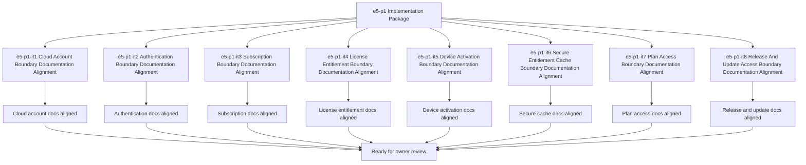

# E5-P1 Cloud Commercial Foundation Implementation Tasks

Updated: 2026-05-22

Branch: `tasks/e5-p1-cloud-commercial-foundation-implementation`

Status: planning-only

This task package is scoped only to `e5-p1 Cloud Commercial Foundation` implementation planning.
It remains documentation/spec-boundary implementation planning only and does not include
cloud API coding, authentication code, subscription code, license code, activation code,
entitlement cache code, plan-access code, release-access code, or update-access code.

## Scope Reminder

- KVDOS is the commercial product.
- KVDF is the governance/tooling layer.
- KVDOS app work stays inside `workspaces/apps/kvdos/`.
- KVDOS v1 commercial boundary = Local IDE Studio + Local Runtime + Cloud subscription/license control.
- Private code, secrets, customer data, local reports, and local runtime state stay local.
- Cloud commercial control only handles account, subscription, license entitlement, activation, plan access, release access, and update access.

## Generated Tasks

### `e5-p1-it1` Cloud Account Boundary Documentation Alignment

Title:
- Align the cloud account boundary wording across app-local KVDOS docs

Allowed files:
- `workspaces/apps/kvdos/docs/reports/e5-p1-cloud-commercial-foundation-build-ready-report.md`
- `workspaces/apps/kvdos/docs/reports/e5-p1-cloud-commercial-foundation-execution-report.md`
- `workspaces/apps/kvdos/docs/roadmap/E5_P1_CLOUD_COMMERCIAL_FOUNDATION_TASKS.md`
- `workspaces/apps/kvdos/docs/roadmap/E5_P1_CLOUD_COMMERCIAL_FOUNDATION_IMPLEMENTATION_TASKS.md`
- `workspaces/apps/kvdos/docs/product/PRODUCT_DEFINITION.md`
- `workspaces/apps/kvdos/docs/product/PRODUCT_STRATEGY.md`

Forbidden files:
- repo-root KVDF core files
- any file outside `workspaces/apps/kvdos/`
- `workspaces/apps/kvdos/src/**`
- `workspaces/apps/kvdos/.kabeeri/tasks.json`
- `workspaces/apps/kvdos/app.kvdos.yaml`

Acceptance criteria:
- Cloud account boundary wording is consistent across app-local docs.
- The wording stays docs-only and does not imply account implementation code.
- The boundary remains pre-implementation and app-local.

Validation commands:
- `rg -n "account|identity|workspace|cloud|subscription|license|activation" workspaces/apps/kvdos/docs/reports workspaces/apps/kvdos/docs/roadmap workspaces/apps/kvdos/docs/product workspaces/apps/kvdos/docs/architecture`
- `git diff --check`

### `e5-p1-it2` Authentication Boundary Documentation Alignment

Title:
- Align authentication boundary notes without building login code

Allowed files:
- `workspaces/apps/kvdos/docs/reports/e5-p1-cloud-commercial-foundation-build-ready-report.md`
- `workspaces/apps/kvdos/docs/reports/e5-p1-cloud-commercial-foundation-execution-report.md`
- `workspaces/apps/kvdos/docs/roadmap/E5_P1_CLOUD_COMMERCIAL_FOUNDATION_TASKS.md`
- `workspaces/apps/kvdos/docs/roadmap/E5_P1_CLOUD_COMMERCIAL_FOUNDATION_IMPLEMENTATION_TASKS.md`

Forbidden files:
- repo-root KVDF core files
- any file outside `workspaces/apps/kvdos/`
- `workspaces/apps/kvdos/src/**`
- `workspaces/apps/kvdos/.kabeeri/tasks.json`
- `workspaces/apps/kvdos/app.kvdos.yaml`

Acceptance criteria:
- Authentication wording is explicit and app-local.
- The wording keeps authentication as a governed commercial concept.
- The boundary does not imply login implementation.

Validation commands:
- `rg -n "auth|login|session|token|account|cloud" workspaces/apps/kvdos/docs/reports workspaces/apps/kvdos/docs/roadmap workspaces/apps/kvdos/docs/product workspaces/apps/kvdos/docs/architecture`
- `git diff --check`

### `e5-p1-it3` Subscription Boundary Documentation Alignment

Title:
- Align subscription boundary notes and plan-state wording

Allowed files:
- `workspaces/apps/kvdos/docs/reports/e5-p1-cloud-commercial-foundation-build-ready-report.md`
- `workspaces/apps/kvdos/docs/reports/e5-p1-cloud-commercial-foundation-execution-report.md`
- `workspaces/apps/kvdos/docs/roadmap/E5_P1_CLOUD_COMMERCIAL_FOUNDATION_TASKS.md`
- `workspaces/apps/kvdos/docs/roadmap/E5_P1_CLOUD_COMMERCIAL_FOUNDATION_IMPLEMENTATION_TASKS.md`
- `workspaces/apps/kvdos/docs/product/PRODUCT_STRATEGY.md`

Forbidden files:
- repo-root KVDF core files
- any file outside `workspaces/apps/kvdos/`
- `workspaces/apps/kvdos/src/**`
- `workspaces/apps/kvdos/.kabeeri/tasks.json`
- `workspaces/apps/kvdos/app.kvdos.yaml`

Acceptance criteria:
- Subscription boundary wording is clear and app-local.
- Plan-state and grace wording are explicit.
- The wording does not imply subscription backend code.

Validation commands:
- `rg -n "subscription|plan|grace|expired|active|entitlement" workspaces/apps/kvdos/docs/reports workspaces/apps/kvdos/docs/roadmap workspaces/apps/kvdos/docs/product workspaces/apps/kvdos/docs/architecture`
- `git diff --check`

### `e5-p1-it4` License Entitlement Boundary Documentation Alignment

Title:
- Align license entitlement boundary notes without building enforcement code

Allowed files:
- `workspaces/apps/kvdos/docs/reports/e5-p1-cloud-commercial-foundation-build-ready-report.md`
- `workspaces/apps/kvdos/docs/reports/e5-p1-cloud-commercial-foundation-execution-report.md`
- `workspaces/apps/kvdos/docs/roadmap/E5_P1_CLOUD_COMMERCIAL_FOUNDATION_TASKS.md`
- `workspaces/apps/kvdos/docs/roadmap/E5_P1_CLOUD_COMMERCIAL_FOUNDATION_IMPLEMENTATION_TASKS.md`
- `workspaces/apps/kvdos/docs/architecture/KVDOS_ARCHITECTURE.md`

Forbidden files:
- repo-root KVDF core files
- any file outside `workspaces/apps/kvdos/`
- `workspaces/apps/kvdos/src/**`
- `workspaces/apps/kvdos/.kabeeri/tasks.json`
- `workspaces/apps/kvdos/app.kvdos.yaml`

Acceptance criteria:
- License entitlement wording is explicit and local-first.
- The wording keeps entitlement as planning/specification, not code.
- The boundary stays pre-implementation.

Validation commands:
- `rg -n "license|entitlement|validity|activation|grace" workspaces/apps/kvdos/docs/reports workspaces/apps/kvdos/docs/roadmap workspaces/apps/kvdos/docs/product workspaces/apps/kvdos/docs/architecture`
- `git diff --check`

### `e5-p1-it5` Device Activation Boundary Documentation Alignment

Title:
- Align device activation boundary notes and offline-grace wording

Allowed files:
- `workspaces/apps/kvdos/docs/reports/e5-p1-cloud-commercial-foundation-build-ready-report.md`
- `workspaces/apps/kvdos/docs/reports/e5-p1-cloud-commercial-foundation-execution-report.md`
- `workspaces/apps/kvdos/docs/roadmap/E5_P1_CLOUD_COMMERCIAL_FOUNDATION_TASKS.md`
- `workspaces/apps/kvdos/docs/roadmap/E5_P1_CLOUD_COMMERCIAL_FOUNDATION_IMPLEMENTATION_TASKS.md`

Forbidden files:
- repo-root KVDF core files
- any file outside `workspaces/apps/kvdos/`
- `workspaces/apps/kvdos/src/**`
- `workspaces/apps/kvdos/.kabeeri/tasks.json`
- `workspaces/apps/kvdos/app.kvdos.yaml`

Acceptance criteria:
- Device activation wording is explicit and app-local.
- Offline grace wording is clear without code.
- The wording does not imply activation implementation.

Validation commands:
- `rg -n "activation|device|offline grace|grace|license" workspaces/apps/kvdos/docs/reports workspaces/apps/kvdos/docs/roadmap workspaces/apps/kvdos/docs/product workspaces/apps/kvdos/docs/architecture`
- `git diff --check`

### `e5-p1-it6` Secure Entitlement Cache Boundary Documentation Alignment

Title:
- Align secure entitlement cache notes without writing cache code

Allowed files:
- `workspaces/apps/kvdos/docs/reports/e5-p1-cloud-commercial-foundation-build-ready-report.md`
- `workspaces/apps/kvdos/docs/reports/e5-p1-cloud-commercial-foundation-execution-report.md`
- `workspaces/apps/kvdos/docs/roadmap/E5_P1_CLOUD_COMMERCIAL_FOUNDATION_TASKS.md`
- `workspaces/apps/kvdos/docs/roadmap/E5_P1_CLOUD_COMMERCIAL_FOUNDATION_IMPLEMENTATION_TASKS.md`

Forbidden files:
- repo-root KVDF core files
- any file outside `workspaces/apps/kvdos/`
- `workspaces/apps/kvdos/src/**`
- `workspaces/apps/kvdos/.kabeeri/tasks.json`
- `workspaces/apps/kvdos/app.kvdos.yaml`

Acceptance criteria:
- Secure cache wording is explicit and local-first.
- The wording keeps cache policy as documentation, not code.
- The boundary remains app-local.

Validation commands:
- `rg -n "cache|entitlement|secure|local-first|refresh" workspaces/apps/kvdos/docs/reports workspaces/apps/kvdos/docs/roadmap workspaces/apps/kvdos/docs/product workspaces/apps/kvdos/docs/architecture`
- `git diff --check`

### `e5-p1-it7` Plan Access Boundary Documentation Alignment

Title:
- Align plan-based feature access wording without building access-control code

Allowed files:
- `workspaces/apps/kvdos/docs/reports/e5-p1-cloud-commercial-foundation-build-ready-report.md`
- `workspaces/apps/kvdos/docs/reports/e5-p1-cloud-commercial-foundation-execution-report.md`
- `workspaces/apps/kvdos/docs/roadmap/E5_P1_CLOUD_COMMERCIAL_FOUNDATION_TASKS.md`
- `workspaces/apps/kvdos/docs/roadmap/E5_P1_CLOUD_COMMERCIAL_FOUNDATION_IMPLEMENTATION_TASKS.md`

Forbidden files:
- repo-root KVDF core files
- any file outside `workspaces/apps/kvdos/`
- `workspaces/apps/kvdos/src/**`
- `workspaces/apps/kvdos/.kabeeri/tasks.json`
- `workspaces/apps/kvdos/app.kvdos.yaml`

Acceptance criteria:
- Plan access wording is explicit.
- Blocked/allowed state wording is clear and reviewable.
- The wording does not imply feature-flag implementation.

Validation commands:
- `rg -n "plan access|feature access|blocked|allowed|entitlement" workspaces/apps/kvdos/docs/reports workspaces/apps/kvdos/docs/roadmap workspaces/apps/kvdos/docs/product workspaces/apps/kvdos/docs/architecture`
- `git diff --check`

### `e5-p1-it8` Release And Update Access Boundary Documentation Alignment

Title:
- Align release and update access wording without building delivery code

Allowed files:
- `workspaces/apps/kvdos/docs/reports/e5-p1-cloud-commercial-foundation-build-ready-report.md`
- `workspaces/apps/kvdos/docs/reports/e5-p1-cloud-commercial-foundation-execution-report.md`
- `workspaces/apps/kvdos/docs/roadmap/E5_P1_CLOUD_COMMERCIAL_FOUNDATION_TASKS.md`
- `workspaces/apps/kvdos/docs/roadmap/E5_P1_CLOUD_COMMERCIAL_FOUNDATION_IMPLEMENTATION_TASKS.md`

Forbidden files:
- repo-root KVDF core files
- any file outside `workspaces/apps/kvdos/`
- `workspaces/apps/kvdos/src/**`
- `workspaces/apps/kvdos/.kabeeri/tasks.json`
- `workspaces/apps/kvdos/app.kvdos.yaml`

Acceptance criteria:
- Release/update access wording is explicit and app-local.
- The wording does not imply packaging or delivery implementation.
- The boundary stays pre-implementation.

Validation commands:
- `rg -n "release|update|download|channel|access" workspaces/apps/kvdos/docs/reports workspaces/apps/kvdos/docs/roadmap workspaces/apps/kvdos/docs/product workspaces/apps/kvdos/docs/architecture`
- `git diff --check`

## Visualization

## PR Title

`e5-p1: cloud commercial foundation implementation package`

## PR Checklist

- [ ] Changes stay inside `workspaces/apps/kvdos/`
- [ ] No repo-root KVDF core files modified
- [ ] No `e6-p1` work started
- [ ] No cloud APIs implemented
- [ ] No authentication implemented
- [ ] No subscriptions, licenses, device activation, entitlement cache, plan access, release access, or update access implemented
- [ ] No runtime, SQLite, execution, or packaging work added
- [ ] No feature code added
- [ ] Cloud account boundary is explicit
- [ ] Authentication boundary is explicit
- [ ] Subscription boundary is explicit
- [ ] License entitlement boundary is explicit
- [ ] Device activation boundary is explicit
- [ ] Secure entitlement cache boundary is explicit
- [ ] Plan access boundary is explicit
- [ ] Release and update access boundary is explicit
- [ ] `git diff --check` passes
- [ ] `.vscode/settings.json` remains untouched
