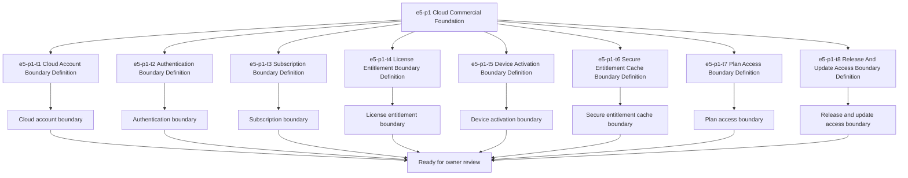

# E5-P1 Cloud Commercial Foundation Tasks

Updated: 2026-05-22

Branch: `tasks/e5-p1-cloud-commercial-foundation`

Status: planning-only

## Purpose

This task package derives from the approved `e5-p1 Cloud Commercial Foundation`
build-ready report.
It prepares the cloud-commercial boundary for later scoped implementation
planning, but it does not authorize cloud API coding by itself.

## Scope Reminder

- `KVDOS` is the commercial product.
- `KVDF` is the governance/tooling layer.
- KVDOS app work stays inside `workspaces/apps/kvdos/`.
- KVDOS v1 commercial boundary = Local IDE Studio + Local Runtime +
  Cloud subscription/license control.
- Private code, secrets, customer data, local reports, and local runtime state
  stay local.
- Cloud commercial control only handles account, subscription, license
  entitlement, activation, plan access, release access, and update access.

## Generated Task IDs

1. `e5-p1-t1` Cloud Account Boundary Definition
2. `e5-p1-t2` Authentication Boundary Definition
3. `e5-p1-t3` Subscription Boundary Definition
4. `e5-p1-t4` License Entitlement Boundary Definition
5. `e5-p1-t5` Device Activation Boundary Definition
6. `e5-p1-t6` Secure Entitlement Cache Boundary Definition
7. `e5-p1-t7` Plan Access Boundary Definition
8. `e5-p1-t8` Release And Update Access Boundary Definition

## Task Package Rules

- Keep all work app-local to `workspaces/apps/kvdos/`.
- Do not modify repo-root KVDF core files.
- Do not start `e6-p1`.
- Do not write implementation code.
- Do not build cloud APIs yet.
- Do not implement authentication, subscriptions, licenses, activation,
  entitlement cache, plan access, release access, or update access yet.
- Do not touch `.vscode/settings.json`.

## Allowed Files

- `workspaces/apps/kvdos/docs/reports/e5-p1-cloud-commercial-foundation-build-ready-report.md`
- `workspaces/apps/kvdos/docs/roadmap/E5_P1_CLOUD_COMMERCIAL_FOUNDATION_TASKS.md`
- `workspaces/apps/kvdos/docs/roadmap/KVDOS_VERSION_PLAN.md`
- `workspaces/apps/kvdos/docs/roadmap/KVDOS_EVOLUTION_PLAN.md`
- `workspaces/apps/kvdos/docs/roadmap/KVDOS_EVOLUTION_TASK_PUNCH.md`
- `workspaces/apps/kvdos/docs/roadmap/KVDOS_IMPLEMENTATION_READINESS_QUEUE.md`
- `workspaces/apps/kvdos/docs/product/PRODUCT_DEFINITION.md`
- `workspaces/apps/kvdos/docs/product/PRODUCT_STRATEGY.md`
- `workspaces/apps/kvdos/docs/product/MVP_SCOPE.md`
- `workspaces/apps/kvdos/docs/architecture/KVDOS_ARCHITECTURE.md`

## Forbidden Files

- repo-root KVDF core files
- any file outside `workspaces/apps/kvdos/`
- `workspaces/apps/kvdos/src/**`
- `workspaces/apps/kvdos/.kabeeri/tasks.json`
- `workspaces/apps/kvdos/.vscode/settings.json`
- `workspaces/apps/kvdos/docs/reports/planning-versions-evos-tasks-pipeline.html`

## Tasks

### `e5-p1-t1` Cloud Account Boundary Definition

- Title: Define the cloud account boundary for KVDOS commercial control
- Build type: cloud-commercial boundary specification
- In scope:
  - cloud account model wording
  - account identity boundary notes
  - account ownership and workspace relationship notes
- Out of scope:
  - cloud login implementation
  - subscription backend implementation
  - license enforcement code
  - device activation code
  - release/update code
- Acceptance criteria:
  - the account boundary is explicit
  - the account boundary stays app-local
  - the boundary does not imply private-code upload
- Validation commands:
  - `rg -n "account|identity|workspace|cloud|subscription|license" workspaces/apps/kvdos/docs/reports workspaces/apps/kvdos/docs/roadmap workspaces/apps/kvdos/docs/product workspaces/apps/kvdos/docs/architecture`
  - `git diff --check`

### `e5-p1-t2` Authentication Boundary Definition

- Title: Define the cloud authentication boundary for KVDOS
- Build type: cloud-commercial boundary specification
- In scope:
  - authentication boundary notes
  - login boundary notes
  - session and account-link wording
- Out of scope:
  - auth implementation code
  - backend APIs
  - token storage implementation
  - device activation implementation
- Acceptance criteria:
  - the authentication boundary is explicit
  - the boundary does not cross into runtime implementation
  - the boundary does not imply private data moves to cloud
- Validation commands:
  - `rg -n "auth|login|session|account|token|cloud" workspaces/apps/kvdos/docs/reports workspaces/apps/kvdos/docs/roadmap workspaces/apps/kvdos/docs/product workspaces/apps/kvdos/docs/architecture`
  - `git diff --check`

### `e5-p1-t3` Subscription Boundary Definition

- Title: Define the subscription boundary and plan-state wording
- Build type: subscription and entitlement specification
- In scope:
  - subscription status wording
  - plan state wording
  - active/expired/grace boundary notes
- Out of scope:
  - subscription backend implementation
  - billing code
  - entitlement enforcement code
  - cloud API coding
- Acceptance criteria:
  - subscription boundary is explicit
  - plan-state wording is clear and app-local
  - no implementation code is implied
- Validation commands:
  - `rg -n "subscription|plan|grace|expired|active|entitlement" workspaces/apps/kvdos/docs/reports workspaces/apps/kvdos/docs/roadmap workspaces/apps/kvdos/docs/product workspaces/apps/kvdos/docs/architecture`
  - `git diff --check`

### `e5-p1-t4` License Entitlement Boundary Definition

- Title: Define the license entitlement boundary
- Build type: entitlement policy specification
- In scope:
  - license entitlement wording
  - entitlement state wording
  - license validity boundary notes
- Out of scope:
  - license enforcement code
  - entitlement backend implementation
  - device activation code
  - release access code
- Acceptance criteria:
  - the license entitlement boundary is explicit
  - local privacy remains protected
  - no enforcement code is introduced
- Validation commands:
  - `rg -n "license|entitlement|validity|activation|grace" workspaces/apps/kvdos/docs/reports workspaces/apps/kvdos/docs/roadmap workspaces/apps/kvdos/docs/product workspaces/apps/kvdos/docs/architecture`
  - `git diff --check`

### `e5-p1-t5` Device Activation Boundary Definition

- Title: Define the device activation boundary
- Build type: activation lifecycle specification
- In scope:
  - activation lifecycle wording
  - device-bound access wording
  - offline grace boundary notes
- Out of scope:
  - device activation implementation
  - backend activation API code
  - local runtime implementation
- Acceptance criteria:
  - the device activation boundary is explicit
  - offline grace is described without code
  - the boundary stays app-local
- Validation commands:
  - `rg -n "activation|device|offline grace|grace|license" workspaces/apps/kvdos/docs/reports workspaces/apps/kvdos/docs/roadmap workspaces/apps/kvdos/docs/product workspaces/apps/kvdos/docs/architecture`
  - `git diff --check`

### `e5-p1-t6` Secure Entitlement Cache Boundary Definition

- Title: Define the secure entitlement cache boundary
- Build type: secure-cache policy specification
- In scope:
  - entitlement cache wording
  - secure local cache boundary notes
  - cache refresh boundary notes
- Out of scope:
  - cache implementation code
  - runtime storage implementation
  - cloud sync code
- Acceptance criteria:
  - the secure cache boundary is explicit
  - the cache remains local-first
  - the boundary does not imply code changes yet
- Validation commands:
  - `rg -n "cache|entitlement|secure|local-first|refresh" workspaces/apps/kvdos/docs/reports workspaces/apps/kvdos/docs/roadmap workspaces/apps/kvdos/docs/product workspaces/apps/kvdos/docs/architecture`
  - `git diff --check`

### `e5-p1-t7` Plan Access Boundary Definition

- Title: Define the plan-based feature access boundary
- Build type: access-control specification
- In scope:
  - plan-based access wording
  - feature access boundary notes
  - blocked/allowed state wording
- Out of scope:
  - feature flag implementation
  - entitlement enforcement code
  - cloud API coding
- Acceptance criteria:
  - plan access is explicit
  - blocked/allowed states are clear
  - the boundary stays pre-implementation
- Validation commands:
  - `rg -n "plan access|feature access|blocked|allowed|entitlement" workspaces/apps/kvdos/docs/reports workspaces/apps/kvdos/docs/roadmap workspaces/apps/kvdos/docs/product workspaces/apps/kvdos/docs/architecture`
  - `git diff --check`

### `e5-p1-t8` Release And Update Access Boundary Definition

- Title: Define the release and update access boundary
- Build type: release-access specification
- In scope:
  - release channel boundary notes
  - update/download access wording
  - secure commercial release boundary notes
- Out of scope:
  - release packaging code
  - update service code
  - cloud API implementation
- Acceptance criteria:
  - release/update access is explicit
  - the boundary remains app-local
  - the boundary does not imply packaging work yet
- Validation commands:
  - `rg -n "release|update|download|channel|access" workspaces/apps/kvdos/docs/reports workspaces/apps/kvdos/docs/roadmap workspaces/apps/kvdos/docs/product workspaces/apps/kvdos/docs/architecture`
  - `git diff --check`

## Visualization

## PR Title

`e5-p1: cloud commercial foundation readiness`

## PR Checklist

- [ ] Changes stay inside `workspaces/apps/kvdos/`
- [ ] No repo-root KVDF core files modified
- [ ] No `e6-p1` work started
- [ ] No cloud APIs implemented
- [ ] No authentication implemented
- [ ] No subscriptions, licenses, device activation, entitlement cache, plan access, release access, or update access implemented
- [ ] No runtime, SQLite, execution, or packaging work added
- [ ] Cloud account boundary is explicit
- [ ] Authentication boundary is explicit
- [ ] Subscription boundary is explicit
- [ ] License entitlement boundary is explicit
- [ ] Device activation boundary is explicit
- [ ] Secure entitlement cache boundary is explicit
- [ ] Plan access boundary is explicit
- [ ] Release and update access boundary is explicit
- [ ] `git diff --check` passes
- [ ] `.vscode/settings.json` remains untouched
