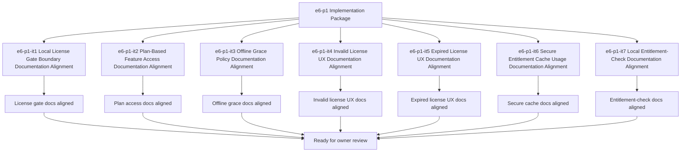

# E6-P1 Local License Gate Implementation Tasks

Updated: 2026-05-22

Branch: `tasks/e6-p1-local-license-gate-implementation`

Status: planning-only

This task package is scoped only to `e6-p1 Local License Gate` implementation planning.
It remains documentation/spec-boundary implementation planning only and does not include
local license enforcement code, feature-gate implementation, or entitlement-check code.

## Scope Reminder

- `KVDOS` is the commercial product.
- `KVDF` is the governance/tooling layer.
- KVDOS app work stays inside `workspaces/apps/kvdos/`.
- KVDOS v1 commercial boundary = Local IDE Studio + Local Runtime + Cloud subscription/license control.
- Private code, secrets, customer data, local reports, and local runtime state stay local.
- Cloud commercial control only handles account, subscription, license entitlement, activation, plan access, release access, and update access.

## Generated Tasks

### `e6-p1-it1` Local License Gate Boundary Documentation Alignment

Title:
- Align the local license gate boundary wording across app-local KVDOS docs

Allowed files:
- `workspaces/apps/kvdos/docs/reports/e6-p1-local-license-gate-build-ready-report.md`
- `workspaces/apps/kvdos/docs/reports/e6-p1-local-license-gate-execution-report.md`
- `workspaces/apps/kvdos/docs/roadmap/E6_P1_LOCAL_LICENSE_GATE_TASKS.md`
- `workspaces/apps/kvdos/docs/roadmap/E6_P1_LOCAL_LICENSE_GATE_IMPLEMENTATION_TASKS.md`
- `workspaces/apps/kvdos/docs/product/PRODUCT_DEFINITION.md`
- `workspaces/apps/kvdos/docs/product/PRODUCT_STRATEGY.md`

Forbidden files:
- repo-root KVDF core files
- any file outside `workspaces/apps/kvdos/`
- `workspaces/apps/kvdos/src/**`
- `workspaces/apps/kvdos/.kabeeri/tasks.json`
- `workspaces/apps/kvdos/app.kvdos.yaml`

Acceptance criteria:
- Local license gate wording is consistent across app-local docs.
- The wording stays docs-only and does not imply enforcement code.
- The boundary remains pre-implementation and app-local.

Validation commands:
- `rg -n "license gate|local license|blocked|allowed|entitlement|KVDOS|KVDF" workspaces/apps/kvdos/docs/reports workspaces/apps/kvdos/docs/roadmap workspaces/apps/kvdos/docs/product workspaces/apps/kvdos/docs/architecture`
- `git diff --check`

### `e6-p1-it2` Plan-Based Feature Access Documentation Alignment

Title:
- Align plan-based feature access wording without building feature-gate code

Allowed files:
- `workspaces/apps/kvdos/docs/reports/e6-p1-local-license-gate-build-ready-report.md`
- `workspaces/apps/kvdos/docs/reports/e6-p1-local-license-gate-execution-report.md`
- `workspaces/apps/kvdos/docs/roadmap/E6_P1_LOCAL_LICENSE_GATE_TASKS.md`
- `workspaces/apps/kvdos/docs/roadmap/E6_P1_LOCAL_LICENSE_GATE_IMPLEMENTATION_TASKS.md`

Forbidden files:
- repo-root KVDF core files
- any file outside `workspaces/apps/kvdos/`
- `workspaces/apps/kvdos/src/**`
- `workspaces/apps/kvdos/.kabeeri/tasks.json`
- `workspaces/apps/kvdos/app.kvdos.yaml`

Acceptance criteria:
- Plan access wording is explicit and app-local.
- Blocked/allowed state wording is clear and reviewable.
- The wording does not imply feature-flag implementation.

Validation commands:
- `rg -n "plan access|feature access|blocked|allowed|entitlement|grace" workspaces/apps/kvdos/docs/reports workspaces/apps/kvdos/docs/roadmap workspaces/apps/kvdos/docs/product workspaces/apps/kvdos/docs/architecture`
- `git diff --check`

### `e6-p1-it3` Offline Grace Policy Documentation Alignment

Title:
- Align offline grace wording without building runtime grace logic

Allowed files:
- `workspaces/apps/kvdos/docs/reports/e6-p1-local-license-gate-build-ready-report.md`
- `workspaces/apps/kvdos/docs/reports/e6-p1-local-license-gate-execution-report.md`
- `workspaces/apps/kvdos/docs/roadmap/E6_P1_LOCAL_LICENSE_GATE_TASKS.md`
- `workspaces/apps/kvdos/docs/roadmap/E6_P1_LOCAL_LICENSE_GATE_IMPLEMENTATION_TASKS.md`
- `workspaces/apps/kvdos/docs/product/MVP_SCOPE.md`

Forbidden files:
- repo-root KVDF core files
- any file outside `workspaces/apps/kvdos/`
- `workspaces/apps/kvdos/src/**`
- `workspaces/apps/kvdos/.kabeeri/tasks.json`
- `workspaces/apps/kvdos/app.kvdos.yaml`

Acceptance criteria:
- Offline grace wording is explicit.
- The wording remains documentation-only.
- The boundary stays app-local.

Validation commands:
- `rg -n "offline grace|grace|offline|policy|entitlement" workspaces/apps/kvdos/docs/reports workspaces/apps/kvdos/docs/roadmap workspaces/apps/kvdos/docs/product workspaces/apps/kvdos/docs/architecture`
- `git diff --check`

### `e6-p1-it4` Invalid License UX Documentation Alignment

Title:
- Align invalid-license wording without building UI code

Allowed files:
- `workspaces/apps/kvdos/docs/reports/e6-p1-local-license-gate-build-ready-report.md`
- `workspaces/apps/kvdos/docs/reports/e6-p1-local-license-gate-execution-report.md`
- `workspaces/apps/kvdos/docs/roadmap/E6_P1_LOCAL_LICENSE_GATE_TASKS.md`
- `workspaces/apps/kvdos/docs/roadmap/E6_P1_LOCAL_LICENSE_GATE_IMPLEMENTATION_TASKS.md`

Forbidden files:
- repo-root KVDF core files
- any file outside `workspaces/apps/kvdos/`
- `workspaces/apps/kvdos/src/**`
- `workspaces/apps/kvdos/.kabeeri/tasks.json`
- `workspaces/apps/kvdos/app.kvdos.yaml`

Acceptance criteria:
- Invalid-license wording is explicit.
- The wording does not imply UI implementation.
- The boundary remains pre-implementation.

Validation commands:
- `rg -n "invalid license|blocked|message|UX|entitlement|license" workspaces/apps/kvdos/docs/reports workspaces/apps/kvdos/docs/roadmap workspaces/apps/kvdos/docs/product workspaces/apps/kvdos/docs/architecture`
- `git diff --check`

### `e6-p1-it5` Expired License UX Documentation Alignment

Title:
- Align expired-license wording without building UI code

Allowed files:
- `workspaces/apps/kvdos/docs/reports/e6-p1-local-license-gate-build-ready-report.md`
- `workspaces/apps/kvdos/docs/reports/e6-p1-local-license-gate-execution-report.md`
- `workspaces/apps/kvdos/docs/roadmap/E6_P1_LOCAL_LICENSE_GATE_TASKS.md`
- `workspaces/apps/kvdos/docs/roadmap/E6_P1_LOCAL_LICENSE_GATE_IMPLEMENTATION_TASKS.md`

Forbidden files:
- repo-root KVDF core files
- any file outside `workspaces/apps/kvdos/`
- `workspaces/apps/kvdos/src/**`
- `workspaces/apps/kvdos/.kabeeri/tasks.json`
- `workspaces/apps/kvdos/app.kvdos.yaml`

Acceptance criteria:
- Expired-license wording is explicit.
- The wording does not imply implementation code.
- The boundary stays app-local.

Validation commands:
- `rg -n "expired license|renewal|blocked|message|UX|entitlement|license" workspaces/apps/kvdos/docs/reports workspaces/apps/kvdos/docs/roadmap workspaces/apps/kvdos/docs/product workspaces/apps/kvdos/docs/architecture`
- `git diff --check`

### `e6-p1-it6` Secure Entitlement Cache Usage Documentation Alignment

Title:
- Align secure entitlement cache usage wording without writing cache code

Allowed files:
- `workspaces/apps/kvdos/docs/reports/e6-p1-local-license-gate-build-ready-report.md`
- `workspaces/apps/kvdos/docs/reports/e6-p1-local-license-gate-execution-report.md`
- `workspaces/apps/kvdos/docs/roadmap/E6_P1_LOCAL_LICENSE_GATE_TASKS.md`
- `workspaces/apps/kvdos/docs/roadmap/E6_P1_LOCAL_LICENSE_GATE_IMPLEMENTATION_TASKS.md`

Forbidden files:
- repo-root KVDF core files
- any file outside `workspaces/apps/kvdos/`
- `workspaces/apps/kvdos/src/**`
- `workspaces/apps/kvdos/.kabeeri/tasks.json`
- `workspaces/apps/kvdos/app.kvdos.yaml`

Acceptance criteria:
- Secure cache wording is explicit and local-first.
- The wording keeps cache policy as documentation, not code.
- The boundary remains app-local.

Validation commands:
- `rg -n "cache|entitlement|secure|local-first|refresh" workspaces/apps/kvdos/docs/reports workspaces/apps/kvdos/docs/roadmap workspaces/apps/kvdos/docs/product workspaces/apps/kvdos/docs/architecture`
- `git diff --check`

### `e6-p1-it7` Local Entitlement-Check Documentation Alignment

Title:
- Align local entitlement-check wording without building enforcement code

Allowed files:
- `workspaces/apps/kvdos/docs/reports/e6-p1-local-license-gate-build-ready-report.md`
- `workspaces/apps/kvdos/docs/reports/e6-p1-local-license-gate-execution-report.md`
- `workspaces/apps/kvdos/docs/roadmap/E6_P1_LOCAL_LICENSE_GATE_TASKS.md`
- `workspaces/apps/kvdos/docs/roadmap/E6_P1_LOCAL_LICENSE_GATE_IMPLEMENTATION_TASKS.md`

Forbidden files:
- repo-root KVDF core files
- any file outside `workspaces/apps/kvdos/`
- `workspaces/apps/kvdos/src/**`
- `workspaces/apps/kvdos/.kabeeri/tasks.json`
- `workspaces/apps/kvdos/app.kvdos.yaml`

Acceptance criteria:
- Entitlement-check wording is explicit.
- The wording stays pre-implementation.
- The boundary remains app-local.

Validation commands:
- `rg -n "entitlement-check|entitlement|allowed|blocked|license|grace" workspaces/apps/kvdos/docs/reports workspaces/apps/kvdos/docs/roadmap workspaces/apps/kvdos/docs/product workspaces/apps/kvdos/docs/architecture`
- `git diff --check`

## Visualization

## PR Title

`e6-p1: local license gate implementation package`

## PR Checklist

- [ ] Changes stay inside `workspaces/apps/kvdos/`
- [ ] No repo-root KVDF core files modified
- [ ] No `e7-p1` work started
- [ ] No local license enforcement implemented
- [ ] No feature gates implemented
- [ ] No entitlement checks implemented
- [ ] No runtime, SQLite, cloud API, execution, or packaging work added
- [ ] No feature code added
- [ ] Local license gate boundary is explicit
- [ ] Plan-based feature access boundary is explicit
- [ ] Offline grace policy boundary is explicit
- [ ] Invalid-license UX boundary is explicit
- [ ] Expired-license UX boundary is explicit
- [ ] Secure entitlement cache usage boundary is explicit
- [ ] Local entitlement-check boundary is explicit
- [ ] `git diff --check` passes
- [ ] `.vscode/settings.json` remains untouched
