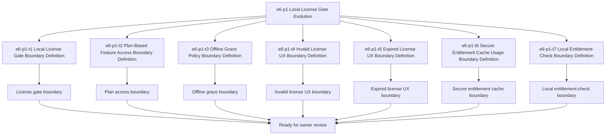

# E6-P1 Local License Gate Tasks

Updated: 2026-05-22

Branch: `tasks/e6-p1-local-license-gate`

Status: planning-only

This task package derives from the approved `e6-p1 Local License Gate`
build-ready report.
It prepares the local-license boundary for later scoped implementation
planning, but it does not authorize license enforcement coding by itself.

## Scope Reminder

- `KVDOS` is the commercial product.
- `KVDF` is the governance/tooling layer.
- KVDOS app work stays inside `workspaces/apps/kvdos/`.
- KVDOS v1 commercial boundary = Local IDE Studio + Local Runtime +
  Cloud subscription/license control.
- Private code, secrets, customer data, local reports, and local runtime state
  stay local.
- Cloud commercial control only handles account, subscription, license
  entitlement, activation, plan access, release access, and update access.

## Generated Task IDs

1. `e6-p1-t1` Local License Gate Boundary Definition
2. `e6-p1-t2` Plan-Based Feature Access Boundary Definition
3. `e6-p1-t3` Offline Grace Policy Boundary Definition
4. `e6-p1-t4` Invalid License UX Boundary Definition
5. `e6-p1-t5` Expired License UX Boundary Definition
6. `e6-p1-t6` Secure Entitlement Cache Usage Boundary Definition
7. `e6-p1-t7` Local Entitlement-Check Boundary Definition

## Task Package Rules

- Keep all work app-local to `workspaces/apps/kvdos/`.
- Do not modify repo-root KVDF core files.
- Do not start `e7-p1`.
- Do not write implementation code.
- Do not build local license enforcement yet.
- Do not implement feature gates yet.
- Do not implement entitlement checks yet.
- Do not touch `.vscode/settings.json`.

## Allowed Files

- `workspaces/apps/kvdos/docs/reports/e6-p1-local-license-gate-build-ready-report.md`
- `workspaces/apps/kvdos/docs/roadmap/E6_P1_LOCAL_LICENSE_GATE_TASKS.md`
- `workspaces/apps/kvdos/docs/roadmap/KVDOS_VERSION_PLAN.md`
- `workspaces/apps/kvdos/docs/roadmap/KVDOS_EVOLUTION_PLAN.md`
- `workspaces/apps/kvdos/docs/roadmap/KVDOS_EVOLUTION_TASK_PUNCH.md`
- `workspaces/apps/kvdos/docs/roadmap/KVDOS_IMPLEMENTATION_READINESS_QUEUE.md`
- `workspaces/apps/kvdos/docs/product/PRODUCT_DEFINITION.md`
- `workspaces/apps/kvdos/docs/product/PRODUCT_STRATEGY.md`
- `workspaces/apps/kvdos/docs/product/MVP_SCOPE.md`
- `workspaces/apps/kvdos/docs/architecture/KVDOS_ARCHITECTURE.md`

## Forbidden Files

- repo-root KVDF core files
- any file outside `workspaces/apps/kvdos/`
- `workspaces/apps/kvdos/src/**`
- `workspaces/apps/kvdos/.kabeeri/tasks.json`
- `workspaces/apps/kvdos/.vscode/settings.json`
- `workspaces/apps/kvdos/docs/reports/planning-versions-evos-tasks-pipeline.html`

## Tasks

### `e6-p1-t1` Local License Gate Boundary Definition

- Title: Define the local license gate boundary for KVDOS
- Build type: local-license-gate specification
- In scope:
  - local license gate wording
  - entitlement-based gate notes
  - blocked/allowed state wording
- Out of scope:
  - local license enforcement code
  - feature gate implementation
  - entitlement-check implementation
  - runtime implementation code
- Acceptance criteria:
  - the local license gate boundary is explicit
  - the boundary stays app-local
  - the wording does not imply enforcement code
- Validation commands:
  - `rg -n "license gate|local license|blocked|allowed|entitlement|KVDOS|KVDF" workspaces/apps/kvdos/docs/reports workspaces/apps/kvdos/docs/roadmap workspaces/apps/kvdos/docs/product workspaces/apps/kvdos/docs/architecture`
  - `git diff --check`

### `e6-p1-t2` Plan-Based Feature Access Boundary Definition

- Title: Define the plan-based feature access boundary
- Build type: access-control specification
- In scope:
  - plan-based access wording
  - feature access boundary notes
  - feature-gate policy notes
- Out of scope:
  - feature-flag implementation
  - access-control code
  - entitlement enforcement code
- Acceptance criteria:
  - plan access is explicit
  - blocked/allowed states are clear
  - the boundary remains pre-implementation
- Validation commands:
  - `rg -n "plan access|feature access|blocked|allowed|entitlement|grace" workspaces/apps/kvdos/docs/reports workspaces/apps/kvdos/docs/roadmap workspaces/apps/kvdos/docs/product workspaces/apps/kvdos/docs/architecture`
  - `git diff --check`

### `e6-p1-t3` Offline Grace Policy Boundary Definition

- Title: Define the offline grace policy boundary
- Build type: policy specification
- In scope:
  - offline grace wording
  - grace-period boundary notes
  - offline continuity notes
- Out of scope:
  - grace-policy implementation
  - runtime network-check code
  - license enforcement code
- Acceptance criteria:
  - offline grace wording is explicit
  - the policy remains documentation-only
  - the boundary stays app-local
- Validation commands:
  - `rg -n "offline grace|grace|offline|policy|entitlement" workspaces/apps/kvdos/docs/reports workspaces/apps/kvdos/docs/roadmap workspaces/apps/kvdos/docs/product workspaces/apps/kvdos/docs/architecture`
  - `git diff --check`

### `e6-p1-t4` Invalid License UX Boundary Definition

- Title: Define the invalid license UX boundary
- Build type: UX boundary specification
- In scope:
  - invalid-license wording
  - blocked-state messaging
  - local UX notes for invalid entitlements
- Out of scope:
  - invalid-license UI implementation
  - alert/banner code
  - runtime enforcement logic
- Acceptance criteria:
  - invalid-license wording is explicit
  - the wording does not imply UI implementation
  - the boundary remains pre-implementation
- Validation commands:
  - `rg -n "invalid license|expired license|blocked|message|UX|entitlement" workspaces/apps/kvdos/docs/reports workspaces/apps/kvdos/docs/roadmap workspaces/apps/kvdos/docs/product workspaces/apps/kvdos/docs/architecture`
  - `git diff --check`

### `e6-p1-t5` Expired License UX Boundary Definition

- Title: Define the expired license UX boundary
- Build type: UX boundary specification
- In scope:
  - expired-license wording
  - renewal-state messaging
  - local UX notes for expired entitlements
- Out of scope:
  - expired-license UI implementation
  - renewal workflow code
  - runtime enforcement logic
- Acceptance criteria:
  - expired-license wording is explicit
  - the wording does not imply implementation code
  - the boundary stays app-local
- Validation commands:
  - `rg -n "expired license|invalid license|renewal|blocked|message|UX|entitlement" workspaces/apps/kvdos/docs/reports workspaces/apps/kvdos/docs/roadmap workspaces/apps/kvdos/docs/product workspaces/apps/kvdos/docs/architecture`
  - `git diff --check`

### `e6-p1-t6` Secure Entitlement Cache Usage Boundary Definition

- Title: Define the secure entitlement cache usage boundary
- Build type: cache-policy specification
- In scope:
  - secure entitlement cache wording
  - local cache usage notes
  - cache refresh boundary notes
- Out of scope:
  - cache implementation code
  - runtime storage implementation
  - cloud sync code
- Acceptance criteria:
  - cache usage wording is explicit
  - the cache remains local-first
  - the boundary does not imply code changes yet
- Validation commands:
  - `rg -n "cache|entitlement|secure|local-first|refresh" workspaces/apps/kvdos/docs/reports workspaces/apps/kvdos/docs/roadmap workspaces/apps/kvdos/docs/product workspaces/apps/kvdos/docs/architecture`
  - `git diff --check`

### `e6-p1-t7` Local Entitlement-Check Boundary Definition

- Title: Define the local entitlement-check boundary
- Build type: entitlement-check specification
- In scope:
  - local entitlement-check wording
  - allowed/blocked state wording
  - entitlement verification boundary notes
- Out of scope:
  - entitlement-check implementation code
  - cloud API coding
  - subscription backend implementation
- Acceptance criteria:
  - entitlement-check wording is explicit
  - the wording stays pre-implementation
  - the boundary remains app-local
- Validation commands:
  - `rg -n "entitlement-check|entitlement|allowed|blocked|license|grace" workspaces/apps/kvdos/docs/reports workspaces/apps/kvdos/docs/roadmap workspaces/apps/kvdos/docs/product workspaces/apps/kvdos/docs/architecture`
  - `git diff --check`

## Visualization

## PR Title

`e6-p1: local license gate readiness`

## PR Checklist

- [ ] Changes stay inside `workspaces/apps/kvdos/`
- [ ] No repo-root KVDF core files modified
- [ ] No `e7-p1` work started
- [ ] No local license enforcement implemented
- [ ] No feature gates implemented
- [ ] No entitlement checks implemented
- [ ] No runtime, SQLite, cloud API, execution, or packaging work added
- [ ] Local license gate boundary is explicit
- [ ] Plan-based feature access boundary is explicit
- [ ] Offline grace policy boundary is explicit
- [ ] Invalid-license UX boundary is explicit
- [ ] Expired-license UX boundary is explicit
- [ ] Secure entitlement cache usage boundary is explicit
- [ ] Local entitlement-check boundary is explicit
- [ ] `git diff --check` passes
- [ ] `.vscode/settings.json` remains untouched
