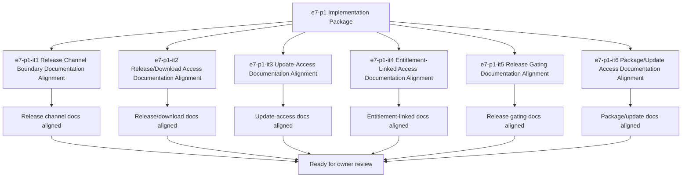

# E7-P1 Release Access Implementation Tasks

Updated: 2026-05-22

Branch: `tasks/e7-p1-release-access`

Status: planning-only

This task package is scoped only to `e7-p1 Release Access` implementation planning.
It remains documentation/spec-boundary implementation planning only and does not include
release packaging code, update-service code, or release/download access code.

## Scope Reminder

- `KVDOS` is the commercial product.
- `KVDF` is the governance/tooling layer.
- KVDOS app work stays inside `workspaces/apps/kvdos/`.
- KVDOS v1 commercial boundary = Local IDE Studio + Local Runtime + Cloud subscription/license control.
- Private code, secrets, customer data, local reports, and local runtime state stay local.
- Cloud commercial control only handles account, subscription, license entitlement, activation, plan access, release access, and update access.

## Generated Tasks

### `e7-p1-it1` Release Channel Boundary Documentation Alignment

Title:
- Align the release channel boundary wording across app-local KVDOS docs

Allowed files:
- `workspaces/apps/kvdos/docs/reports/e7-p1-release-access-build-ready-report.md`
- `workspaces/apps/kvdos/docs/reports/e7-p1-release-access-execution-report.md`
- `workspaces/apps/kvdos/docs/roadmap/E7_P1_RELEASE_ACCESS_TASKS.md`
- `workspaces/apps/kvdos/docs/roadmap/E7_P1_RELEASE_ACCESS_IMPLEMENTATION_TASKS.md`
- `workspaces/apps/kvdos/docs/product/PRODUCT_DEFINITION.md`
- `workspaces/apps/kvdos/docs/product/PRODUCT_STRATEGY.md`

Forbidden files:
- repo-root KVDF core files
- any file outside `workspaces/apps/kvdos/`
- `workspaces/apps/kvdos/src/**`
- `workspaces/apps/kvdos/.kabeeri/tasks.json`
- `workspaces/apps/kvdos/app.kvdos.yaml`

Acceptance criteria:
- Release channel wording is consistent across app-local docs.
- The wording stays docs-only and does not imply packaging code.
- The boundary remains pre-implementation and app-local.

Validation commands:
- `rg -n "release channel|release|update|package|download|KVDOS|KVDF" workspaces/apps/kvdos/docs/reports workspaces/apps/kvdos/docs/roadmap workspaces/apps/kvdos/docs/product workspaces/apps/kvdos/docs/architecture`
- `git diff --check`

### `e7-p1-it2` Release/Download Access Documentation Alignment

Title:
- Align release/download access wording without building delivery code

Allowed files:
- `workspaces/apps/kvdos/docs/reports/e7-p1-release-access-build-ready-report.md`
- `workspaces/apps/kvdos/docs/reports/e7-p1-release-access-execution-report.md`
- `workspaces/apps/kvdos/docs/roadmap/E7_P1_RELEASE_ACCESS_TASKS.md`
- `workspaces/apps/kvdos/docs/roadmap/E7_P1_RELEASE_ACCESS_IMPLEMENTATION_TASKS.md`

Forbidden files:
- repo-root KVDF core files
- any file outside `workspaces/apps/kvdos/`
- `workspaces/apps/kvdos/src/**`
- `workspaces/apps/kvdos/.kabeeri/tasks.json`
- `workspaces/apps/kvdos/app.kvdos.yaml`

Acceptance criteria:
- Release/download access wording is explicit and app-local.
- Blocked/allowed state wording is clear and reviewable.
- The wording does not imply delivery or package code implementation.

Validation commands:
- `rg -n "release/download|download|release access|entitlement|release gating" workspaces/apps/kvdos/docs/reports workspaces/apps/kvdos/docs/roadmap workspaces/apps/kvdos/docs/product workspaces/apps/kvdos/docs/architecture`
- `git diff --check`

### `e7-p1-it3` Update-Access Documentation Alignment

Title:
- Align update-access wording without building update-service code

Allowed files:
- `workspaces/apps/kvdos/docs/reports/e7-p1-release-access-build-ready-report.md`
- `workspaces/apps/kvdos/docs/reports/e7-p1-release-access-execution-report.md`
- `workspaces/apps/kvdos/docs/roadmap/E7_P1_RELEASE_ACCESS_TASKS.md`
- `workspaces/apps/kvdos/docs/roadmap/E7_P1_RELEASE_ACCESS_IMPLEMENTATION_TASKS.md`
- `workspaces/apps/kvdos/docs/product/MVP_SCOPE.md`

Forbidden files:
- repo-root KVDF core files
- any file outside `workspaces/apps/kvdos/`
- `workspaces/apps/kvdos/src/**`
- `workspaces/apps/kvdos/.kabeeri/tasks.json`
- `workspaces/apps/kvdos/app.kvdos.yaml`

Acceptance criteria:
- Update-access wording is explicit.
- The wording remains documentation-only.
- The boundary stays app-local.

Validation commands:
- `rg -n "update-access|update|offline|release|download|entitlement" workspaces/apps/kvdos/docs/reports workspaces/apps/kvdos/docs/roadmap workspaces/apps/kvdos/docs/product workspaces/apps/kvdos/docs/architecture`
- `git diff --check`

### `e7-p1-it4` Entitlement-Linked Access Documentation Alignment

Title:
- Align entitlement-linked access wording without writing enforcement code

Allowed files:
- `workspaces/apps/kvdos/docs/reports/e7-p1-release-access-build-ready-report.md`
- `workspaces/apps/kvdos/docs/reports/e7-p1-release-access-execution-report.md`
- `workspaces/apps/kvdos/docs/roadmap/E7_P1_RELEASE_ACCESS_TASKS.md`
- `workspaces/apps/kvdos/docs/roadmap/E7_P1_RELEASE_ACCESS_IMPLEMENTATION_TASKS.md`

Forbidden files:
- repo-root KVDF core files
- any file outside `workspaces/apps/kvdos/`
- `workspaces/apps/kvdos/src/**`
- `workspaces/apps/kvdos/.kabeeri/tasks.json`
- `workspaces/apps/kvdos/app.kvdos.yaml`

Acceptance criteria:
- Entitlement-linked access wording is explicit.
- The wording does not imply implementation.
- The boundary remains pre-implementation.

Validation commands:
- `rg -n "entitlement|release access|gated|allowed|blocked|package" workspaces/apps/kvdos/docs/reports workspaces/apps/kvdos/docs/roadmap workspaces/apps/kvdos/docs/product workspaces/apps/kvdos/docs/architecture`
- `git diff --check`

### `e7-p1-it5` Release Gating Documentation Alignment

Title:
- Align release gating wording without building gate logic

Allowed files:
- `workspaces/apps/kvdos/docs/reports/e7-p1-release-access-build-ready-report.md`
- `workspaces/apps/kvdos/docs/reports/e7-p1-release-access-execution-report.md`
- `workspaces/apps/kvdos/docs/roadmap/E7_P1_RELEASE_ACCESS_TASKS.md`
- `workspaces/apps/kvdos/docs/roadmap/E7_P1_RELEASE_ACCESS_IMPLEMENTATION_TASKS.md`

Forbidden files:
- repo-root KVDF core files
- any file outside `workspaces/apps/kvdos/`
- `workspaces/apps/kvdos/src/**`
- `workspaces/apps/kvdos/.kabeeri/tasks.json`
- `workspaces/apps/kvdos/app.kvdos.yaml`

Acceptance criteria:
- Release gating wording is explicit.
- The boundary stays app-local.
- The wording does not imply packaging code.

Validation commands:
- `rg -n "release gating|gating|release access|allowed|blocked|entitlement" workspaces/apps/kvdos/docs/reports workspaces/apps/kvdos/docs/roadmap workspaces/apps/kvdos/docs/product workspaces/apps/kvdos/docs/architecture`
- `git diff --check`

### `e7-p1-it6` Package/Update Access Documentation Alignment

Title:
- Align package/update access wording without building delivery code

Allowed files:
- `workspaces/apps/kvdos/docs/reports/e7-p1-release-access-build-ready-report.md`
- `workspaces/apps/kvdos/docs/reports/e7-p1-release-access-execution-report.md`
- `workspaces/apps/kvdos/docs/roadmap/E7_P1_RELEASE_ACCESS_TASKS.md`
- `workspaces/apps/kvdos/docs/roadmap/E7_P1_RELEASE_ACCESS_IMPLEMENTATION_TASKS.md`

Forbidden files:
- repo-root KVDF core files
- any file outside `workspaces/apps/kvdos/`
- `workspaces/apps/kvdos/src/**`
- `workspaces/apps/kvdos/.kabeeri/tasks.json`
- `workspaces/apps/kvdos/app.kvdos.yaml`

Acceptance criteria:
- Package/update access wording is explicit.
- The wording stays pre-implementation.
- The boundary remains app-local.

Validation commands:
- `rg -n "package/update|package|update|download|release|access" workspaces/apps/kvdos/docs/reports workspaces/apps/kvdos/docs/roadmap workspaces/apps/kvdos/docs/product workspaces/apps/kvdos/docs/architecture`
- `git diff --check`

## Visualization

## PR Title

`e7-p1: release access implementation package`

## PR Checklist

- [ ] Changes stay inside `workspaces/apps/kvdos/`
- [ ] No repo-root KVDF core files modified
- [ ] No `e8-p1` work started
- [ ] No release packaging implemented
- [ ] No update service implemented
- [ ] No release/download access implemented
- [ ] No cloud APIs, authentication, subscriptions, licenses, runtime, SQLite, or execution work added
- [ ] No feature code added
- [ ] Release channel boundary is explicit
- [ ] Release/download access boundary is explicit
- [ ] Update-access boundary is explicit
- [ ] Entitlement-linked access boundary is explicit
- [ ] Release gating boundary is explicit
- [ ] Package/update access boundary is explicit
- [ ] `git diff --check` passes
- [ ] `.vscode/settings.json` remains untouched
