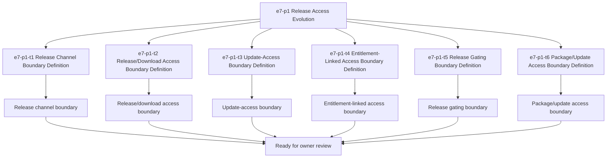

# E7-P1 Release Access Tasks

Updated: 2026-05-22

Branch: `tasks/e7-p1-release-access`

Status: planning-only

This task package derives from the approved `e7-p1 Release Access`
build-ready report.
It prepares the release-access boundary for later scoped implementation
planning, but it does not authorize packaging or update-service coding by itself.

## Scope Reminder

- `KVDOS` is the commercial product.
- `KVDF` is the governance/tooling layer.
- KVDOS app work stays inside `workspaces/apps/kvdos/`.
- KVDOS v1 commercial boundary = Local IDE Studio + Local Runtime +
  Cloud subscription/license control.
- Private code, secrets, customer data, local reports, and local runtime state
  stay local.
- Cloud commercial control only handles account, subscription, license
  entitlement, activation, plan access, release access, and update access.

## Generated Task IDs

1. `e7-p1-t1` Release Channel Boundary Definition
2. `e7-p1-t2` Release/Download Access Boundary Definition
3. `e7-p1-t3` Update-Access Boundary Definition
4. `e7-p1-t4` Entitlement-Linked Access Boundary Definition
5. `e7-p1-t5` Release Gating Boundary Definition
6. `e7-p1-t6` Package/Update Access Boundary Definition

## Task Package Rules

- Keep all work app-local to `workspaces/apps/kvdos/`.
- Do not modify repo-root KVDF core files.
- Do not start `e8-p1`.
- Do not write implementation code.
- Do not build release packaging yet.
- Do not implement update service yet.
- Do not implement release/download access yet.
- Do not touch `.vscode/settings.json`.

## Allowed Files

- `workspaces/apps/kvdos/docs/reports/e7-p1-release-access-build-ready-report.md`
- `workspaces/apps/kvdos/docs/roadmap/E7_P1_RELEASE_ACCESS_TASKS.md`
- `workspaces/apps/kvdos/docs/roadmap/KVDOS_VERSION_PLAN.md`
- `workspaces/apps/kvdos/docs/roadmap/KVDOS_EVOLUTION_PLAN.md`
- `workspaces/apps/kvdos/docs/roadmap/KVDOS_EVOLUTION_TASK_PUNCH.md`
- `workspaces/apps/kvdos/docs/roadmap/KVDOS_IMPLEMENTATION_READINESS_QUEUE.md`
- `workspaces/apps/kvdos/docs/product/PRODUCT_DEFINITION.md`
- `workspaces/apps/kvdos/docs/product/PRODUCT_STRATEGY.md`
- `workspaces/apps/kvdos/docs/product/MVP_SCOPE.md`
- `workspaces/apps/kvdos/docs/architecture/KVDOS_ARCHITECTURE.md`

## Forbidden Files

- repo-root KVDF core files
- any file outside `workspaces/apps/kvdos/`
- `workspaces/apps/kvdos/src/**`
- `workspaces/apps/kvdos/.kabeeri/tasks.json`
- `workspaces/apps/kvdos/.vscode/settings.json`
- `workspaces/apps/kvdos/docs/reports/planning-versions-evos-tasks-pipeline.html`

## Tasks

### `e7-p1-t1` Release Channel Boundary Definition

- Title: Define the release channel boundary for KVDOS commercial control
- Build type: release-access specification
- In scope:
  - release channel boundary notes
  - release tier wording
  - update-availability boundary notes
- Out of scope:
  - release packaging implementation
  - update-service implementation
  - release/download implementation
  - cloud API coding
- Acceptance criteria:
  - the release channel boundary is explicit
  - the boundary stays app-local
  - the wording does not imply packaging code
- Validation commands:
  - `rg -n "release channel|release|update|package|download|KVDOS|KVDF" workspaces/apps/kvdos/docs/reports workspaces/apps/kvdos/docs/roadmap workspaces/apps/kvdos/docs/product workspaces/apps/kvdos/docs/architecture`
  - `git diff --check`

### `e7-p1-t2` Release/Download Access Boundary Definition

- Title: Define the release/download access boundary
- Build type: release-access specification
- In scope:
  - release/download access wording
  - entitlement-gated release access notes
  - release delivery boundary notes
- Out of scope:
  - release/download implementation
  - package delivery code
  - cloud API coding
- Acceptance criteria:
  - release/download access wording is explicit
  - the wording stays pre-implementation
  - the boundary remains app-local
- Validation commands:
  - `rg -n "release/download|download|release access|entitlement|release gating" workspaces/apps/kvdos/docs/reports workspaces/apps/kvdos/docs/roadmap workspaces/apps/kvdos/docs/product workspaces/apps/kvdos/docs/architecture`
  - `git diff --check`

### `e7-p1-t3` Update-Access Boundary Definition

- Title: Define the update-access boundary
- Build type: update-access specification
- In scope:
  - update-access wording
  - update-availability notes
  - secure update boundary notes
- Out of scope:
  - update-service implementation
  - update download code
  - cloud API coding
- Acceptance criteria:
  - update-access wording is explicit
  - the boundary does not imply update-service code
  - the wording stays app-local
- Validation commands:
  - `rg -n "update-access|update|download|release|channel|entitlement" workspaces/apps/kvdos/docs/reports workspaces/apps/kvdos/docs/roadmap workspaces/apps/kvdos/docs/product workspaces/apps/kvdos/docs/architecture`
  - `git diff --check`

### `e7-p1-t4` Entitlement-Linked Access Boundary Definition

- Title: Define the entitlement-linked access boundary
- Build type: access-control specification
- In scope:
  - entitlement-linked release access wording
  - gated-release notes
  - local-private content protection notes
- Out of scope:
  - entitlement implementation code
  - enforcement code
  - cloud API coding
- Acceptance criteria:
  - entitlement-linked access is explicit
  - the wording does not imply implementation
  - the boundary remains pre-implementation
- Validation commands:
  - `rg -n "entitlement|release access|gated|allowed|blocked|package" workspaces/apps/kvdos/docs/reports workspaces/apps/kvdos/docs/roadmap workspaces/apps/kvdos/docs/product workspaces/apps/kvdos/docs/architecture`
  - `git diff --check`

### `e7-p1-t5` Release Gating Boundary Definition

- Title: Define the release gating boundary
- Build type: release-access policy specification
- In scope:
  - release gating wording
  - gated-access notes
  - local-private data protection notes
- Out of scope:
  - release-gating implementation
  - runtime release code
  - packaging implementation
- Acceptance criteria:
  - release gating wording is explicit
  - the boundary stays app-local
  - the wording does not imply packaging code
- Validation commands:
  - `rg -n "release gating|gating|release access|allowed|blocked|entitlement" workspaces/apps/kvdos/docs/reports workspaces/apps/kvdos/docs/roadmap workspaces/apps/kvdos/docs/product workspaces/apps/kvdos/docs/architecture`
  - `git diff --check`

### `e7-p1-t6` Package/Update Access Boundary Definition

- Title: Define the package/update access boundary
- Build type: release-access specification
- In scope:
  - package/update access wording
  - release artifact access notes
  - update/download access notes
- Out of scope:
  - package delivery code
  - update-service code
  - packaging implementation
- Acceptance criteria:
  - package/update access wording is explicit
  - the wording stays pre-implementation
  - the boundary remains app-local
- Validation commands:
  - `rg -n "package/update|package|update|download|release|access" workspaces/apps/kvdos/docs/reports workspaces/apps/kvdos/docs/roadmap workspaces/apps/kvdos/docs/product workspaces/apps/kvdos/docs/architecture`
  - `git diff --check`

## Visualization

## PR Title

`e7-p1: release access readiness`

## PR Checklist

- [ ] Changes stay inside `workspaces/apps/kvdos/`
- [ ] No repo-root KVDF core files modified
- [ ] No `e8-p1` work started
- [ ] No release packaging implemented
- [ ] No update service implemented
- [ ] No release/download access implemented
- [ ] No cloud APIs, authentication, subscriptions, licenses, runtime, SQLite, or execution work added
- [ ] No feature code added
- [ ] Release channel boundary is explicit
- [ ] Release/download access boundary is explicit
- [ ] Update-access boundary is explicit
- [ ] Entitlement-linked access boundary is explicit
- [ ] Release gating boundary is explicit
- [ ] Package/update access boundary is explicit
- [ ] `git diff --check` passes
- [ ] `.vscode/settings.json` remains untouched
