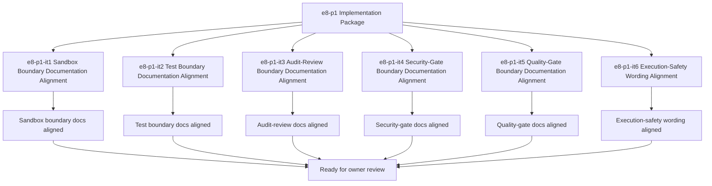

# E8-P1 Safety And Quality Implementation Tasks

Updated: 2026-05-22

Branch: `tasks/e8-p1-safety-and-quality-implementation`

Status: planning-only

This task package is scoped only to `e8-p1 Safety And Quality` implementation planning.
It remains documentation/spec-boundary implementation planning only and does not include
sandbox implementation code, test harness code, audit logic, security-gate code, quality-gate code, or execution logic.

## Scope Reminder

- `KVDOS` is the commercial product.
- `KVDF` is the governance/tooling layer.
- KVDOS app work stays inside `workspaces/apps/kvdos/`.
- KVDOS v1 commercial boundary = Local IDE Studio + Local Runtime + Cloud subscription/license control.
- Private code, secrets, customer data, local reports, and local runtime state stay local.
- Cloud commercial control only handles account, subscription, license entitlement, activation, plan access, release access, and update access.

## Generated Tasks

### `e8-p1-it1` Sandbox Boundary Documentation Alignment

Title:
- Align sandbox boundary wording across app-local KVDOS docs

Allowed files:
- `workspaces/apps/kvdos/docs/reports/e8-p1-safety-and-quality-build-ready-report.md`
- `workspaces/apps/kvdos/docs/reports/e8-p1-safety-and-quality-execution-report.md`
- `workspaces/apps/kvdos/docs/roadmap/E8_P1_SAFETY_AND_QUALITY_TASKS.md`
- `workspaces/apps/kvdos/docs/roadmap/E8_P1_SAFETY_AND_QUALITY_IMPLEMENTATION_TASKS.md`
- `workspaces/apps/kvdos/docs/product/PRODUCT_DEFINITION.md`
- `workspaces/apps/kvdos/docs/product/PRODUCT_STRATEGY.md`

Forbidden files:
- repo-root KVDF core files
- any file outside `workspaces/apps/kvdos/`
- `workspaces/apps/kvdos/src/**`
- `workspaces/apps/kvdos/.kabeeri/tasks.json`
- `workspaces/apps/kvdos/app.kvdos.yaml`

Acceptance criteria:
- Sandbox boundary wording is consistent across app-local docs.
- The wording stays docs-only and does not imply runtime behavior.
- The boundary remains pre-implementation and app-local.

Validation commands:
- `rg -n "sandbox|allow|deny|safe|execution|KVDOS|KVDF" workspaces/apps/kvdos/docs/reports workspaces/apps/kvdos/docs/roadmap workspaces/apps/kvdos/docs/product workspaces/apps/kvdos/docs/architecture`
- `git diff --check`

### `e8-p1-it2` Test Boundary Documentation Alignment

Title:
- Align test boundary wording without building test harness code

Allowed files:
- `workspaces/apps/kvdos/docs/reports/e8-p1-safety-and-quality-build-ready-report.md`
- `workspaces/apps/kvdos/docs/reports/e8-p1-safety-and-quality-execution-report.md`
- `workspaces/apps/kvdos/docs/roadmap/E8_P1_SAFETY_AND_QUALITY_TASKS.md`
- `workspaces/apps/kvdos/docs/roadmap/E8_P1_SAFETY_AND_QUALITY_IMPLEMENTATION_TASKS.md`

Forbidden files:
- repo-root KVDF core files
- any file outside `workspaces/apps/kvdos/`
- `workspaces/apps/kvdos/src/**`
- `workspaces/apps/kvdos/.kabeeri/tasks.json`
- `workspaces/apps/kvdos/app.kvdos.yaml`

Acceptance criteria:
- Test boundary wording is explicit and app-local.
- Blocked/allowed state wording is clear and reviewable.
- The wording does not imply test harness implementation.

Validation commands:
- `rg -n "test boundary|tests|validation|quality|execution|KVDOS|KVDF" workspaces/apps/kvdos/docs/reports workspaces/apps/kvdos/docs/roadmap workspaces/apps/kvdos/docs/product workspaces/apps/kvdos/docs/architecture`
- `git diff --check`

### `e8-p1-it3` Audit-Review Boundary Documentation Alignment

Title:
- Align audit-review boundary wording without building audit logic

Allowed files:
- `workspaces/apps/kvdos/docs/reports/e8-p1-safety-and-quality-build-ready-report.md`
- `workspaces/apps/kvdos/docs/reports/e8-p1-safety-and-quality-execution-report.md`
- `workspaces/apps/kvdos/docs/roadmap/E8_P1_SAFETY_AND_QUALITY_TASKS.md`
- `workspaces/apps/kvdos/docs/roadmap/E8_P1_SAFETY_AND_QUALITY_IMPLEMENTATION_TASKS.md`

Forbidden files:
- repo-root KVDF core files
- any file outside `workspaces/apps/kvdos/`
- `workspaces/apps/kvdos/src/**`
- `workspaces/apps/kvdos/.kabeeri/tasks.json`
- `workspaces/apps/kvdos/app.kvdos.yaml`

Acceptance criteria:
- Audit-review boundary wording is explicit.
- The wording stays pre-implementation.
- The boundary remains app-local.

Validation commands:
- `rg -n "audit|review|audit trail|governance|safety|KVDOS|KVDF" workspaces/apps/kvdos/docs/reports workspaces/apps/kvdos/docs/roadmap workspaces/apps/kvdos/docs/product workspaces/apps/kvdos/docs/architecture`
- `git diff --check`

### `e8-p1-it4` Security-Gate Boundary Documentation Alignment

Title:
- Align security-gate boundary wording before approved execution

Allowed files:
- `workspaces/apps/kvdos/docs/reports/e8-p1-safety-and-quality-build-ready-report.md`
- `workspaces/apps/kvdos/docs/reports/e8-p1-safety-and-quality-execution-report.md`
- `workspaces/apps/kvdos/docs/roadmap/E8_P1_SAFETY_AND_QUALITY_TASKS.md`
- `workspaces/apps/kvdos/docs/roadmap/E8_P1_SAFETY_AND_QUALITY_IMPLEMENTATION_TASKS.md`

Forbidden files:
- repo-root KVDF core files
- any file outside `workspaces/apps/kvdos/`
- `workspaces/apps/kvdos/src/**`
- `workspaces/apps/kvdos/.kabeeri/tasks.json`
- `workspaces/apps/kvdos/app.kvdos.yaml`

Acceptance criteria:
- Security-gate boundary wording is explicit.
- The wording does not imply code implementation.
- The boundary stays app-local.

Validation commands:
- `rg -n "security|gate|deny|allow|safety|execution|KVDOS|KVDF" workspaces/apps/kvdos/docs/reports workspaces/apps/kvdos/docs/roadmap workspaces/apps/kvdos/docs/product workspaces/apps/kvdos/docs/architecture`
- `git diff --check`

### `e8-p1-it5` Quality-Gate Boundary Documentation Alignment

Title:
- Align quality-gate boundary wording for execution readiness

Allowed files:
- `workspaces/apps/kvdos/docs/reports/e8-p1-safety-and-quality-build-ready-report.md`
- `workspaces/apps/kvdos/docs/reports/e8-p1-safety-and-quality-execution-report.md`
- `workspaces/apps/kvdos/docs/roadmap/E8_P1_SAFETY_AND_QUALITY_TASKS.md`
- `workspaces/apps/kvdos/docs/roadmap/E8_P1_SAFETY_AND_QUALITY_IMPLEMENTATION_TASKS.md`

Forbidden files:
- repo-root KVDF core files
- any file outside `workspaces/apps/kvdos/`
- `workspaces/apps/kvdos/src/**`
- `workspaces/apps/kvdos/.kabeeri/tasks.json`
- `workspaces/apps/kvdos/app.kvdos.yaml`

Acceptance criteria:
- Quality-gate boundary wording is explicit.
- The wording stays pre-implementation.
- The boundary remains app-local.

Validation commands:
- `rg -n "quality|gate|review|readiness|execution|KVDOS|KVDF" workspaces/apps/kvdos/docs/reports workspaces/apps/kvdos/docs/roadmap workspaces/apps/kvdos/docs/product workspaces/apps/kvdos/docs/architecture`
- `git diff --check`

### `e8-p1-it6` Execution-Safety Wording Alignment

Title:
- Align execution-safety wording without enabling execution

Allowed files:
- `workspaces/apps/kvdos/docs/reports/e8-p1-safety-and-quality-build-ready-report.md`
- `workspaces/apps/kvdos/docs/reports/e8-p1-safety-and-quality-execution-report.md`
- `workspaces/apps/kvdos/docs/roadmap/E8_P1_SAFETY_AND_QUALITY_TASKS.md`
- `workspaces/apps/kvdos/docs/roadmap/E8_P1_SAFETY_AND_QUALITY_IMPLEMENTATION_TASKS.md`

Forbidden files:
- repo-root KVDF core files
- any file outside `workspaces/apps/kvdos/`
- `workspaces/apps/kvdos/src/**`
- `workspaces/apps/kvdos/.kabeeri/tasks.json`
- `workspaces/apps/kvdos/app.kvdos.yaml`

Acceptance criteria:
- Execution-safety wording is explicit.
- The wording does not imply runnable behavior.
- The boundary stays app-local.

Validation commands:
- `rg -n "execution safety|safe|unsafe|execution|approval|KVDOS|KVDF" workspaces/apps/kvdos/docs/reports workspaces/apps/kvdos/docs/roadmap workspaces/apps/kvdos/docs/product workspaces/apps/kvdos/docs/architecture`
- `git diff --check`

## Visualization

## PR Title

`e8-p1: safety and quality implementation package`

## PR Checklist

- [ ] Changes stay inside `workspaces/apps/kvdos/`
- [ ] No repo-root KVDF core files modified
- [ ] No `e9-p1` work started
- [ ] No sandbox implementation code added
- [ ] No test harnesses added
- [ ] No audit implementation code added
- [ ] No security gates added
- [ ] No quality gates added
- [ ] No runtime, SQLite, cloud API, execution, or packaging work added
- [ ] No feature code added
- [ ] Sandbox boundary is explicit
- [ ] Test boundary is explicit
- [ ] Audit-review boundary is explicit
- [ ] Security-gate boundary is explicit
- [ ] Quality-gate boundary is explicit
- [ ] Execution-safety wording is explicit
- [ ] `git diff --check` passes
- [ ] `.vscode/settings.json` remains untouched
