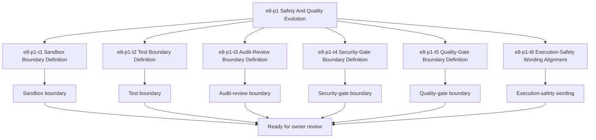

# E8-P1 Safety And Quality Tasks

Updated: 2026-05-22

Branch: `tasks/e8-p1-safety-and-quality`

Status: planning-only

This task package is scoped only to `e8-p1 Safety And Quality` implementation planning.
It remains documentation/spec-boundary implementation planning only and does not include
sandbox implementation code, test harness code, audit logic, security-gate code, or quality-gate code.

## Scope Reminder

- `KVDOS` is the commercial product.
- `KVDF` is the governance/tooling layer.
- KVDOS app work stays inside `workspaces/apps/kvdos/`.
- KVDOS v1 commercial boundary = Local IDE Studio + Local Runtime + Cloud subscription/license control.
- Private code, secrets, customer data, local reports, and local runtime state stay local.
- Cloud commercial control only handles account, subscription, license entitlement, activation, plan access, release access, and update access.

## Generated Task IDs

1. `e8-p1-t1` Sandbox Boundary Definition
2. `e8-p1-t2` Test Boundary Definition
3. `e8-p1-t3` Audit-Review Boundary Definition
4. `e8-p1-t4` Security-Gate Boundary Definition
5. `e8-p1-t5` Quality-Gate Boundary Definition
6. `e8-p1-t6` Execution-Safety Wording Alignment

## Task Package Rules

- Keep all work app-local to `workspaces/apps/kvdos/`.
- Do not modify repo-root KVDF core files.
- Do not start `e9-p1`.
- Do not write implementation code.
- Do not build sandbox behavior yet.
- Do not build test harnesses yet.
- Do not build audit review yet.
- Do not build security gates yet.
- Do not build quality gates yet.
- Do not touch `.vscode/settings.json`.

## Allowed Files

- `workspaces/apps/kvdos/docs/reports/e8-p1-safety-and-quality-build-ready-report.md`
- `workspaces/apps/kvdos/docs/reports/e8-p1-safety-and-quality-execution-report.md`
- `workspaces/apps/kvdos/docs/roadmap/E8_P1_SAFETY_AND_QUALITY_TASKS.md`
- `workspaces/apps/kvdos/docs/product/PRODUCT_DEFINITION.md`
- `workspaces/apps/kvdos/docs/product/PRODUCT_STRATEGY.md`
- `workspaces/apps/kvdos/docs/product/MVP_SCOPE.md`
- `workspaces/apps/kvdos/docs/architecture/KVDOS_ARCHITECTURE.md`
- `workspaces/apps/kvdos/docs/roadmap/KVDOS_VERSION_PLAN.md`
- `workspaces/apps/kvdos/docs/roadmap/KVDOS_EVOLUTION_PLAN.md`
- `workspaces/apps/kvdos/docs/roadmap/KVDOS_EVOLUTION_TASK_PUNCH.md`
- `workspaces/apps/kvdos/docs/roadmap/KVDOS_IMPLEMENTATION_READINESS_QUEUE.md`

## Forbidden Files

- repo-root KVDF core files
- any file outside `workspaces/apps/kvdos/`
- `workspaces/apps/kvdos/src/**`
- `workspaces/apps/kvdos/.kabeeri/tasks.json`
- `workspaces/apps/kvdos/.vscode/settings.json`
- `workspaces/apps/kvdos/docs/reports/planning-versions-evos-tasks-pipeline.html`

## Tasks

### `e8-p1-t1` Sandbox Boundary Definition

- Title: Define the sandbox boundary for KVDOS safety gating
- Build type: safety specification
- In scope:
  - sandbox boundary notes
  - allow/deny wording
  - pre-execution safety framing
- Out of scope:
  - sandbox implementation code
  - execution runner code
  - runtime implementation
- Acceptance criteria:
  - sandbox boundary is explicit
  - the wording stays app-local
  - the boundary does not imply execution code
- Validation commands:
  - `rg -n "sandbox|allow|deny|safe|execution|KVDOS|KVDF" workspaces/apps/kvdos/docs/reports workspaces/apps/kvdos/docs/roadmap workspaces/apps/kvdos/docs/product workspaces/apps/kvdos/docs/architecture`
  - `git diff --check`

### `e8-p1-t2` Test Boundary Definition

- Title: Define the test boundary for KVDOS quality gating
- Build type: quality specification
- In scope:
  - test boundary notes
  - validation-gate wording
  - pre-execution quality framing
- Out of scope:
  - test harness implementation code
  - test execution code
  - runtime implementation
- Acceptance criteria:
  - test boundary is explicit
  - the wording stays app-local
  - the boundary does not imply test harness code
- Validation commands:
  - `rg -n "test boundary|tests|validation|quality|execution|KVDOS|KVDF" workspaces/apps/kvdos/docs/reports workspaces/apps/kvdos/docs/roadmap workspaces/apps/kvdos/docs/product workspaces/apps/kvdos/docs/architecture`
  - `git diff --check`

### `e8-p1-t3` Audit-Review Boundary Definition

- Title: Define the audit-review boundary for governed safety checks
- Build type: governance specification
- In scope:
  - audit-review notes
  - audit trail review wording
  - pre-execution governance framing
- Out of scope:
  - audit implementation code
  - runtime audit logic
  - security-gate implementation
- Acceptance criteria:
  - audit-review boundary is explicit
  - the wording stays pre-implementation
  - the boundary remains app-local
- Validation commands:
  - `rg -n "audit|review|audit trail|governance|safety|KVDOS|KVDF" workspaces/apps/kvdos/docs/reports workspaces/apps/kvdos/docs/roadmap workspaces/apps/kvdos/docs/product workspaces/apps/kvdos/docs/architecture`
  - `git diff --check`

### `e8-p1-t4` Security-Gate Boundary Definition

- Title: Define the security-gate boundary before approved execution
- Build type: security specification
- In scope:
  - security-gate notes
  - deny/allow safety wording
  - pre-execution guard rails
- Out of scope:
  - security-gate implementation code
  - sandbox implementation code
  - execution runner code
- Acceptance criteria:
  - security-gate boundary is explicit
  - the wording does not imply code
  - the boundary stays app-local
- Validation commands:
  - `rg -n "security|gate|deny|allow|safety|execution|KVDOS|KVDF" workspaces/apps/kvdos/docs/reports workspaces/apps/kvdos/docs/roadmap workspaces/apps/kvdos/docs/product workspaces/apps/kvdos/docs/architecture`
  - `git diff --check`

### `e8-p1-t5` Quality-Gate Boundary Definition

- Title: Define the quality-gate boundary for approved execution readiness
- Build type: quality specification
- In scope:
  - quality-gate notes
  - readiness wording
  - review-before-execution framing
- Out of scope:
  - quality-gate implementation code
  - test harness implementation code
  - execution runner code
- Acceptance criteria:
  - quality-gate boundary is explicit
  - the wording stays pre-implementation
  - the boundary remains app-local
- Validation commands:
  - `rg -n "quality|gate|review|readiness|execution|KVDOS|KVDF" workspaces/apps/kvdos/docs/reports workspaces/apps/kvdos/docs/roadmap workspaces/apps/kvdos/docs/product workspaces/apps/kvdos/docs/architecture`
  - `git diff --check`

### `e8-p1-t6` Execution-Safety Wording Alignment

- Title: Align execution-safety wording without enabling execution
- Build type: documentation alignment
- In scope:
  - execution-safety wording
  - safe/unsafe boundary phrasing
  - pre-execution approval framing
- Out of scope:
  - execution code
  - runner code
  - sandbox runtime code
- Acceptance criteria:
  - execution-safety wording is explicit
  - the wording does not imply runnable behavior
  - the boundary stays app-local
- Validation commands:
  - `rg -n "execution safety|safe|unsafe|execution|approval|KVDOS|KVDF" workspaces/apps/kvdos/docs/reports workspaces/apps/kvdos/docs/roadmap workspaces/apps/kvdos/docs/product workspaces/apps/kvdos/docs/architecture`
  - `git diff --check`

## Visualization

## PR Title

`e8-p1: safety and quality task package`

## PR Checklist

- [ ] Changes stay inside `workspaces/apps/kvdos/`
- [ ] No repo-root KVDF core files modified
- [ ] No `e9-p1` work started
- [ ] No sandbox implementation code added
- [ ] No test harnesses added
- [ ] No audit implementation code added
- [ ] No security gates added
- [ ] No quality gates added
- [ ] No runtime, SQLite, cloud API, execution, or packaging work added
- [ ] No feature code added
- [ ] Sandbox boundary is explicit
- [ ] Test boundary is explicit
- [ ] Audit-review boundary is explicit
- [ ] Security-gate boundary is explicit
- [ ] Quality-gate boundary is explicit
- [ ] Execution-safety wording is explicit
- [ ] `git diff --check` passes
- [ ] `.vscode/settings.json` remains untouched
