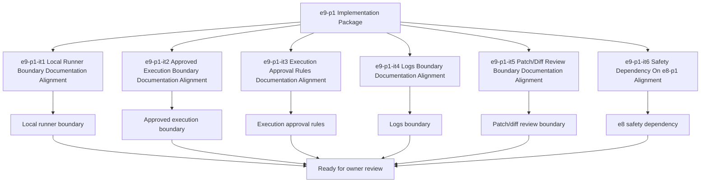

# E9-P1 Execution And Review Implementation Tasks

Updated: 2026-05-22

Branch: `tasks/e9-p1-execution-and-review-implementation`

Status: planning-only

This task package is scoped only to `e9-p1 Execution And Review` implementation planning.
It remains documentation/spec-boundary implementation planning only and does not include
local runner implementation code, approved execution code, logs code, or patch/diff review code.

## Scope Reminder

- `KVDOS` is the commercial product.
- `KVDF` is the governance/tooling layer.
- KVDOS app work stays inside `workspaces/apps/kvdos/`.
- KVDOS v1 commercial boundary = Local IDE Studio + Local Runtime + Cloud subscription/license control.
- Private code, secrets, customer data, local reports, and local runtime state stay local.
- Cloud commercial control only handles account, subscription, license entitlement, activation, plan access, release access, and update access.

## Generated Tasks

### `e9-p1-it1` Local Runner Boundary Documentation Alignment

- Title: Define the local runner boundary for approved execution
- Build type: execution specification
- In scope:
  - local runner boundary notes
  - runner purpose wording
  - approved-task execution framing
- Out of scope:
  - runner implementation code
  - execution scheduling code
  - runtime implementation
- Acceptance criteria:
  - local runner boundary is explicit
  - the wording stays app-local
  - the boundary does not imply runnable behavior
- Validation commands:
  - `rg -n "local runner|runner|execution|approved|KVDOS|KVDF" workspaces/apps/kvdos/docs/reports workspaces/apps/kvdos/docs/roadmap workspaces/apps/kvdos/docs/product workspaces/apps/kvdos/docs/architecture`
  - `git diff --check`

### `e9-p1-it2` Approved Execution Boundary Documentation Alignment

- Title: Define the approved execution boundary for governed task runs
- Build type: execution policy specification
- In scope:
  - approved execution notes
  - authorization wording
  - pre-run approval framing
- Out of scope:
  - approved execution implementation code
  - runtime mutation code
  - cloud API coding
- Acceptance criteria:
  - approved execution boundary is explicit
  - the wording stays pre-implementation
  - the boundary remains app-local
- Validation commands:
  - `rg -n "approved execution|execution|approved|allow|deny|runner|KVDOS|KVDF" workspaces/apps/kvdos/docs/reports workspaces/apps/kvdos/docs/roadmap workspaces/apps/kvdos/docs/product workspaces/apps/kvdos/docs/architecture`
  - `git diff --check`

### `e9-p1-it3` Execution Approval Rules Documentation Alignment

- Title: Define the execution approval rules for controlled runs
- Build type: governance specification
- In scope:
  - execution approval rules
  - approval handoff wording
  - approval checkpoint framing
- Out of scope:
  - approval UI implementation
  - approval automation code
  - runner implementation code
- Acceptance criteria:
  - execution approval rules are explicit
  - the wording is reviewable and app-local
  - the boundary does not imply automation
- Validation commands:
  - `rg -n "approval|approved|execution|runner|governance|KVDOS|KVDF" workspaces/apps/kvdos/docs/reports workspaces/apps/kvdos/docs/roadmap workspaces/apps/kvdos/docs/product workspaces/apps/kvdos/docs/architecture`
  - `git diff --check`

### `e9-p1-it4` Logs Boundary Documentation Alignment

- Title: Define the logs boundary for approved execution visibility
- Build type: observability specification
- In scope:
  - logs boundary notes
  - visibility wording
  - reviewable output framing
- Out of scope:
  - logs implementation code
  - log streaming code
  - runtime mutation code
- Acceptance criteria:
  - logs boundary is explicit
  - the wording stays documentation-only
  - the boundary remains app-local
- Validation commands:
  - `rg -n "logs|log|visibility|execution|review|KVDOS|KVDF" workspaces/apps/kvdos/docs/reports workspaces/apps/kvdos/docs/roadmap workspaces/apps/kvdos/docs/product workspaces/apps/kvdos/docs/architecture`
  - `git diff --check`

### `e9-p1-it5` Patch/Diff Review Boundary Documentation Alignment

- Title: Define the patch/diff review boundary for execution review
- Build type: review specification
- In scope:
  - patch/diff review notes
  - review handoff wording
  - reviewability framing
- Out of scope:
  - patch/diff review code
  - diff generation code
  - execution automation code
- Acceptance criteria:
  - patch/diff review boundary is explicit
  - the wording remains pre-implementation
  - the boundary stays app-local
- Validation commands:
  - `rg -n "patch|diff|review|execution|approval|KVDOS|KVDF" workspaces/apps/kvdos/docs/reports workspaces/apps/kvdos/docs/roadmap workspaces/apps/kvdos/docs/product workspaces/apps/kvdos/docs/architecture`
  - `git diff --check`

### `e9-p1-it6` Safety Dependency On e8-p1 Alignment

- Title: Align the e9 safety dependency on e8-p1
- Build type: dependency specification
- In scope:
  - safety dependency wording
  - e8-before-e9 sequence notes
  - pre-execution gating wording
- Out of scope:
  - safety implementation code
  - execution implementation code
  - packaging implementation code
- Acceptance criteria:
  - dependency on e8-p1 is explicit
  - the wording stays app-local
  - the boundary does not imply execution code
- Validation commands:
  - `rg -n "e8|e9|safety|dependency|execution|KVDOS|KVDF" workspaces/apps/kvdos/docs/reports workspaces/apps/kvdos/docs/roadmap workspaces/apps/kvdos/docs/product workspaces/apps/kvdos/docs/architecture`
  - `git diff --check`

## Visualization

## PR Title

`e9-p1: execution and review implementation package`

## PR Checklist

- [ ] Changes stay inside `workspaces/apps/kvdos/`
- [ ] No repo-root KVDF core files modified
- [ ] No `e10-p1` work started
- [ ] No local runner implementation added
- [ ] No approved execution implementation added
- [ ] No logs implementation added
- [ ] No patch/diff review implementation added
- [ ] No runtime, SQLite, cloud API, execution, or packaging work added
- [ ] No feature code added
- [ ] Local runner boundary is explicit
- [ ] Approved execution boundary is explicit
- [ ] Execution approval rules are explicit
- [ ] Logs boundary is explicit
- [ ] Patch/diff review boundary is explicit
- [ ] Safety dependency on e8-p1 is explicit
- [ ] `git diff --check` passes
- [ ] `.vscode/settings.json` remains untouched
