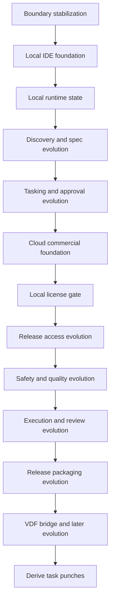

# KVDOS Evolution Plan

Updated: 2026-05-21

This document comes before task generation.
It sits underneath the commercial foundation stage plan:

- [KVDOS Commercial Foundation Stage Plan](./KVDOS_VERSION_PLAN.md)

The sequence is:

1. approve the evolution slices
2. derive task punches from the approved slices
3. derive the implementation readiness queue
4. generate the task queue

## Evolution Order

### E0. Boundary Stabilization

Goal: make the product boundary honest before any implementation split.

Includes:

- KVDOS v1 commercial boundary
- local-first privacy boundary
- KVDF vs KVDOS separation
- source-of-truth map

Why it matters:

- keeps the planning stack truthful
- prevents later track drift

### E1. Local IDE Studio Foundation

Goal: define the local Studio shell and navigation that users will see first.

Includes:

- Studio shell
- navigation
- project registry
- selected project scope

### E2. Local Runtime State

Goal: define the runtime state that makes the local product durable.

Includes:

- SQLite local runtime
- `.kvdos` state model
- workspace/project/task/report/approval records

### E3. Discovery And Spec Evolution

Goal: make discovery and spec generation part of the product flow.

Includes:

- questionnaire UI
- blueprint/spec generation
- `app.kvdos.yaml` validation
- source-of-truth map

### E4. Tasking And Approval Evolution

Goal: define the governed task layer that follows approved evolution slices.

Includes:

- task queue
- FIFO ordering
- approval panel
- reports panel
- audit trail

### E5. Cloud Commercial Foundation

Goal: define the commercial control plane that makes KVDOS v1 shippable.

Includes:

- cloud account model
- auth/login
- subscription status
- license entitlement
- device activation

### E6. Local License Gate Evolution

Goal: define how the licensed IDE is gated locally without leaking private data.

Includes:

- local license gate
- plan-based feature access
- offline grace policy
- invalid or expired license UX

### E7. Release Access Evolution

Goal: define release and update access as part of the commercial boundary.

Includes:

- release channel access
- package/update access
- release/download gating

### E8. Safety And Quality Evolution

Goal: define safety checks before any risky execution or packaging.

Includes:

- sandbox
- tests
- audit trail review
- security gates

### E9. Execution And Review Evolution

Goal: define the approved execution model after the local and commercial gates are stable.

Includes:

- local runner
- approved execution
- logs
- patch/diff review

### E10. Release Packaging Evolution

Goal: define the desktop packaging and updater boundary.

Includes:

- desktop build
- updater strategy
- release packaging
- download access control

### E11. VDF Bridge And Later Evolution

Goal: define how KVDOS stays aligned with KVDF without mixing the boundaries.

Includes:

- KVDF/KVDOS mapping
- evolution reports
- controlled upgrades

## Task Derivation Rule

Tasks come after evolution approval.

For each approved evolution slice:

- create a task punch
- derive implementation tasks
- record acceptance criteria
- attach the relevant reports and files

The derived punch list lives in:

- [KVDOS Evolution Task Punch](./KVDOS_EVOLUTION_TASK_PUNCH.md)
- [KVDOS Implementation Readiness Queue](./KVDOS_IMPLEMENTATION_READINESS_QUEUE.md)

The commercial foundation stage plan groups these slices into stage-shaped bundles.

## Mermaid View

