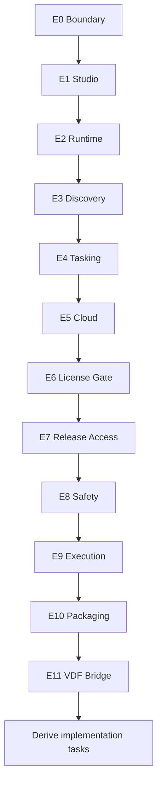

# KVDOS Evolution Task Punch

Updated: 2026-05-21

This is the derived punch list for the approved KVDOS evolution order.

It is planning-only. No implementation tasks are generated here yet.

Each evolution has one planning punch.
Each punch is version-linked so the release ladder and the slice ladder stay in sync.

## Punch Summary

| ID | Version anchor | Evolution | Punch goal | Depends on | Primary output |
| --- | --- | --- | --- | --- | --- |
| `e0-p1` | `v0.1` | Boundary Stabilization | Lock the KVDOS v1 boundary and the KVDF/KVDOS separation. | None | Boundary map and scope notes |
| `e1-p1` | `v0.1` | Local IDE Studio Foundation | Define the Studio shell and first visible navigation structure. | `e0-p1` | Studio shell plan |
| `e2-p1` | `v0.2` | Local Runtime State | Define the local runtime state model and durable storage shape. | `e1-p1` | Runtime state plan |
| `e3-p1` | `v0.3` | Discovery And Spec Evolution | Define the questionnaire, blueprint, and `app.kvdos.yaml` evolution slice. | `e2-p1` | Discovery/spec plan |
| `e4-p1` | `v0.4` | Tasking And Approval Evolution | Define task queue, approval, report, and audit evolution slices. | `e3-p1` | Governance/tasking plan |
| `e5-p1` | `v0.5` | Cloud Commercial Foundation | Define cloud account, auth, subscription, entitlement, and activation evolution slices. | `e4-p1` | Cloud commercial plan |
| `e6-p1` | `v0.6` | Local License Gate Evolution | Define the local commercial gate and plan-based feature access. | `e5-p1` | License gate plan |
| `e7-p1` | `v0.7` | Release Access Evolution | Define release channel and update/download access control. | `e6-p1` | Release access plan |
| `e8-p1` | `v0.8` | Safety And Quality Evolution | Define sandbox, tests, audit review, and security gates before execution. | `e7-p1` | Safety/quality plan |
| `e9-p1` | `v0.9` | Execution And Review Evolution | Define approved execution, logs, patch review, and runner behavior. | `e8-p1` | Execution/review plan |
| `e10-p1` | `v1.0` | Release Packaging Evolution | Define desktop build, updater, packaging, and download boundary. | `e9-p1` | Release packaging plan |
| `e11-p1` | `v1.1+` | VDF Bridge And Later Evolution | Define KVDF/KVDOS mapping and later evolution boundaries. | `e10-p1` | Bridge/evolution plan |

## Per-Evolution Punches

### `e0-p1` Boundary Stabilization

- Goal: make the planning stack honest before any implementation split.
- Scope: KVDOS v1 commercial boundary, local-first privacy boundary, KVDF vs KVDOS separation, source-of-truth map.
- Planning output: boundary map, boundary language notes, and keep-out list for later tracks.
- Acceptance: the boundary wording clearly distinguishes product, runtime, and governance layers.
- Handoff: the version plan can point to a stable slice boundary without ambiguity.

### `e1-p1` Local IDE Studio Foundation

- Goal: define the local Studio shell and navigation users see first.
- Scope: Studio shell, navigation, project registry, selected project scope.
- Planning output: Studio shell outline, navigation model, and selected-project state sketch.
- Acceptance: the Studio foundation can be described without implying execution or cloud dependencies.
- Handoff: the release ladder can now describe the first visible product surface.

### `e2-p1` Local Runtime State

- Goal: define the durable local state model.
- Scope: SQLite local runtime, `.kvdos` state model, workspace/project/task/report/approval records.
- Planning output: runtime entity map, local-state boundary notes, and persistence scope list.
- Acceptance: the runtime record set is explicit and local-first.
- Handoff: local persistence is named before the spec/discovery flow expands.

### `e3-p1` Discovery And Spec Evolution

- Goal: define discovery and spec generation before tasking.
- Scope: questionnaire UI, blueprint/spec generation, `app.kvdos.yaml` validation, source-of-truth map.
- Planning output: discovery flow map, questionnaire lifecycle notes, and spec-validation boundaries.
- Acceptance: the discovery flow can produce a grounded product spec.
- Handoff: product discovery can be derived from a stable local runtime base.

### `e4-p1` Tasking And Approval Evolution

- Goal: define the governed task layer after approved evolution slices.
- Scope: task queue, FIFO ordering, approval panel, reports panel, audit trail.
- Planning output: task derivation rules, approval checkpoints, and reporting/audit scope.
- Acceptance: task derivation rules are clear and approval-aware.
- Handoff: tasking can be planned without leaking execution semantics.

### `e5-p1` Cloud Commercial Foundation

- Goal: define the commercial control plane for v1 release.
- Scope: cloud account model, auth/login, subscription status, license entitlement, device activation.
- Planning output: cloud account model, entitlement boundary notes, and activation lifecycle sketch.
- Acceptance: the commercial boundary is explicit and local-private data remains local.
- Handoff: commercial gating can be added without moving private workspace data.

### `e6-p1` Local License Gate Evolution

- Goal: define how the licensed IDE is gated locally.
- Scope: local license gate, plan-based feature access, offline grace policy, invalid or expired license UX.
- Planning output: local gate rules, feature-access matrix, and grace-policy decision log.
- Acceptance: the app can describe blocked and allowed states clearly.
- Handoff: the IDE can enforce commercial access without clouding local privacy.

### `e7-p1` Release Access Evolution

- Goal: define release and update access control as part of commercial v1.
- Scope: release channel access, package/update access, release/download gating.
- Planning output: release-channel matrix, update/download rules, and entitlement-linked access notes.
- Acceptance: access control is tied to entitlement, not to private project content.
- Handoff: release delivery can be controlled without touching source privacy.

### `e8-p1` Safety And Quality Evolution

- Goal: define safety checks before execution or packaging.
- Scope: sandbox, tests, audit trail review, security gates.
- Planning output: safety gate checklist, quality gate map, and audit-review requirements.
- Acceptance: safety comes before execution in the approved order.
- Handoff: execution can only be considered after the safe path is defined.

### `e9-p1` Execution And Review Evolution

- Goal: define approved execution and review behavior.
- Scope: local runner, approved execution, logs, patch/diff review.
- Planning output: runner flow, review handoff notes, and execution approval boundaries.
- Acceptance: execution is clearly downstream from safety approval.
- Handoff: implementation can be planned after safety is explicit.

### `e10-p1` Release Packaging Evolution

- Goal: define desktop packaging and updater boundaries.
- Scope: desktop build, updater strategy, release packaging, download access control.
- Planning output: packaging flow, updater boundary notes, and release artifact checklist.
- Acceptance: packaging is tied to the commercial boundary and not to marketplace claims.
- Handoff: the v1.0 bundle can be framed as a shippable product boundary.

### `e11-p1` VDF Bridge And Later Evolution

- Goal: define how KVDOS stays aligned with KVDF.
- Scope: KVDF/KVDOS mapping, evolution reports, controlled upgrades.
- Planning output: bridge map, upgrade-control notes, and later-only evolution framing.
- Acceptance: the bridge stays later than the commercial v1 boundary and does not blur product lines.
- Handoff: future evolution can stay separate from the shipped v1 boundary.

## Mermaid View

