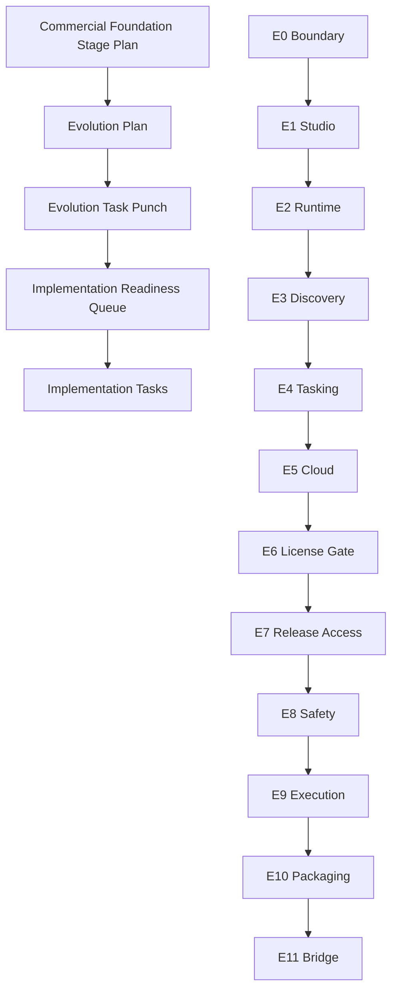

# KVDOS Implementation Readiness Queue

Updated: 2026-05-21

This queue is derived from the approved KVDOS evolution punches.
It sits after the commercial foundation stage plan, evolution plan, and evolution task punch.
It is a pre-build planning queue, not direct implementation work.
Actual coding tasks come after each queue item is approved for build-out.

Order of planning:

1. KVDOS Commercial Foundation Stage Plan
2. KVDOS Evolution Plan
3. KVDOS Evolution Task Punch
4. KVDOS Implementation Readiness Queue
5. Implementation tasks

## Path Rule

All file paths in this queue are relative to `workspaces/apps/kvdos/`.
Do not modify repo-root KVDF files unless a separately approved KVDF bridge task explicitly allows it.

## Queue Rules

- Keep the queue aligned to the approved evolution order.
- Do not expand scope beyond the evolution slice.
- Do not start implementation until the related punch is approved for build-out.
- Keep the queue app-local to `workspaces/apps/kvdos`.

## Queue Approval Rule

Each queue item must produce a build-ready report before coding begins.

A queue item is approved for implementation only when:

- its boundary is documented
- its source files are listed
- its acceptance criteria are clear
- its risks are known
- its keep-out scope is defined
- owner approval is recorded

After approval, implementation tasks may be generated only for that queue item.

## Implementation Readiness Queue

### 1. `e0-p1` Boundary Stabilization

- Build focus: create the boundary map and scope notes that keep KVDF and KVDOS separated.
- Inputs: commercial foundation stage plan, evolution plan, product boundary docs.
- Build type: architecture and boundary specification.
- Required files: `workspaces/apps/kvdos/docs/roadmap/KVDOS_VERSION_PLAN.md`, `workspaces/apps/kvdos/docs/roadmap/KVDOS_EVOLUTION_PLAN.md`, `workspaces/apps/kvdos/docs/product/PRODUCT_DEFINITION.md`.
- Output: boundary map, boundary language notes, keep-out list.
- Acceptance criteria: the product boundary is explicit enough to support release planning.
- Approval gate: owner approval for boundary wording.
- Can implementation start after this?: yes, but only for this queue item after its build-ready report is approved.

### 2. `e1-p1` Local IDE Studio Foundation

- Build focus: define the Studio shell, primary navigation, registry framing, and selected-project scope.
- Inputs: app workspace layout, product definition docs, Studio report language.
- Build type: product shell specification.
- Required files: `workspaces/apps/kvdos/docs/product/PRODUCT_DEFINITION.md`, `workspaces/apps/kvdos/docs/product/PRODUCT_STRATEGY.md`, `workspaces/apps/kvdos/docs/reports/KVDOS_PIPELINE_VISUAL_REPORT.md`.
- Output: Studio shell plan, navigation plan, first-view layout notes.
- Acceptance criteria: the visible product shell is clear before runtime state work begins.
- Approval gate: owner approval for studio scope and shell framing.
- Can implementation start after this?: yes, but only for this queue item after its build-ready report is approved.

### 3. `e2-p1` Local Runtime State

- Build focus: define the local persistence model for the product runtime.
- Inputs: `.kvdos` state assumptions, SQLite direction, task/report/approval entity needs.
- Build type: runtime architecture specification.
- Required files: `workspaces/apps/kvdos/docs/architecture/KVDOS_ARCHITECTURE.md`, `workspaces/apps/kvdos/docs/product/MVP_SCOPE.md`.
- Output: runtime entity map, persistence scope, state boundary notes.
- Acceptance criteria: durable local state is explicit enough to support discovery and tasking.
- Approval gate: owner approval for runtime state shape.
- Can implementation start after this?: yes, but only for this queue item after its build-ready report is approved.

### 4. `e3-p1` Discovery And Spec Evolution

- Build focus: define questionnaire flow, blueprint/spec flow, and `app.kvdos.yaml` validation.
- Inputs: approved questionnaire answers, product source of truth, discovery docs.
- Build type: discovery and spec-flow specification.
- Required files: `workspaces/apps/kvdos/app.kvdos.yaml`, `workspaces/apps/kvdos/docs/product/PRODUCT_DEFINITION.md`, `workspaces/apps/kvdos/docs/reports/KVDOS_PIPELINE_VISUAL_REPORT.md`.
- Output: discovery flow map, questionnaire lifecycle notes, spec-validation boundaries.
- Acceptance criteria: discovery can produce a grounded product spec.
- Approval gate: owner approval for questionnaire/spec flow.
- Can implementation start after this?: yes, but only for this queue item after its build-ready report is approved.

### 5. `e4-p1` Tasking And Approval Evolution

- Build focus: define the governed task layer, FIFO queue behavior, approvals, reports, and audit.
- Inputs: tasking rules, approval policy, reporting expectations.
- Build type: tasking and governance specification.
- Required files: `workspaces/apps/kvdos/docs/roadmap/KVDOS_EVOLUTION_TASK_PUNCH.md`, `workspaces/apps/kvdos/.kabeeri/tasks.json`.
- Output: task derivation rules, approval checkpoints, report/audit scope.
- Acceptance criteria: task planning is approval-aware and ready for implementation.
- Approval gate: owner approval for governed task layer.
- Can implementation start after this?: yes, but only for this queue item after its build-ready report is approved.

### 6. `e5-p1` Cloud Commercial Foundation

- Build focus: define account, auth, subscription, entitlement, and activation behavior.
- Inputs: commercial boundary rules, privacy rules, local/private data rules.
- Build type: cloud commercial architecture specification.
- Required files: `workspaces/apps/kvdos/docs/product/PRODUCT_STRATEGY.md`, `workspaces/apps/kvdos/docs/architecture/KVDOS_ARCHITECTURE.md`.
- Output: cloud account model, entitlement boundary notes, activation lifecycle sketch.
- Acceptance criteria: cloud commercial control is explicit without moving private data.
- Approval gate: owner approval for cloud boundary and entitlement model.
- Can implementation start after this?: yes, but only for this queue item after its build-ready report is approved.

### 7. `e6-p1` Local License Gate Evolution

- Build focus: define local licensing checks, feature access, offline grace, and invalid-license UX.
- Inputs: cloud commercial plan, local privacy boundary, app gating requirements.
- Build type: license-gate policy specification.
- Required files: `workspaces/apps/kvdos/docs/roadmap/KVDOS_VERSION_PLAN.md`, `workspaces/apps/kvdos/docs/architecture/KVDOS_ARCHITECTURE.md`.
- Output: local gate rules, feature-access matrix, grace-policy notes.
- Acceptance criteria: the app can explain allowed and blocked states clearly.
- Approval gate: owner approval for local entitlement enforcement.
- Can implementation start after this?: yes, but only for this queue item after its build-ready report is approved.

### 8. `e7-p1` Release Access Evolution

- Build focus: define release channel access and update/download gating.
- Inputs: entitlement model, commercial control notes, release packaging assumptions.
- Build type: release-access specification.
- Required files: `workspaces/apps/kvdos/docs/roadmap/KVDOS_VERSION_PLAN.md`, `workspaces/apps/kvdos/docs/roadmap/KVDOS_EVOLUTION_PLAN.md`.
- Output: release-channel matrix, update/download rules, access notes.
- Acceptance criteria: release delivery is tied to entitlement, not private source content.
- Approval gate: owner approval for release access policy.
- Can implementation start after this?: yes, but only for this queue item after its build-ready report is approved.

### 9. `e8-p1` Safety And Quality Evolution

- Build focus: define sandbox, test, audit review, and security gates.
- Inputs: execution policy, risk boundaries, release guard assumptions.
- Build type: safety and quality specification.
- Required files: `workspaces/apps/kvdos/docs/roadmap/EVOLUTION_EXECUTION_RULES.md`, `workspaces/apps/kvdos/docs/roadmap/FUTURE_ONLY_TRACKS.md`.
- Output: safety gate checklist, quality gate map, audit-review requirements.
- Acceptance criteria: execution cannot move forward until safety is explicit.
- Approval gate: owner approval for safety gating.
- Can implementation start after this?: yes, but only for this queue item after its build-ready report is approved.

### 10. `e9-p1` Execution And Review Evolution

- Build focus: define the approved runner path, logs, and patch/diff review flow.
- Inputs: safety gates, approval gates, local runtime model.
- Build type: execution and review specification.
- Required files: `workspaces/apps/kvdos/docs/roadmap/EVOLUTION_EXECUTION_RULES.md`, `workspaces/apps/kvdos/docs/roadmap/KVDOS_EVOLUTION_PLAN.md`.
- Output: runner flow, review handoff notes, execution approval boundaries.
- Acceptance criteria: execution can be planned only after safety and approvals are in place.
- Approval gate: owner approval for approved execution model.
- Can implementation start after this?: yes, but only for this queue item after its build-ready report is approved.

### 11. `e10-p1` Release Packaging Evolution

- Build focus: define desktop build, updater strategy, packaging, and download boundary.
- Inputs: execution readiness, commercial control, release access rules.
- Build type: packaging and release-readiness specification.
- Required files: `workspaces/apps/kvdos/docs/roadmap/KVDOS_RELEASE_LADDER.md`, `workspaces/apps/kvdos/docs/roadmap/KVDOS_VERSION_PLAN.md`.
- Output: packaging flow, updater boundary notes, release artifact checklist.
- Acceptance criteria: the v1.0 product boundary can be framed as a shippable package.
- Approval gate: owner approval for release packaging boundary.
- Can implementation start after this?: yes, but only for this queue item after its build-ready report is approved.

### 12. `e11-p1` VDF Bridge And Later Evolution

- Build focus: define KVDF/KVDOS mapping and later-only upgrade boundaries.
- Inputs: shipped KVDOS boundary, bridge policy, future-track separation rules.
- Build type: bridge and future-track specification.
- Required files: `workspaces/apps/kvdos/docs/roadmap/EVOLUTION_MASTER_PLAN.md`, `workspaces/apps/kvdos/docs/roadmap/FUTURE_ONLY_TRACKS.md`.
- Output: bridge map, upgrade-control notes, later-only framing.
- Acceptance criteria: future evolution stays separated from the shipped v1 boundary.
- Approval gate: owner approval for any bridge or later-track wording.
- Can implementation start after this?: yes, but only for this queue item after its build-ready report is approved.

## Mermaid View

