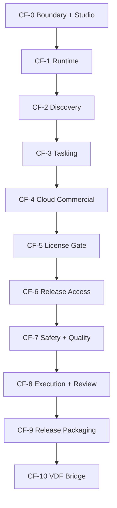

# KVDOS Commercial Foundation Stage Plan

Updated: 2026-05-21

This plan is the commercial foundation stage layer above the evolution plan.
It is not the repo's historical release numbering.
It uses CF labels to avoid colliding with existing KVDOS v0.x and v1.x roadmap history.

Source slices:

- [KVDOS Evolution Plan](./KVDOS_EVOLUTION_PLAN.md)
- [KVDOS Evolution Task Punch](./KVDOS_EVOLUTION_TASK_PUNCH.md)

Order:

1. approve the commercial foundation stage plan
2. approve the evolution slices
3. derive task punches
4. derive the implementation readiness queue
5. generate implementation tasks

## Stage Meaning

- A commercial foundation stage is a release-shaped bundle of approved evolutions.
- An evolution is a planning slice.
- A task punch is a derived implementation queue from an approved evolution slice.

## Proposed Commercial Foundation Stage Ladder

### CF-0

Boundary and Studio foundation:

- E0 Boundary Stabilization
- E1 Local IDE Studio Foundation

### CF-1

Local runtime foundation:

- E2 Local Runtime State

### CF-2

Discovery and spec foundation:

- E3 Discovery And Spec Evolution

### CF-3

Tasking and approval foundation:

- E4 Tasking And Approval Evolution

### CF-4

Cloud commercial foundation:

- E5 Cloud Commercial Foundation

### CF-5

Local license gate:

- E6 Local License Gate Evolution

### CF-6

Release access:

- E7 Release Access Evolution

### CF-7

Safety and quality:

- E8 Safety And Quality Evolution

### CF-8

Execution and review:

- E9 Execution And Review Evolution

### CF-9

Commercial release packaging and final boundary:

- E10 Release Packaging Evolution

### CF-10

Later bridge and evolution work:

- E11 VDF Bridge And Later Evolution

## Why This Order

- The boundary must be stable before any product split.
- The local IDE and runtime must exist before commercial gating makes sense.
- Safety must come before execution.
- Execution must come before release packaging.
- The VDF bridge belongs after the v1 commercial boundary is already defined.

## Mermaid View

## Relationship To Other Plans

- Evolution plan: defines the approved slices.
- Commercial foundation stage plan: groups those slices into stage-shaped bundles.
- Task plan: derives the implementation readiness queue after evolution approval.
- The commercial foundation stage plan is the release-level wrapper around the evolution plan.
- The evolution plan is the slice-level source of truth for the commercial foundation stage plan.
